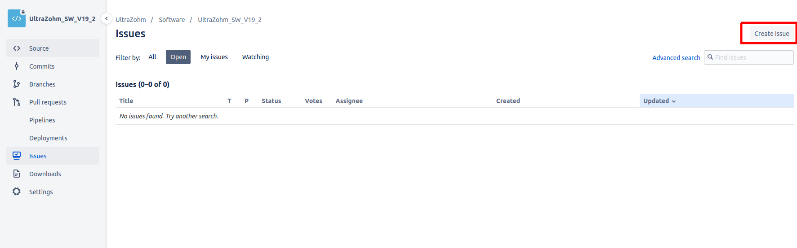
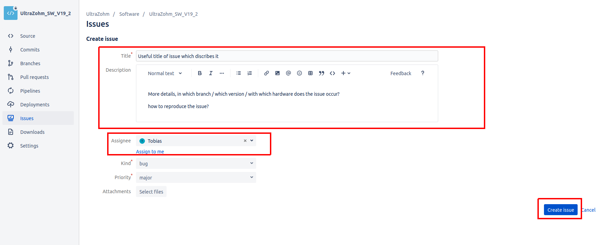
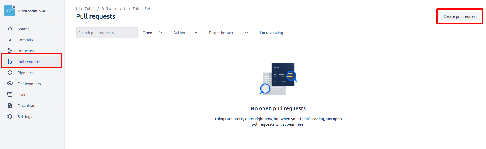
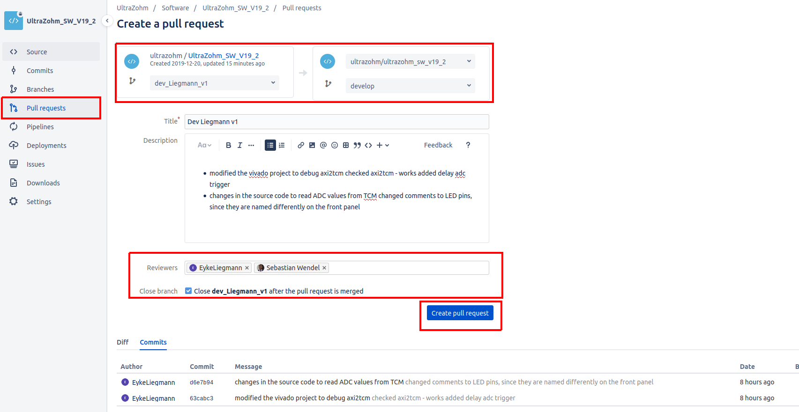
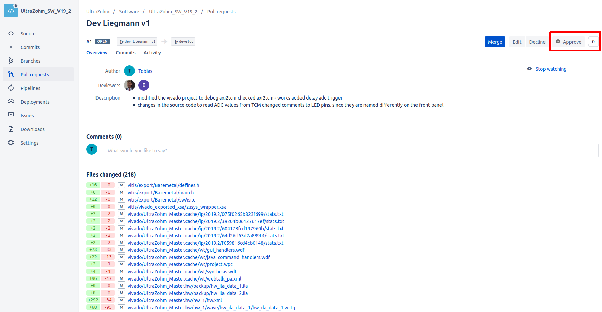

=========
Bitbucket
=========

Bitbucket is a cloud hosting service on which the remote repository of the UltraZohm is hosted `UZ Repository <https://bitbucket.org/ultrazohm/ultrazohm_sw/>`_ .
The source files and pull requests in the repository are public, while the issues are private. 
Therefore, one has to be registered at Bitbucket and request access to the repository at one of the maintainers.
Please use a descriptive user name and work-related mail address.

The Bitbucket features **Issues** and **Pull Requests** are used to structure the technical discussion around the UltraZohm.

.. _bitbucket_issues:

Issues
******
The `issue tracker <https://bitbucket.org/ultrazohm/ultrazohm_sw/issues>`_ is used to keep track of all issues with the UltraZohm and its documentation.
**Issues** are bugs or problems with the system / the source code / documentation of the system and should be reported.

In the ``ultrazohm_sw`` repository you can click on issues to get a list of all open issues.

.. image:: ./images_bitbucket/issues.png

Before reporting an issue, check if this issue already exists. You can sort the list by module and use the free text search.

If the issue does not exist, report a new issue by clicking on ``Create issue``.

**Some comments on how to use the issues**

- **Create a new issue for each topic**. In this way, the issues structure the technical discussion that often follows afterwards and it is easier to keep track of what is left to do for the assignee.
- Enter a **descriptive title** that describes the issue in a few words. 
- In the Description add more **details on the observed behavior, how to reproduce the problem**, and explain the steps you have taken so far to resolve the issue.
- You can assign the issue to yourself or somebody else, who will be notified automatically. When creating new issue, it **might be better not to assign the issue to someone** without talking to them beforehand. Otherwise, this might be perceived like telling them what they have to do - no one likes that. If in doubt, rather not assign the issue and instead tag the relevant people in the description.
- **Tag the relevant people** in the issue description by using ``@person`` otherwise they might miss the issue, if they do not check the issue tracker regularly.
- Take advantage of the issue features by modifying **kind and priority** to indicate its urgency and your intend (bug report vs. suggestion for an enhancement).
- **Add a component** to indicate if the issue is related to the Vivado, Vitis, git, docs, Altium.
- Click ``Create issue`` to create the issue.

- Once the issue has been created, **discuss everything inside this issue**. This helps to document the development progress and on-boarding others, when you ask them for help or review later on. When discussing with someone in person or on the phone, write the outcome of the discussion in the issue.
- **Do not hesitate to close the issue**, once you think it has been resolved. If it turns out it has not been resolved, they can simply be re-opened again. Generally though, this should be done by the assignee or the reporter.

.. _bitbucket_pull_request:

Pull Request
************

After you finished a feature and you want to include your changes in the main repository you have to create a pull request in Bitbucket.
A pull request is the process to merge your changes from your ``feature/branch`` into ``develop``.

In the *Create a pull request* plane you can choose which branches should be merged. Choose your ``feature/branch`` on the left side and ``develop`` on the right.
Give the merge request a useful title and describe what the changes do. The commit messages of your ``feature/branch`` are automatically added.

* If you fix issues with your pull request, specify the issue in the title with ``close #IssueID``, i.e. *Example text, close #99 #100*. 
* This will automatically close the specified issue after the pull request is merged.  
* For further information read :ref:`bitbucket_smart_commits`.

Next, assign reviewers with at least one maintainer and **click close feature after the pull request is merged**.
The reviewers will be notified and after the pull request is merged, the feature branch will be deleted from the remote repository.

The proposed changes can be discussed in the pull request and after the pull request is approved by a maintainer, the changes can be merged by the maintainer.

.. _bitbucket_smart_commits:

Using Smart Commits
*******************

Further documentation, on how to resolve issues automatically, can be found `here <https://support.atlassian.com/bitbucket-cloud/docs/resolve-issues-automatically-when-users-push-code/>`_.

Alternatively you can manage your project's repositories in Bitbucket or GitHub using `Smart Commits <https://support.atlassian.com/bitbucket-cloud/docs/use-smart-commits/>`_. With smart commits you can process your issues using special commands in your commit messages. You can:

* Comment on issues.
* Record time tracking information against issues.
* Issues can be tagged and closed automatically through your commit message, by adding the following in your commit message, with ``XX`` being the issue number. This is a nice feature, since it links your commit to the issue, making it easier to track your changes:

   * ``close issue #XX`` for closing the issue
   * ``issue #XX`` to link the commit to the issue

