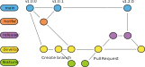

=====================
Contribution Workflow
=====================

The UltraZohm community uses the git-flow branching model since it is easy to apply (more info: `Atlassian <https://www.atlassian.com/git/tutorials/comparing-workflows/gitflow-workflow>`_, `Gitflow cheat sheet <https://danielkummer.github.io/git-flow-cheatsheet/index.html>`_).
In addition to the git-flow model, :ref:`bitbucket_pull_request` are used for all merges.
See  the `Atlassian tutorial <https://www.atlassian.com/en/git/tutorials/making-a-pull-request>`_ for additional information.
It is not possible to merge into the ``main`` or ``develop`` branches without a pull request.

UltraZohm Workflow
------------------

Git-flow is supported by the `gitflow extension <https://github.com/nvie/gitflow/wiki/Command-Line-Arguments>`_ as well as the GUI clients Sourcetree and GitKraken.

.. _gitflow_picture:

  Visualization of git-flow.

:numref:`gitflow_picture` shows the gitflow.
The following branches are used:

  * ``main``

    * Exists forever
    * Stable Version
    * Version **tag** after each merge

  * ``develop``

    * Exists forever
    * Current development version
    * Pull request to merge to ``main``
    * Increment the second number of the version tag by one

  * ``feature``

    * Created by contributors to implement features
    * Pull request to merge into develop
    * Deleted after pull request is accepted

  * ``hotfix``

    * Created by maintainers to fix **bugs** in ``main``
    * Pull request to merge to ``main``
    * Increment the last number of the version tag by one
    * Pull request to merge to ``develop``
    * Deleted after both pull requests are accepted

  * ``release``

    * Created by maintainers for major releases
    * Created by maintainers if merge conflicts occur in pull request from ``develop`` to ``main``
    * Resolve merge conflicts 
    * Pull request to merge to ``main``
    * Increment the first number of the version tag by one
    * Pull request to merge to ``develop``
    * Deleted after both pull requests are accepted

.. warning::

  It is impossible to merge anything without a pull request into ``main`` or develop, nor is it possible to push changes to these branches!

Branch names
************

The naming convention for the branches is as follows:

  * ``feature/featurename``

    * Branch of type ``feature``
    * ``featurename`` describes what feature is implemented
    * Example: ``feature/pwm_module``

  * ``hotfix/hotfixname`` 
  
    * Branch of type ``hotfix``
    * ``hotfixname`` refers to the bug which the contribution fixes
    * Example: ``hotfix/fix_pwm_counter_overflow``
  
  * ``release/releasename_v000``

    * Branch of type ``release``
    * ``releasename`` should describe what features are released
    * Contains the version number that will be the new tag for the ``main`` branch

Version number
**************

The version number is the **tag** of the commits of the ``main`` branch.
Depending on how much the code changed, it is either a revision (only bug fixes were made and no new features are added), a new sub-version (at least one new feature is added), or a new major version (multiple new features, big changes).

::

  v3.1.7
   │ │ │
   │ │ └───────── Revision: bug fixes, no new features (merged a hotfix)
   │ └─────────── Minor release, at least one new feature
   └───────────── Major release

Additional information
**********************

Relevant resources for git-flow can be found here:

  * <https://nvie.com/posts/a-successful-git-branching-model/>
  * <https://danielkummer.github.io/git-flow-cheatsheet/index.html>
  * <https://m.infos.seibert-media.net/Productivity/Git-Workflows+-+Der+Gitflow-Workflow.html> (German)
  * <https://www.atlassian.com/git/tutorials/comparing-workflows/gitflow-workflow>