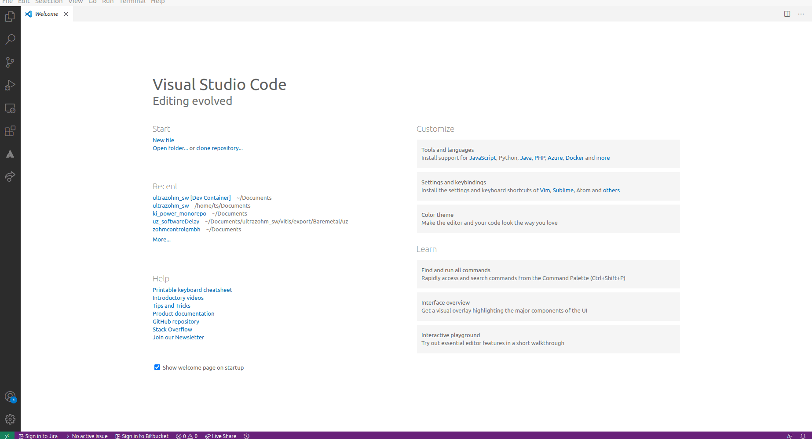
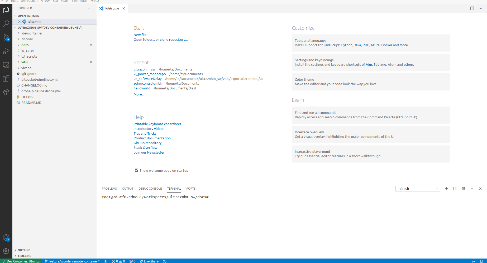
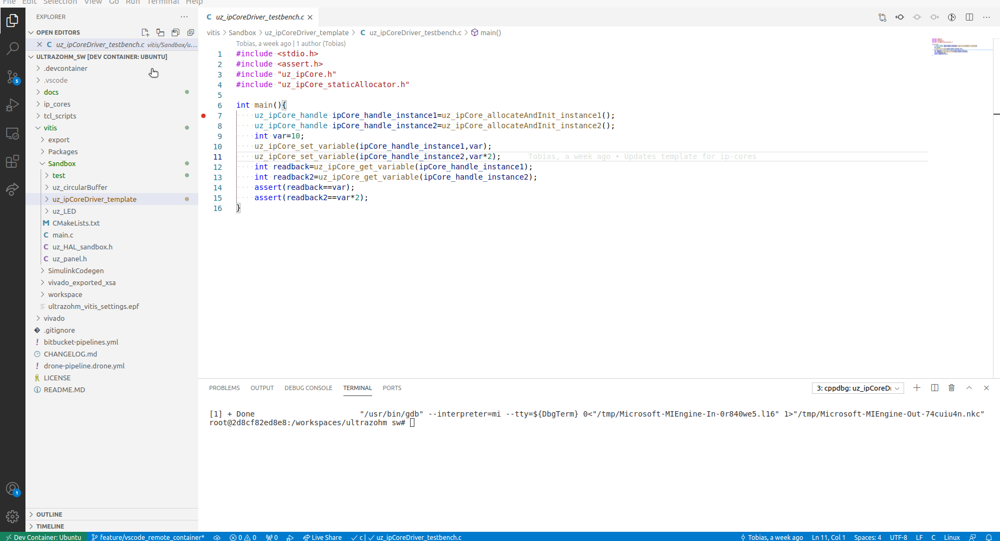
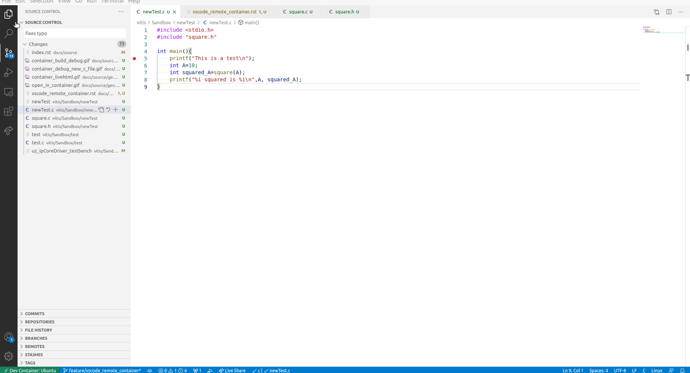
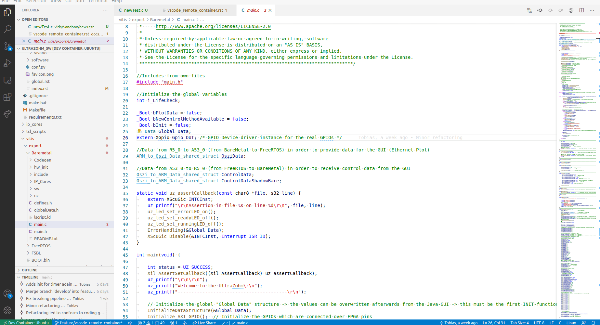

.. _vscode_remote_container:

==================================================
VS Code Remote Container (Development environment)
==================================================

`VS Code <https://code.visualstudio.com/>`_ is the recommended text editor for the UltraZohm project.
Using the `remote container extension <https://marketplace.visualstudio.com/items?itemName=ms-vscode-remote.remote-containers>`_ allows for a consistent development environment with easy setup.
Further information:

- https://code.visualstudio.com/docs/remote/containers

Prerequisites
*************

- Install `docker <https://docs.docker.com/get-docker/>`_
- Install `VS Code <https://code.visualstudio.com/>`_
- Install `remote container extension <https://marketplace.visualstudio.com/items?itemName=ms-vscode-remote.remote-containers>`_
- Clone the ``ultrazohm_sw`` repository

Podman instead of Docker
------------------------

Using remote container with Docker might lead to unwanted problems with file permissions on Linux and Docker runs as root by default.
`Podman <https://github.com/containers/podman>`_ can be used as a rootless alternative to Docker.

- `Podman installation <https://podman.io/getting-started/installation>`_
- `VS Code documentation to use podman instead of Docker <https://code.visualstudio.com/docs/remote/containers>`_
- To use, install Podman and write ``podman`` in the VS Code Setting ``Remote -> Container -> Docker Path``

.. note:: It might be possible to use Podman with WSL2 on Windows, yet this is not tested. See https://www.redhat.com/sysadmin/podman-windows-wsl2 

Alternative: Gitpod
-------------------

`Gitpod <https://gitpod.io>`_ can be used to start a VS Code workspace in the browser without any local installations required.

- `Open UltraZohm workspace in Gitpod <https://gitpod.io/#https://bitbucket.org/ultrazohm/ultrazohm_sw/src/main/>`_
- Login with your Bitbucket account
- The complete development environment as outlined in this document is automatically loaded (sphinx, ceedling)
- Just click the link and start development

.. figure:: gitpod_preview.gif

  Open repository in Gitpod workspace.

Usage
*****

- Start VS Code
- ``File`` -> ``Open Folder``
- Choose the ``ultrazohm_sw``
- A prompt opens up that asks if you want to open the folder in the container
- Click *Reopen in Container*
- VS Code restarts
- Development environment is ready to use

  Open repository in remote container

Build documentation
-------------------

In VS Code:

- Menu: Terminal -> ``New Terminal``
- A Terminal opens which can be used, e.g., to build the documentation
- ``cd docs``
- ``make livehtml``
- A new browser window opens with a live preview of the documentation opens
- If you change the documentation an save, the live preview rebuilds automatically
- Alternative: use ``make clean html`` to build manually

.. figure:: container_livehtml.gif

  Use ``make livehtml`` to create a live preview of the docs

Building C-Programs
-------------------

VS Code integrates gcc and gdb wich enables the usage of VS Code as a development environment.
See `this tutorial <https://code.visualstudio.com/docs/languages/cpp>`_.
In the ``ultrazohm_sw`` repository the folder ``Vitis/Sandbox`` can be used to prototype your code.
The remote container is setup in a way that all *.c files inside the folder of the *.c file that holds the *main* function are visible to the linker.

  Build and debug the example IP-Core driver

  Build and debug of a new C program

Git
---

VS Code features a git extension (`gitlens <https://marketplace.visualstudio.com/items?itemName=eamodio.gitlens>`_) that can be used to commit changes and see the timeline of a file.

  Commit changes from VS Code

  Use gitlense to inspect commits on a file