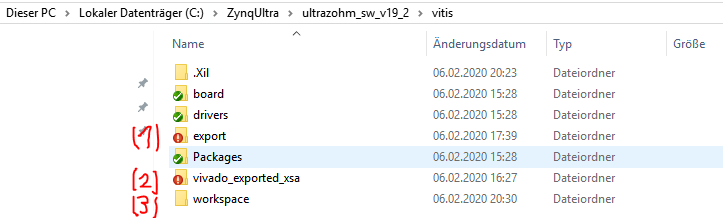
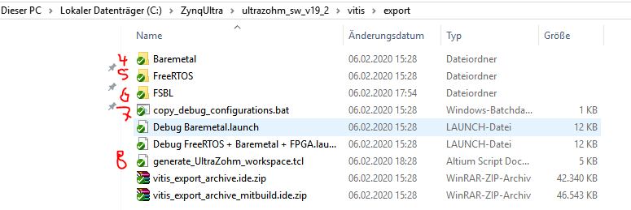
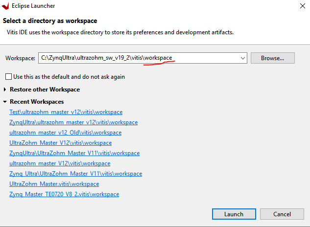
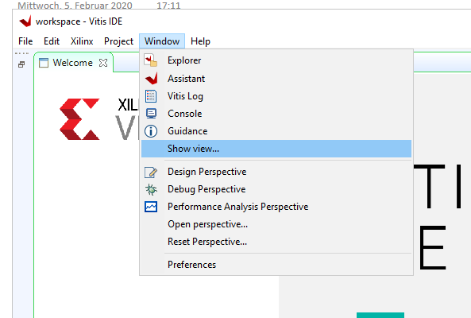
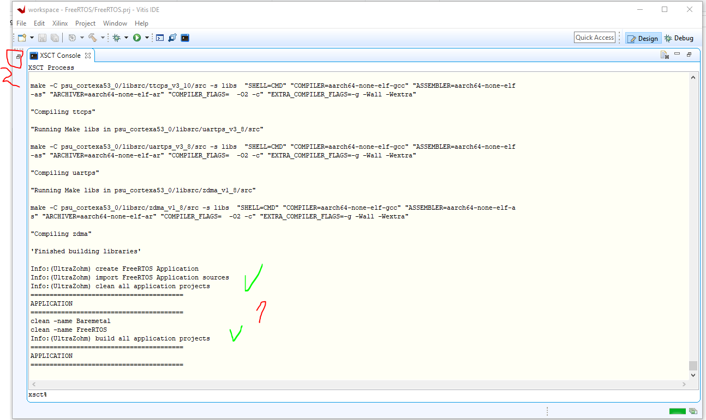
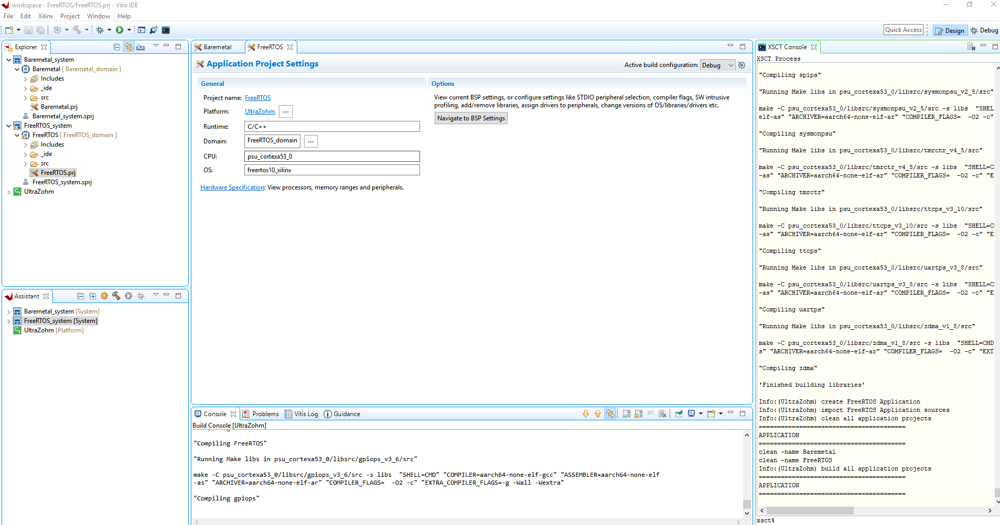

=======================================
Import project to Vitis with tcl-script
=======================================

Background
----------

* This is the standard way to get the project from Bitbucket!
* From GIT you will get "export" files (1) which uses the xsa file from Vivado (2), in order to build the workspace for Vitis (3)
* After you get the software from Bitbucket, the workspace folder doesn't exist. It will be created automatically.

* In the folder "export" is a TCL-script (8),which automatically builds the Vitis workspace.
* Therefore, the source files for the Baremetal (4), the FreeRTOS (5) and the First-Stage-Bootloader (FSBL) (5) are used.
* In the end of this chapter, the debug configurations can be also included, by clicking on the bat file (7).

Step by step
------------

0. Clone the git **ultrazohm_sw_19_2** from Bitbucket, if not already done

1. Open Vitis directly from the start menu or launch it from Vivado

2. Create a new workspace in Vitis

3. Click on Window -> Show view…

4. Open Xilinx -> XSCT Console

..	image:: ./images_import_TCL/vitis_createTCL5.png

5. Copy the following lines to the console one-by-one:

::

   cd [getws]
   source {../export/generate_UltraZohm_workspace.tcl}

6. And wait for 10-15 minutes

..	image:: ./images_import_TCL/vitis_createTCL6.png

7. Now your workspace should work

 - See (1)
 - Than press (2) to open the folder tree.

10. At this point, the whole BSP-files had a reset and the Platform project as well as the Application Project had a clean and build.
