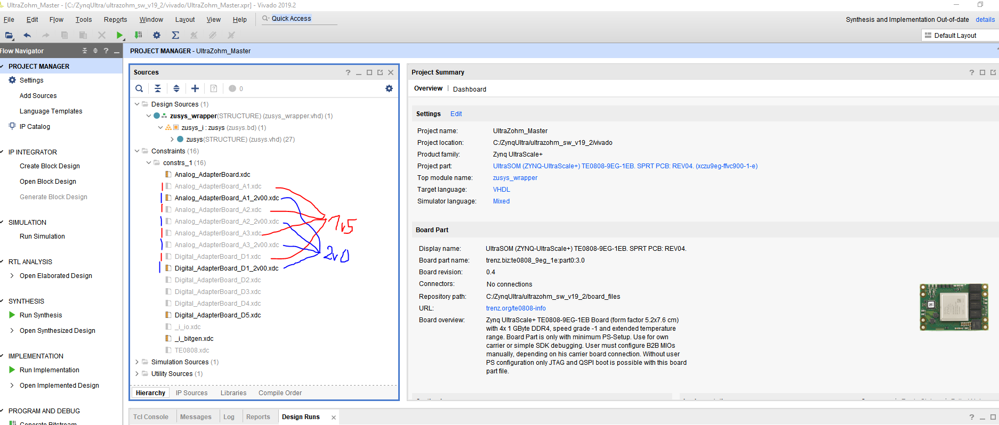
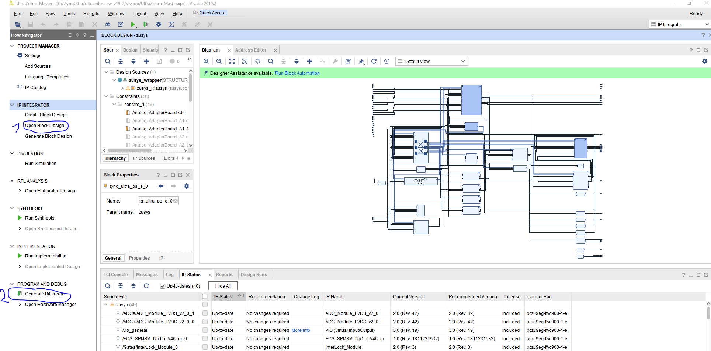
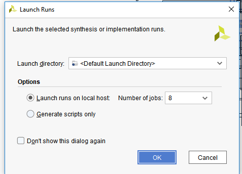
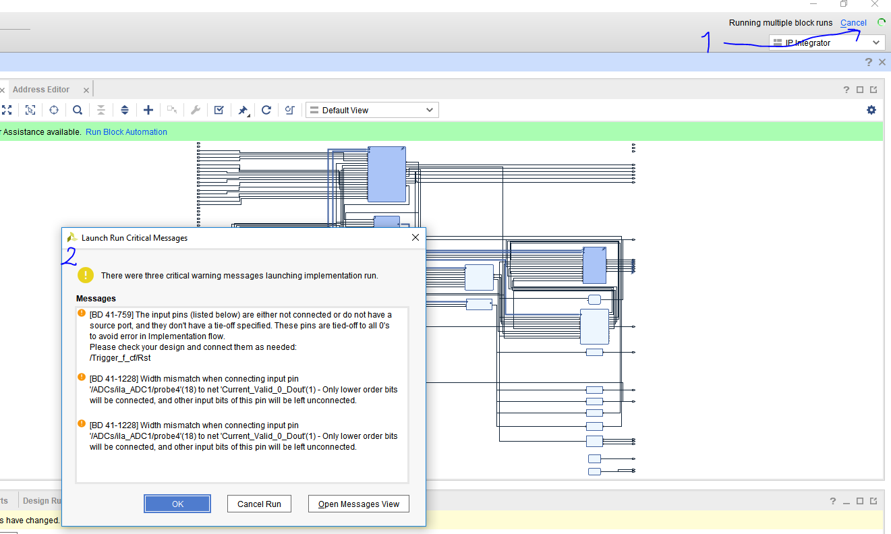
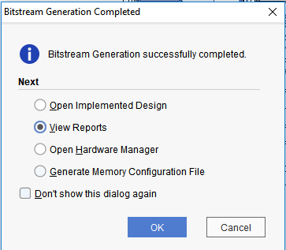
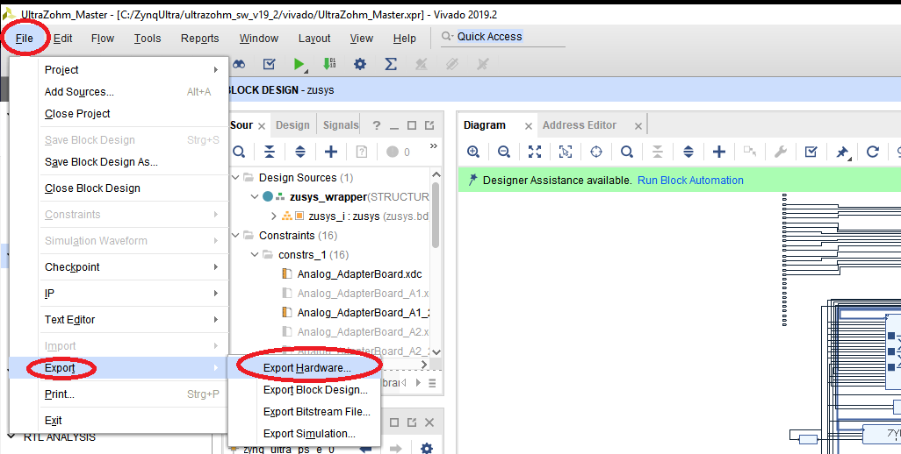
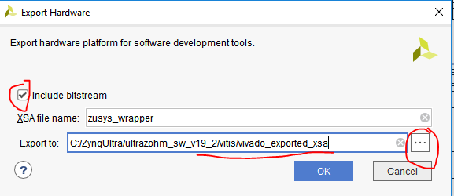
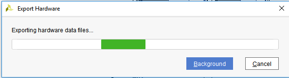
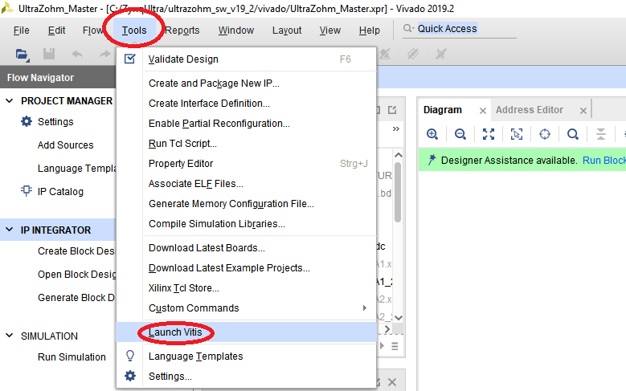

======================
Vivado - First Steps
======================

The **UltraZohm_SW_V19_2** project and the **AA_IP_Repository** must be always in the same folder direction!

Check the constraints
---------------------

1. Check if, depending on your real hardware, the correct constraints are active
2. You will find the version number on the right corner of the Carrier-Board
3. 1v5 is the first hardware revision
4. 2v0 is the second hardware revision
5. Per right-click on the file you can "Enable" or "Disable" it

Check the design and generate Bitstream
---------------------------------------

1. You can check with (1), if the correct pins are chosen
2. You can generate a Bitstream (2), which also implies all previous steps such as synthesis, implementation

3. You will see that the generation process starts, at the right top corner (1). This will, depending on the size of the design, have a duration of 5-30 minutes.
4. Sometimes some messages will appear (2), you always have to decide, if it is important or not

 a. In the shown case, an ILA was connected with to small Bit size
 b. Another pin is not connected
 c. Both messages are, in this case, not important

Export the Bitstream
--------------------

1. After a successful run, you can choose if you want to see the design in detail, or if you want to see just the messages and want to go further!

2. Afterwards, you have to export the "zusys_wrapper.xsa" file!

3. You have to include the Bitstream (design for the FPGA) and choose the correct folder
4. It is recommended to place it in the folder **/vitis/vivado_exported_xsa** from the specific project, in order to use/import it afterwards in Vitis

Start Vitis
-----------

1. Now everything is done in Vivado and the design as well as the whole hardware settings are done and exported in the "zusys_wrapper.xsa" file
2. Next step, open Vitis, but keep Vivado always in background open (e.g. for hardware monitoring with the ILA)

