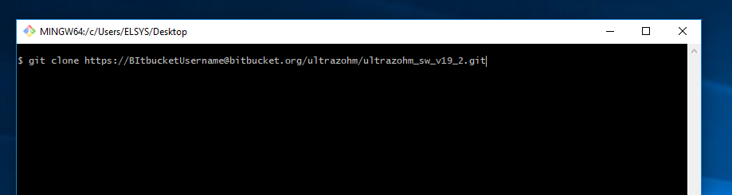

===
Git
===

User quick-guide
----------------
To use the system clone the repository with the user name of Bitbucket ``BitbucketUsername``.

::

  git clone https://BitbucketUsername@bitbucket.org/ultrazohm/ultrazohm_sw_v19_2.git

Check out the ``master`` branch with the relevant version (newest is recommended!).
Use the export script to create a workspace which is not git versioned and use the system.

If you want to add functionality to the system create a feature branch off of ``develop`` with the name ``feature/featurename``, make changes and push them.
After the feature is finished create a pull request to merge the feature branch into ``develop``.

.. note::

  If you find a bug, create an issue!

.. warning::

  It is not possible to commit changes to ``master`` or ``develop``.
  It is not possible to merge feature branches ``master`` or ``develop``.
  Always use pull requests.

Installation
------------

The version control of the source files of the UltraZohm is done by git.

Therefore, a git installation is needed: <https://git-scm.com/downloads>.

The homepage of git offers excellent documentation <https://git-scm.com/doc>, tutorials and videos <https://git-scm.com/videos>
Another recommended tutorial is offered by Bitbucket <https://www.atlassian.com/git/tutorials>.

An understanding on what git is and how it is used is mandatory for working with the UltraZohm and is assumed in the following sections!

To make the usage of git more easy a graphical git client can be installed in addition to git.
Sourcetree <https://www.sourcetreeapp.com/> (Free, Windows and Mac) or GitKraken <https://www.gitkraken.com> (paid for private repositorys, free for students and research institutions/non-profit, Windows, Mac, Linux) is recommended.

Git Bash
--------

If you are comfortable with git bash / CLI tool you can use it as well to clone the repository.

