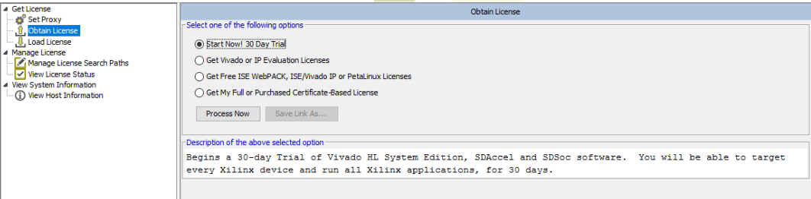
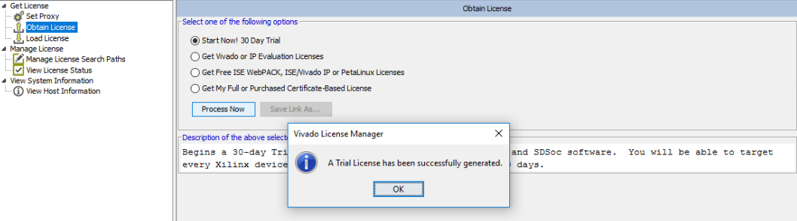

==============
Vivado License
==============

A valid license for the Vivado software is necessary to generate the bitstream for the Xilinx UltraScale+ (XCZU9EG).
Otherwise following error message will be generated in Vivado

.. image:: ./images_license/vitis_license0.png

Obtain a Vivado license
-----------------------

There are three ways to get a valid license for Vivado:

1. Purchase the license from Xilinx

2. `Apply for the Xilinx donation Program for universities` <https://www.xilinx.com/support/university/donation-program.html>

3. Obtain a 30-day trial license

.. this should not be used anymore!
.. Licenses are available via TUM. To get a license do the following steps:

.. 1. Open "Manage Xilinx Licenses"
.. 2. Make a screenshot of the "View Host Information" folder

.. .. image:: ./images_license/vitis_license1.png

.. 3. Send the screenshot to eyke.liegmann@tum.de and request a license
.. 4. Afterward, you will get a license file which you can load here:

.. .. image:: ./images_license/vitis_license2.png

.. 5. Afterward, it will work

.. .. image:: ./images_license/vitis_license3.png

Obtain trial license
--------------------

Open the Vivado license manager.

.. image:: ./images_license/manage_license.png

`View License Status` is empty.

.. image:: ./images_license/license_manager_empty.png

Generate a 30-day trial license.

Vivado prompts successful license generation.

The license manager shows the license in `View License Status` after a refresh.

.. image:: ./images_license/trial_license_activated.png