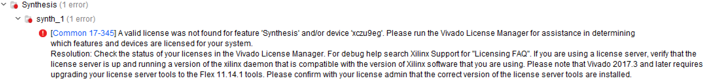
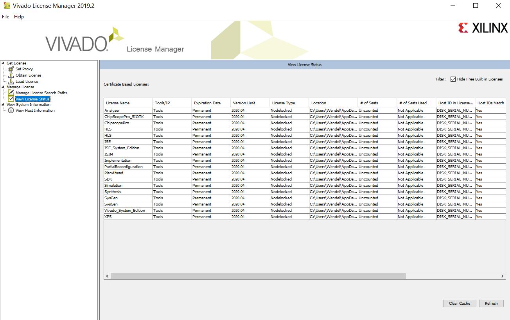

=======
License
=======

Why do I need it?
-----------------

For generating the bitstream for the leading edge UltraScale (XCZU9EG) a license for the vivado software is necessary.
Otherwise following error message will be generated in vivado

How do I get it?
----------------

Licenses are available via TUM. To get a license do the following steps:

1. Open "Manage Xilinx Licenses 2019.2"
2. Make a screenshot of the "View Host Information" folder

.. image:: ./images_license/vitis_license1.png

3. Send the screenshot to eyke.liegmann@tum.de and request a license
4. Afterwards you will get a license file which you can load here:

.. image:: ./images_license/vitis_license2.png

5. Afterwards, it will work

