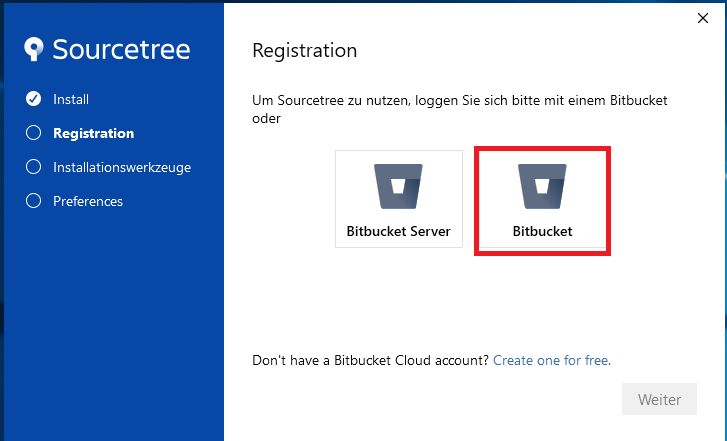
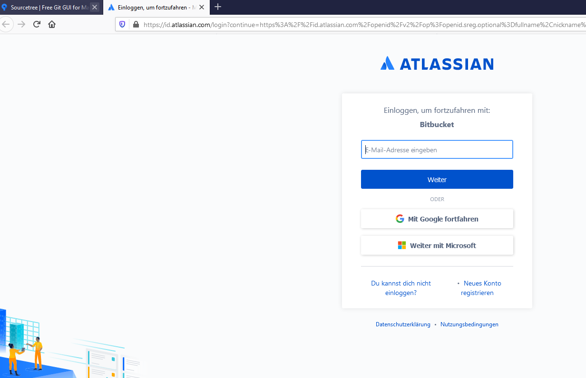
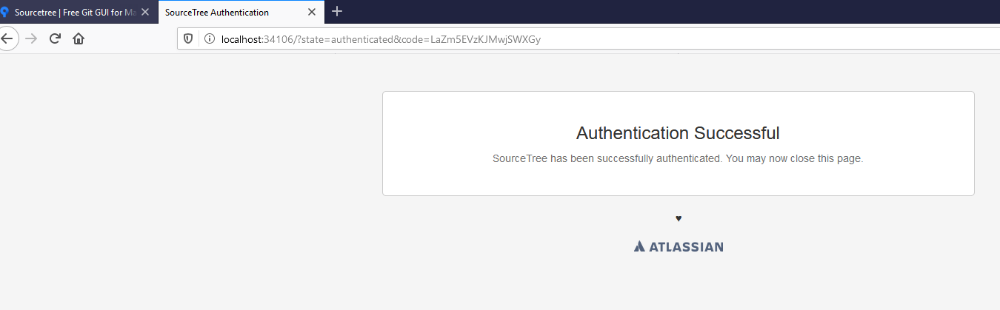
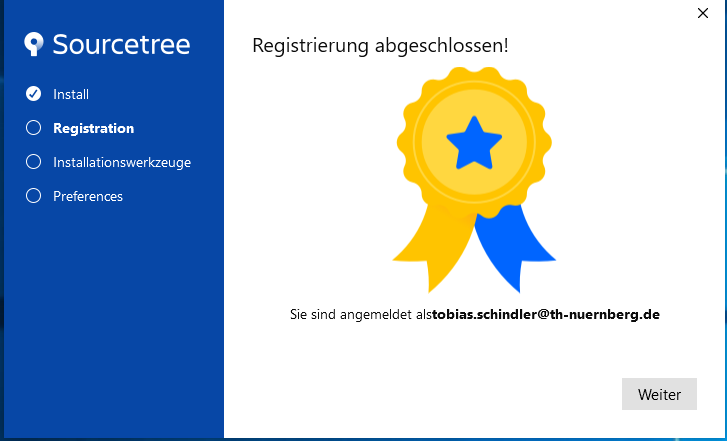
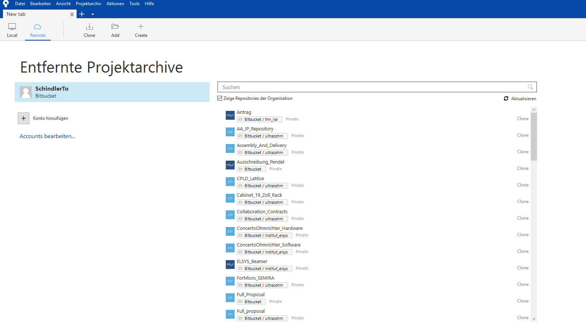
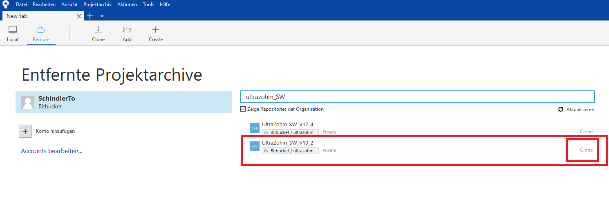
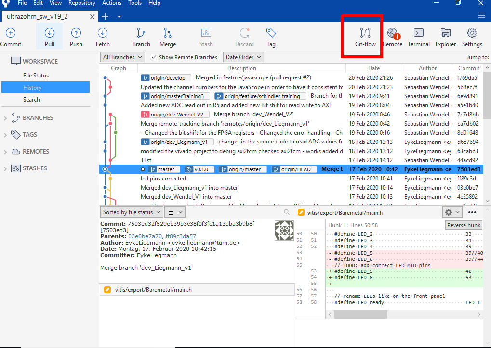
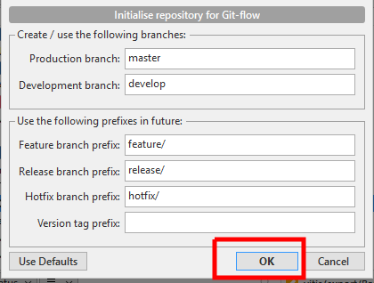
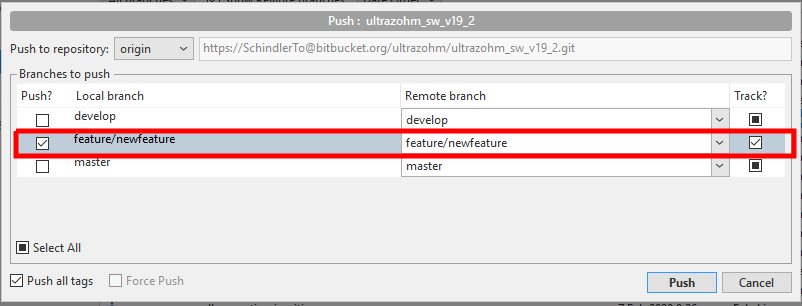
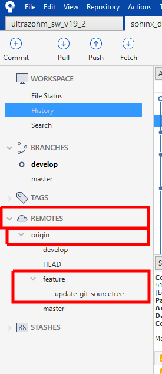

==========
Sourcetree
==========

Sourcetree is a git GUI with great compatibility to Bitbucket <https://www.sourcetreeapp.com/>.
It is recommended to use Sourcetree for convenience and for standardization in the community.
If you are not familiar with Sourcetree please refer to the following resources:

  * <https://confluence.atlassian.com/bitbucket/tutorial-learn-bitbucket-with-sourcetree-760120235.html>
  * <https://confluence.atlassian.com/bitbucket/tutorial-learn-about-bitbucket-pull-requests-774243385.html>

.. note::

  the following description of the installation and useage of sourcetree is quite basic.
  Make sure to check the links above to the Sourcetree and Bitbucket tutorial, which is provided by Bitbucket itself and quite useful!

Sourcetree installation
***********************

The following details the installation of Sourcetree.
We use Bitbucket Cloud hosted, so click ``Bitbucket`` (right).

You will be asked to login to your Bitbucket account. If you do not have one, please create one <https://www.bitbucket.com> since it is required to access the software of the UltraZohm.

You only need to download and install git (if you do not have installed it already).

.. image:: ./images_git/sourcetree_installer2.png

If you know what a SSH Key is, how to use it and want to use it, you can you it (Ja=Yes, Nein=No).
If you do not know what a SSH Key is, click ``Nein`` (No), you do not need it.

.. image:: ./images_git/sourcetree_ssh.png

After that the installation is complete and you can open Sourcetree and you should be loged in and you see your remote repositorys.
If you are in the UltraZohm team you will see the ``ultrazohm_sw`` repository.

Click on ``clone`` to download the software to your local hard drive.

The dialog to clone the repository is opend and you can add the local path. It is recommended to use:

::

  C:\UltraZohm\ultrazohm_sw

.. image:: ./images_git/sourcetree_clone2.png

This will take some time, after the clone is complete, Sourcetree and the repository is ready to use.

.. image:: ./images_git/sourcetree_cloned.png

You can and should change the language to **english** with ``Tools--> Options`` which is highly recommended or the specific git commands will be translated!

.. image:: ./images_git/sourcetree_sprache.png

Sourcetree known issues
***********************

.. note::

  Sourcetree installation with version 3.3.8 does not create a desktop link to the program and it is therefore inconvenient to start sourcetree.
  To create a desktop shortcut you can navigate to the install path which is:
  ::

    C:Users\USERNAME\AppData\Local\SourceTree

  Where ``USERNAME`` is the name of your windows user account. Note that the path might be a hidden folder.
  To  create a shortcut right click the sourcetree.exe and click ``create desktop shortcut``.

Sourcetree git-flow
*******************

We use the git-flow workflow as a branching model for the ``ultrazohm_sw`` repository <https://www.atlassian.com/git/tutorials/comparing-workflows/gitflow-workflow>.
Git-flow is integrated in Sourcetree and straigth forward for users.

To use git-flow for the first time click the git-flow icon in sourcetree.

A window pops up which asks you ti initialize the repository for git-flow. Just click ok.

.. warning::

  do not change the default settings!

Git-flow is initialized in the repository (takes a few moments).

.. image:: ./images_git/gitflow3.png

Click again on the git-flow icon in sourcetree, you are prompted to choose a git-flow action.
The only relevant action for users is ``Start New Feature`` - click it.

.. image:: ./images_git/gitflow4.png

You are asked to give a name for the feature, enter a expressive name and click ok.
Naming:

* ``featurename`` is a feature branch with ``featurename`` referring to what feature is developed - e.g. ``oversampling`` if the feature is about oversampling
* ``developername`` is a feature branch with no specific purpose and is linked to a person instead - e.g. ``schindler``. This is a sandbox for developers for daily use of the system

.. warning::

  do not change ``start at: develop`` to anything else.

.. image:: ./images_git/gitflow5.png

The feature branch is now created on your local machine and you can start working.
If you want to push the new branch to the remote repository just lick push.

.. image:: ./images_git/gitflow6.png

You are asked which branches should be pushed to the remote repository.
Select your feature branch and click push.

To see the remote branches, unfold remotes, origin and feature (small arrow).
After you pushed your branch it will be visible here, if not, fetch the remote.

.. Sourcetree stash changes
.. ------------------------
..
.. TODO: Stash
