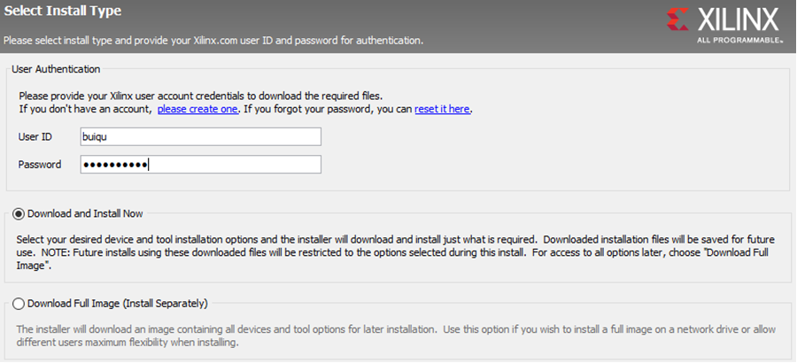
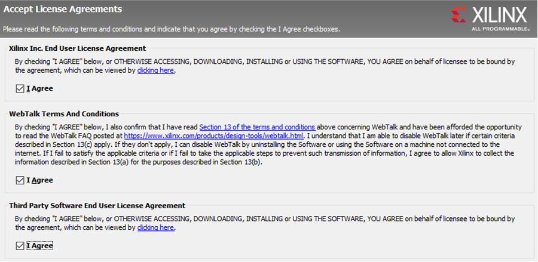
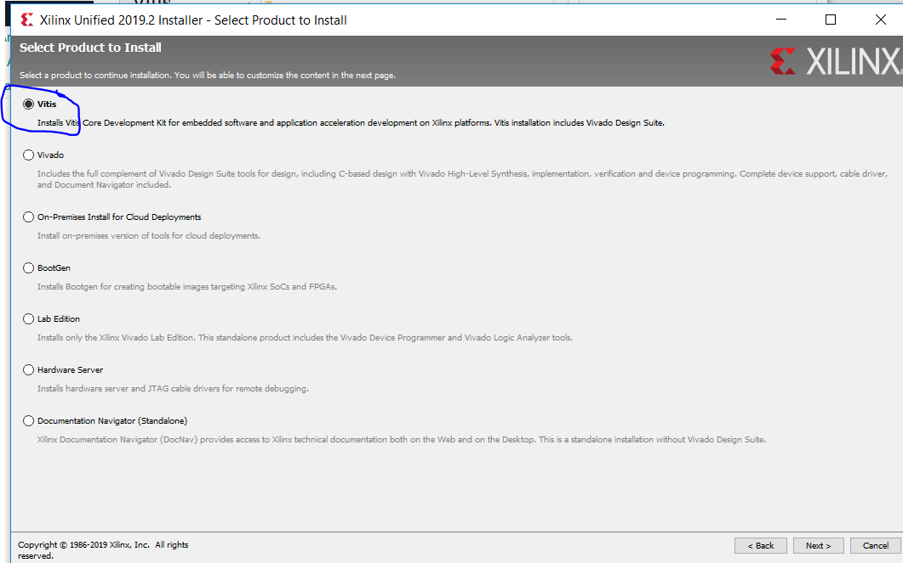
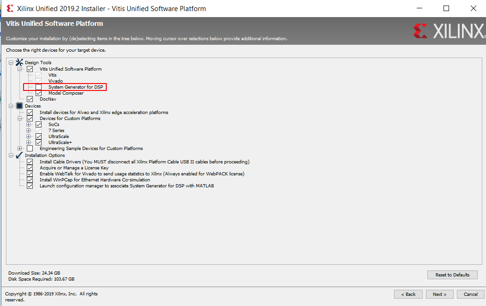
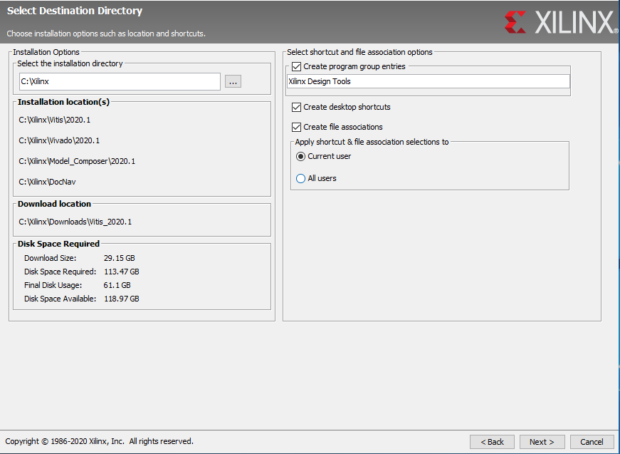

================
Xilinx Toolchain
================

1. `Download Link <https://www.xilinx.com/support/download/index.html/content/xilinx/en/downloadNav/vitis.html>`_ (Xilinx account required)

.. image:: ./images_installation/vitis_website1.png

2. Choose Name, Address, E-Mail, and the rest of the data
3. File ``Xilinx_Unified_2020.1_0602_1208_Win64.exe`` run. Click Next
4. Select Download and Install Now and sign in with your Xilinx user account. Click Next

5. Agree to all license agreements, terms, and conditions. Click Next

6. Select the specific products

7. Install what you want and what you need. It is recommended is to install as shown below. Uncheck `System Generator for DSP` and do not install it because this is not used and can lead to errors in MATLAB since this is a MATLAB-Toolbox.

8. Specify where to install

9. Install

.. image:: ./images_installation/vitis_website7.png

10. Install the ``Vitis Core Development Kit Update 1`` in the same way
