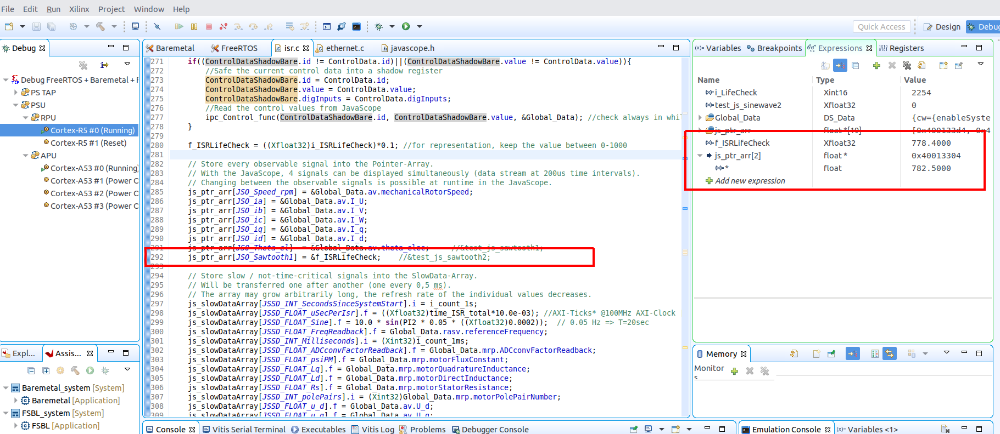
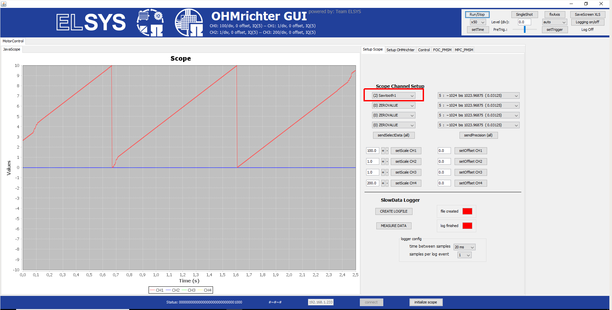
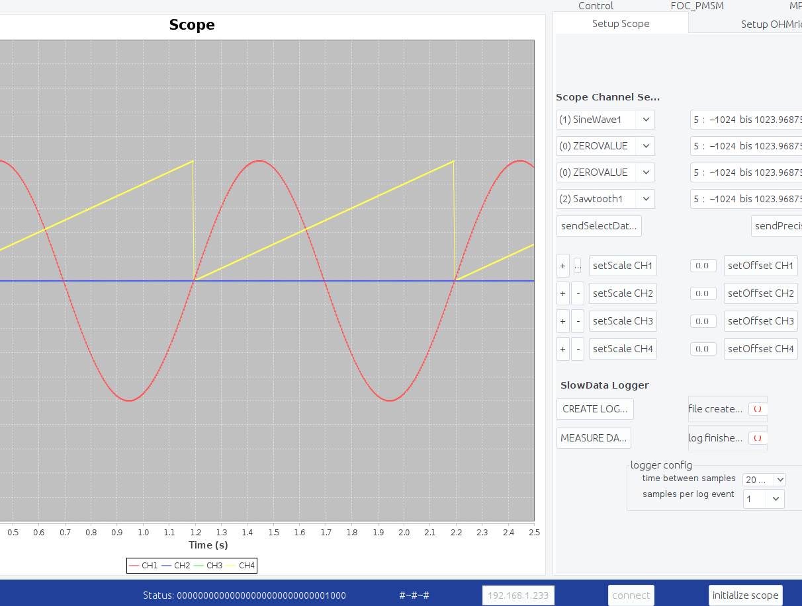

==============================
First steps with the UltraZohm
==============================

Aim of the tutorial
*******************

In this tutorial, the :ref:`GUI` (Javascope) is used to visualize the life check variable of the R5 of the UltraZohm.
Furthermore, a sine wave calculation is added to the interrupt service routine (isr.c) of the R5.
The Javascope is used to visualize the sine wave.

After this tutorial, you can:

- Make changes to the PS of the system
- Build the Vitis project to incorporate the changes
- Transfer the bitstream & software to the UltraZohm
- Start a debug session
- Use the Javascope to visualize variables of the R5

Requirements
************

The following tutorial requires:

- Complete Xilinx Toolchain (Vivado, Vitis) installation
- git installation
- Java installation
- Cloned all UltraZohm repositories from Bitbucket
- UltraZohm connected to your PC by Ethernet and USB (JTAG)

UltraZohm Setup
***************

The UltraZohm has to be connected to a PC by Ethernet and USB (JTAG-Programmer).

.. image:: ./img/physical_setup.jpg

Visualize the life check
************************

The ISR's life check variable (lifecheck) is written to the Javascope struct ``js_ch_observable`` to display it in the Javascope GUI.

.. code-block:: c

    js_ch_observable[JSO_SineWave1] = &lifecheck;
    
Change the variables around, so that the life check will be written to ``js_ch_observable[JSO_Sawtooth1]`` instead.

.. code-block:: c
    
    js_ch_observable[JSO_Sawtooth1] 	= &lifecheck;
    js_ch_observable[JSO_SineWave1]   = &ISRExecutionTime;
    js_ch_observable[JSO_SineWave2]   = &isr_period_us;

Program the UltraZohm and start the debug session (debug-icon).
Start all PS-cores and add ``lifecheck`` to the expressions.
Click on refresh (green rectangle in the picture below) to refresh the current values of the expressions. 

Start the Javscope, connect it to the UltraZohm, click on ``Run/Stop`` to start the Javascope, and choose ``Sawtooth1`` for channel 1.
You might have to change the scale (``setScale CH1``).

Visualize sine wave
*******************

The next step is to add a sine wave and display it on the Javascope.
In the ``javascope.c`` of the R5 the struct ``js_ch_observable[JSO_SineWave1]`` already exists, which we can use.  

Declare a new variable ``test_js_sinewave1``.

.. code-block:: c

   float test_js_sinewave1=0.0;
   
Assign the variable ``test_js_sinewave1`` to the Javascope struct ``js_ch_observable``:

.. code-block:: c

   js_ch_observable[JSO_SineWave1]=&test_js_sinewave1;

Add the following code to the ``JavaScope_update()`` function in the ``javascope.c``. ``uz_SystemTime_GetUptimeInMs`` counts up every 1 millisecond and can be used as the counter:

.. code-block:: c

   test_js_sinewave1 = 10.0 * sin(2.0 * M_PI * uz_SystemTime_GetUptimeInMs()*0.001);
   
Build the code.
Next, start a debug session, start the UltraZohm and the Javascope. You should see the SineWave if the channel ``SineWave1`` is selected.

Finally, if everything worked accordingly, undo the changes made in this chapter. 