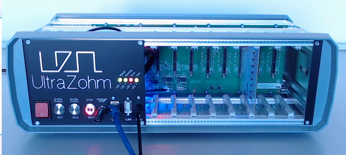

==========================
Virtual Input Output (VIO) 
==========================

Aim of the tutorial
*******************

In this tutorial, the Virtual Input Output (VIO) IP-Core is used to light up LEDs on the optical adapter board.

After this tutorial, you can:

- Connect to the programmed FPGA with Vivado
- Use the VIO
- Test the optical adapter board

Requirements
************

The following tutorial requires:

- Complete UltraZohm Toolchain (Vivado, Vitis, ultrazohm_sw repository)
- UltraZohm connected to your PC by Ethernet and USB (JTAG)
- Optical adapter card in slot D3 (:ref:`dig_optical`)

UltraZohm Setup
***************

The UltraZohm has to be connected to a PC by Ethernet and USB (JTAG-Programmer) and the optical adapter card is in D3.

VIO usage
*********

.. youtube:: jtIzec7ymQA

.. image:: https://images2.imgbox.com/d3/5a/JaM3wGSv_o.gif

Updated information
*******************

VIO IP-Core at `1:02 <https://youtu.be/jtIzec7ymQA?t=62>`_ has a different name now. Furthermore, the output ports are labled **D3_OUT[25:0]** instead of **Dig_Ch4[25:0]**.

.. image:: ./img/Block_Design.png

Furthermore, the selection for the **hw_vio** channel at `1:25 <https://youtu.be/jtIzec7ymQA?t=85>`_ changed aswell. It is now **hw_vio_6** instead of **hw_vio_5**.
