========
CANape
========

.. _CANape:

CANape is a professional measurement, calibration, and diagnostic tool for embedded systems. It is widely used in the automotive industry for analyzing ECU behavior, acquiring measurement data, and calibrating parameters in real time. CANape supports various communication protocols, including XCP (Universal Measurement and Calibration Protocol), which enables high-speed access to internal ECU variables during runtime. With its powerful analysis functions, graphical visualization, and integration into development workflows, CANape helps engineers optimize and validate embedded software efficiently.

Universities can obtain free licenses, while licenses for industrial use are subject to a fee. Please contact your local sales representative for further information.

Use XCP with UltraZohm
----------------------

First of all we need to create an A2L file that contains all the address information of the symbols (e.g. global variables of UltraZohm software). Afterwards this file will be added to the CANape project to visualize measurement signals and stimulate parameters.

Tutorial - create A2L file with ASAP2 Studio
--------------------------------------------

This Tutorial was conducted using ASAP2 Studio 20.0.

1. Open ASAP2 Studio, which is included in the CANape installation package. During the installation process, this tool has to be selected manually.

.. _CANape_A2L_01:

.. figure:: pics/A2L/A2L_01.png
	:width: 30%
	:align: center

2. A blank page will appear.

.. _CANape_A2L_02:

.. figure:: pics/A2L/A2L_02.png
	:width: 90%
	:align: center

3. Create a new database.

.. _CANape_A2L_03:

.. figure:: pics/A2L/A2L_03.png
	:width: 80%
	:align: center

4. Load the MAP file.

.. _CANape_A2L_04:

.. figure:: pics/A2L/A2L_04.png
	:width: 90%
	:align: center

5. Select the ELF file inside the Vitis workspace folder under the baremetal project of the R5-Core. The ELF file is generated during compilation of the Vitis project.

.. _CANape_A2L_05:

.. figure:: pics/A2L/A2L_05.png
	:width: 80%
	:align: center

6. Select "OK".

.. _CANape_A2L_06:

.. figure:: pics/A2L/A2L_06.png
	:width: 60%
	:align: center

7. In the MAP File section, all available variables of your software are shown. As an example, right-click on a variable and add it as a measurement signal ("read object").

.. _CANape_A2L_07:

.. figure:: pics/A2L/A2L_07.png
	:width: 90%
	:align: center

8. All extracted variables from the MAP file are listed in the Overview section.

.. _CANape_A2L_08:

.. figure:: pics/A2L/A2L_08.png
	:width: 90%
	:align: center

9. Besides measurement signals, add a parameter ("write object"). In this example, a parameter struct was generated by a Simulink model.

.. _CANape_A2L_09:

.. figure:: pics/A2L/A2L_09.png
	:width: 90%
	:align: center

10. The new parameter is also listed in the Overview section.

.. _CANape_A2L_10:

.. figure:: pics/A2L/A2L_10.png
	:width: 90%
	:align: center

11. To simplify usage for the user, a verbal value table can be defined (e.g. 0 --> OFF, 1 --> ON).

.. _CANape_A2L_11:

.. figure:: pics/A2L/A2L_11.png
	:width: 80%
	:align: center

12. Select "Goto".

.. _CANape_A2L_12:

.. figure:: pics/A2L/A2L_12.png
	:width: 60%
	:align: center

13. A conversion method was created. Add a new verbal table for this conversion method.

.. _CANape_A2L_13:

.. figure:: pics/A2L/A2L_13.png
	:width: 80%
	:align: center

14. Select "Goto".

.. _CANape_A2L_14:

.. figure:: pics/A2L/A2L_14.png
	:width: 60%
	:align: center

15. Create rows and enter the individual translation from numerical value to text.

.. _CANape_A2L_15:

.. figure:: pics/A2L/A2L_15.png
	:width: 60%
	:align: center

16. If a parameter or measurement signal from a struct is used, the name can become very long. Copy the relevant characters to the "Display identifier". This identifier will be used in the project GUI.

.. _CANape_A2L_16:

.. figure:: pics/A2L/A2L_16.png
	:width: 90%
	:align: center

17. Save the project into a folder, e.g. where the CANape project is located.

.. _CANape_A2L_17:

.. figure:: pics/A2L/A2L_17.png
	:width: 70%
	:align: center

18. Enter a name for this A2L project.

.. _CANape_A2L_18:

.. figure:: pics/A2L/A2L_18.png
	:width: 80%
	:align: center

Tutorial - create CANape project
--------------------------------

CANape Tutorial
===============

This Tutorial was conducted using CANape 24.0.

1. Create a new project and give it a name.

.. _CANape_project_01:

.. figure:: pics/CANape_Project/01.png
	:width: 90%
	:align: center

2. Select a folder as project workspace.

.. _CANape_project_02:

.. figure:: pics/CANape_Project/02.png
	:width: 70%
	:align: center

3. Select "Finish".

.. _CANape_project_03:

.. figure:: pics/CANape_Project/03.png
	:width: 70%
	:align: center

4. A blank CANape project page will appear.

.. _CANape_project_04:

.. figure:: pics/CANape_Project/04.png
	:width: 90%
	:align: center

5. Create "New Device from Database" and select the A2L file.

.. _CANape_project_05:

.. figure:: pics/CANape_Project/05.png
	:width: 90%
	:align: center

6. Type in a name and select XCP.

.. _CANape_project_06:

.. figure:: pics/CANape_Project/06.png
	:width: 80%
	:align: center

7. Select "Next".

.. _CANape_project_07:

.. figure:: pics/CANape_Project/07.png
	:width: 80%
	:align: center

8. Select Ethernet as transportation layer and create a new network.

.. _CANape_project_08:

.. figure:: pics/CANape_Project/08.png
	:width: 80%
	:align: center

9. Either type in an individual name for the network or leave the default "ETH_Network", then press the door exit icon to leave this window.

.. _CANape_project_09:

.. figure:: pics/CANape_Project/09.png
	:width: 80%
	:align: center

10. Select "Next".

.. _CANape_project_10:

.. figure:: pics/CANape_Project/10.png
	:width: 80%
	:align: center

11. Select "MAP file predetermined" and "New".

.. _CANape_project_11:

.. figure:: pics/CANape_Project/11.png
	:width: 80%
	:align: center

12. Browse for a variable description file.

.. _CANape_project_12:

.. figure:: pics/CANape_Project/12.png
	:width: 70%
	:align: center

13. Select the ELF file inside the Vitis workspace folder under the baremetal project of the R5-Core. The ELF file is generated during compilation of the Vitis project.

.. _CANape_project_13:

.. figure:: pics/CANape_Project/13.png
	:width: 80%
	:align: center

14. Select "Yes".

.. _CANape_project_14:

.. figure:: pics/CANape_Project/14.png
	:width: 50%
	:align: center

15. Change the format of the MAP file to "ELF/DWARF, Extended C++ support".

.. _CANape_project_15:

.. figure:: pics/CANape_Project/15.png
	:width: 90%
	:align: center

16. Select "OK".

.. _CANape_project_16:

.. figure:: pics/CANape_Project/16.png
	:width: 80%
	:align: center

17. Select automatically update the MAP file and press "Next".

.. _CANape_project_17:

.. figure:: pics/CANape_Project/17.png
	:width: 80%
	:align: center

18. Select "OK".

.. _CANape_project_18:

.. figure:: pics/CANape_Project/18.png
	:width: 80%
	:align: center

19. The Settings window will open automatically. Change to the subsection "Event List".

.. _CANape_project_19:

.. figure:: pics/CANape_Project/19.png
	:width: 80%
	:align: center

20. Specify 1 µs as time stamp resolution.

.. _CANape_project_20:

.. figure:: pics/CANape_Project/20.png
	:width: 80%
	:align: center

21. Insert a new XCP event. "daq_fast" will be the ISR task of the UltraZohm software and will be called with a frequency specified by the FPGA design (default: PWM frequency). This example uses 10 kHz (= 100 µs). The ISR frequency is flexible, therefore the XCP event can be named "daq_fast" instead of "daq_100us".

.. _CANape_project_21:

.. figure:: pics/CANape_Project/21.png
	:width: 80%
	:align: center

22. Add an XCP event for 1 ms.

.. _CANape_project_22:

.. figure:: pics/CANape_Project/22.png
	:width: 50%
	:align: center

23. Continue adding the XCP events as shown in the following picture. The XCP events must exist in the UltraZohm software driver. Therefore, configure the event channel number correctly.

.. _CANape_project_23:

.. figure:: pics/CANape_Project/23.png
	:width: 80%
	:align: center

24. Accept the changes and close the window.

.. _CANape_project_24:

.. figure:: pics/CANape_Project/24.png
	:width: 80%
	:align: center

25. Right-click on the blank GUI area and add a "Device Window".

.. _CANape_project_25:

.. figure:: pics/CANape_Project/25.png
	:width: 90%
	:align: center

26. Double-click on the device for more settings.

.. _CANape_project_26:

.. figure:: pics/CANape_Project/26.png
	:width: 50%
	:align: center

27. Change to the Protocol section and configure the CTO/DTO size.

.. _CANape_project_27:

.. figure:: pics/CANape_Project/27.png
	:width: 80%
	:align: center

28. Change to the Transport Layer section and configure the Ethernet settings. In some cases, manual IP configuration is restricted by company administrators. In this case, use a link-local IP address (169.254.x.x), which is a self-configured, non-routable address valid only on a local network segment.

.. _CANape_project_28:

.. figure:: pics/CANape_Project/28.png
	:width: 80%
	:align: center

29. Make sure the software is running on the UltraZohm system and perform an XCP connection test under the "Protocol" section.

.. _CANape_project_29:

.. figure:: pics/CANape_Project/29.png
	:width: 80%
	:align: center

30. Connection successfully established.

.. _CANape_project_30:

.. figure:: pics/CANape_Project/30.png
	:width: 60%
	:align: center

31. Open the Measurement Configuration using one of the marked icons.

.. _CANape_project_31:

.. figure:: pics/CANape_Project/31.png
	:width: 90%
	:align: center

32. Fill the DAQ (data acquisition) lists with variables. Right-click on the desired XCP event and insert a signal.

.. _CANape_project_32:

.. figure:: pics/CANape_Project/32.png
	:width: 80%
	:align: center

33. The window shows all variables added from the compiled ELF file to the A2L file. Select variables and press "Apply".

.. _CANape_project_33:

.. figure:: pics/CANape_Project/33.png
	:width: 70%
	:align: center

34. Enable the bus performance view to see Ethernet bus load and transferred data bytes.

.. _CANape_project_34:

.. figure:: pics/CANape_Project/34.png
	:width: 80%
	:align: center

35. To go online, use one of the marked options. The DAQ configuration is uploaded from CANape to the UltraZohm system.

.. _CANape_project_35:

.. figure:: pics/CANape_Project/35.png
	:width: 90%
	:align: center

36. CANape is now online.

.. _CANape_project_36:

.. figure:: pics/CANape_Project/36.png
	:width: 80%
	:align: center

37. Add a Data window to the panel.

.. _CANape_project_37:

.. figure:: pics/CANape_Project/37.png
	:width: 60%
	:align: center

38. Insert measurement signals.

.. _CANape_project_38:

.. figure:: pics/CANape_Project/38.png
	:width: 60%
	:align: center

39. Select the signals and click on "Apply".

.. _CANape_project_39:

.. figure:: pics/CANape_Project/39.png
	:width: 80%
	:align: center

40. Add a Graphic window to the panel.

.. _CANape_project_40:

.. figure:: pics/CANape_Project/40.png
	:width: 60%
	:align: center

41. Insert measurement signals.

.. _CANape_project_41:

.. figure:: pics/CANape_Project/41.png
	:width: 60%
	:align: center

42. Open graphic configuration.

.. _CANape_project_42:

.. figure:: pics/CANape_Project/42.png
	:width: 60%
	:align: center

43. Create a common axis.

.. _CANape_project_43:

.. figure:: pics/CANape_Project/43.png
	:width: 80%
	:align: center

44. Type a name for the axis and configure the default scaling settings.

.. _CANape_project_44:

.. figure:: pics/CANape_Project/44.png
	:width: 70%
	:align: center

45. To load the default scaling, click on "Set home".

.. _CANape_project_45:

.. figure:: pics/CANape_Project/45.png
	:width: 80%
	:align: center

46. Add a Calibration window to the panel.

.. _CANape_project_46:

.. figure:: pics/CANape_Project/46.png
	:width: 60%
	:align: center

47. Insert a calibration object.

.. _CANape_project_47:

.. figure:: pics/CANape_Project/47.png
	:width: 60%
	:align: center

48. Select the A2L file.

.. _CANape_project_48:

.. figure:: pics/CANape_Project/48.png
	:width: 60%
	:align: center

49. Select the parameter.

.. _CANape_project_49:

.. figure:: pics/CANape_Project/49.png
	:width: 80%
	:align: center

50. The parameter value is visible as a drop-down menu as configured in the A2L file.

.. _CANape_project_50:

.. figure:: pics/CANape_Project/50.png
	:width: 60%
	:align: center

51. Variables can also be assigned to instruments by drag-and-drop via the "Symbol Explorer".

.. _CANape_project_51:

.. figure:: pics/CANape_Project/51.png
	:width: 90%
	:align: center

52. Start the signal transmission with the yellow flash icon.

.. _CANape_project_52:

.. figure:: pics/CANape_Project/52.png
	:width: 90%
	:align: center

Finished CANape project with active data transmission.

.. _CANape_project_53:

.. figure:: pics/CANape_Project/53.png
	:width: 90%
	:align: center
