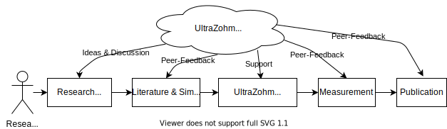
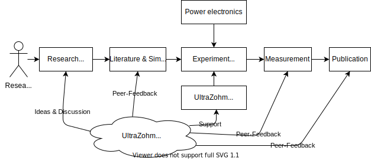
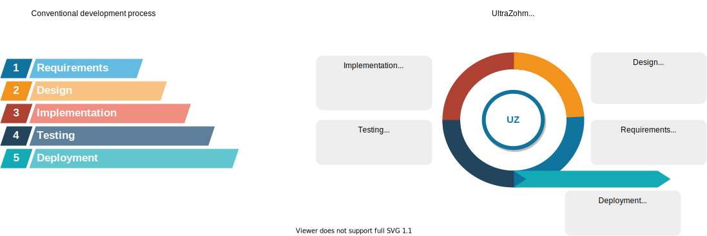

=========
Use-cases
=========

The UltraZohm offers a multitude of use-cases.

- Enabler for research on modern control algorithms for power electronics and electrical drives
- Usage for research in power electronics as a universal control unit in the laboratory
- Development of new products that use the identical SoM as the UltraZohm does to improve time-to-market
- Development of  platform-independent software, IP-Cores, and hardware components utilizing the UltraZohm for rapid prototyping
- Usage for first bring-up of power electronics and electrical drives for testing in the laboratory

Research of control algorithms
******************************

   Use-case for researchers utilizing the UltraZohm to research control algorithms.

Research of power electronics
*****************************

   Use-case for researchers utilizing the UltraZohm to research power electronics.

Development process
*******************

   Use-case for utilizing the UltraZohm in the development of products.