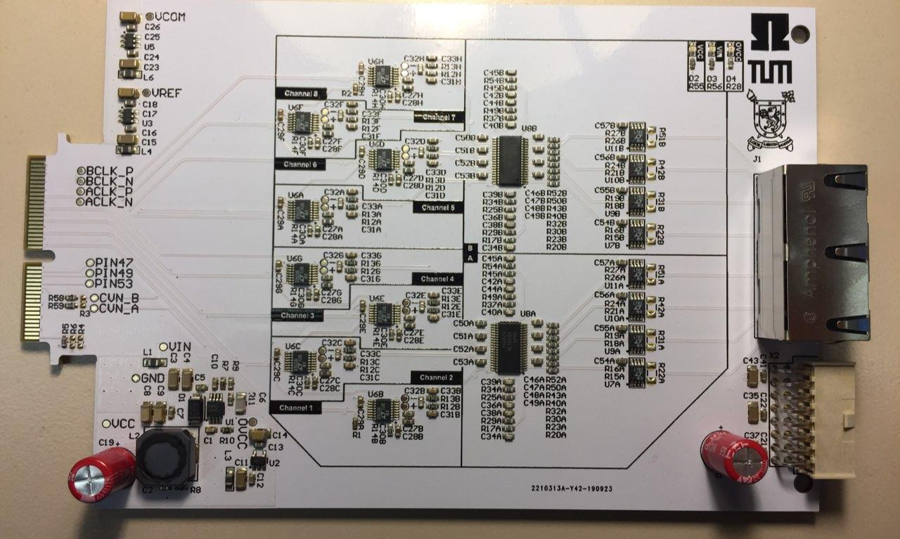
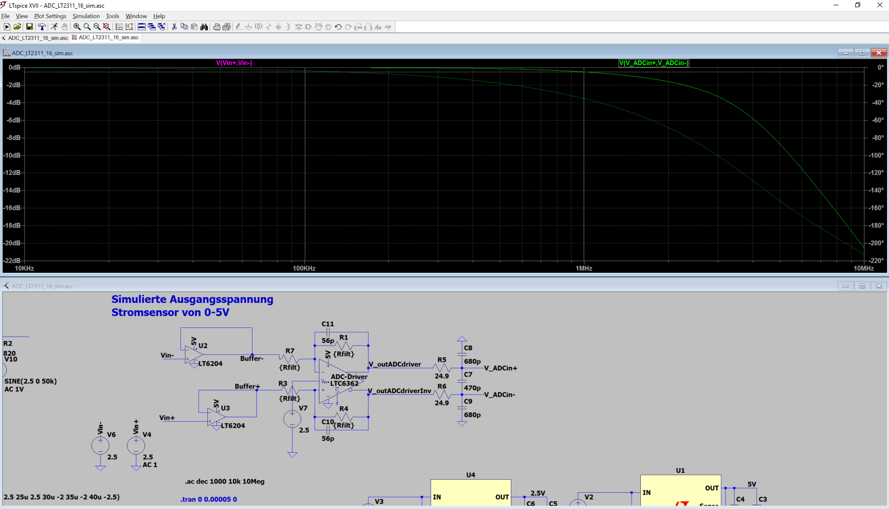

.. _analog_ltc_v2:

=======================
Analog LTC2311-16 2vXX
=======================

Functionality
-----------------------
* Measures 8 differential signals with 16 bits and a maximum of 5 MSPS.
* The 8 measurement channels are fully parallel 
* All ADCs are triggered at the same time

.. image:: LTC2311_16_v2/LTC2311_16_overview.png

1. Current measurement shunt (optional, not populated)
2. Input buffer, i.e. voltage follower, to reduce loading of sensor network
3. Differential amplifier to scale the signal to the ADC input range and 1st order RC filter, 
4. Output filter of differential Op Amp

Before first use
----------------------------
.. note:: 
   For all types of measurements it is recommended to adjust the gains of stage 3 to :math:`{\pm 5}` V to utilize the full input range of the ADC. Initially the gain is set to :math:`g={R_{17}}/{R_{20}} = 1k\Omega/1k\Omega = 1`. 
   
   The crossover frequency of stage 3 can be adjusted by the capacitor in the feedback path C34 and C38. They create a first order low-pass filter with the parallel resistor with :math:`f_\mathrm{cross}=\frac{1}{R_{29}C_{38}} = \frac{1}{1\,\mathrm{k}\Omega \cdot 56\,\mathrm{pF}} = 1.8\, \mathrm{MHz}`. 
   
   Use the LTSpice simulation the find the correct gains for your setup, it is attached at the end of this document. 

Variants
----------------------------
There are four ways to measure an analog signal with this adapter card

1. Fully differential measurement
""""""""""""""""""""""""""""""""""""""""""""""""""""""""""""""""""""""""""""
In_P and In_N are fully differential signals, meaning they inverted signals with a common-mode offset of 2.5V e.g. 

* For 0V input voltage, both In_P and In_N are 2.5V
* For +1V input voltage, In_P is 3V and In_N is 2V
* For -3V input voltage, In_P is 1V and In_N is 3V 

.. image:: LTC2311_16_v2/differential_signal.png
   :width: 500

In this case the input signal can be connected directly to the input pins of the ADC card. The input range is **+-5V**, with an filter crossover frequency of 3MHz.

This will yield the highest signal to noise ratio (SNR) even when using longer cables. For longer cables it is recommended to use a differential line driver on the sensing board of this form:

.. image:: LTC2311_16_v2/differential_signal_over_cable.png
   :width: 500

2. Single-ended measurement with reference to an offset voltage
""""""""""""""""""""""""""""""""""""""""""""""""""""""""""""""""""""""""""""
The negative input In_N is set to a fixed offset voltage, e.g. 2.5V which is often provided by the current sensor. The positive input may vary between 0V to 5V. 

With the standard configuration, only 15-bits of the 16bit ADC are used, because the gain of the differential OpAmp is :math:`{R_{17}}/{R_{20}} = 1k\Omega/1k\Omega = 1`. To overcome this, R17 and R29 (see figure on the right) can be adjusted to get the desired gain to use the full input range of +-5V of the ADC.

Both voltages should be transferred over the same twisted-pair cable as the positive input In_P, to get the same common mode noise on both lines, which is then canceled out by the differential amplifier. 

.. image:: LTC2311_16_v2/single_ended_to_Vcm.png
   :width: 350

3. Single-ended measurement with reference to ground potential
""""""""""""""""""""""""""""""""""""""""""""""""""""""""""""""""""""""""""""
.. warning:: 
   There is a bug on this board that effects this type of measurement, this will be solved in the next version. At the moment it is possible to measure with this setup, but there are some limitations. If possible, this type of measurement should be avoided.
   
The negative input In_N is set to ground which is preferably transferred over the same cable as the measurement singal In_P 
Now the best setup depends on the range of the positive input In_P.

* If In_P is between 0.1V and 4.9V, then you only have to change the feedback resistors.
* If In_P is between -4.9 to +4.9V, it is recommended to remove the voltage follower U_7,9,10,11 respectively. This might lead to a undesired loading of the sensor network. It is recommended to simulate the behavior in LTSpice first. The simulation file is provided at the end.

.. image:: LTC2311_16_v2/single_ended_to_GND.png
   :width: 350

This might load your sensor and is not recommended for measuring current signals with the shunt resistor.

In all cases, you should change the feedback resistors from 1k to 10k to get a more linear behavior, see attached excel sheet. This means all the following 32 resistors (if this is relevant for all 8 channels): R_17,20,23,25,29,30,32,34,40,43,50,52,45,54,49,37

4. Current signal using the shunt resistor R22 
""""""""""""""""""""""""""""""""""""""""""""""""""""""""""""""""""""""""""""
A resistor can be placed between In_P and In_N to terminate a current signal and turn it into a voltage signal that can be measured with this circuit. In this case the voltage follower is absolutely necessary to avoid an undesired current flow into the differential amplifier. 
Besides that it behaves like a single-ended measurement. Depending on the potential of In_N, you can refer to the suggestions in point 2 and 3. It is recommended to use the reference voltage of the sensor as negative input.

Known issues
-----------------------
.. warning::
   * single-ended measurements referenced to ground 
   * only one ADC card can be used at the moment due to problems with the trigger

Compatibility 
----------------------
* Slots A1 to A3 can be used without limitations
 

See also
"""""""""""""""
* :download:`Schematic 2v03 <LTC2311_16_v2/SCH_LTC2311_16_2v03.pdf>`
* :download:`Assembly Drawing 2v03 <LTC2311_16_v2/ASM_LTC2311_16_2v03.pdf>`
* :download:`LTSpice simulation 2v03 <LTC2311_16_v2/ADC_LT2311_16_sim.asc>`
* :download:`Measurements of Variants and their linearity 2v03 <LTC2311_16_v2/ADC_LTC2311_16_v2_Testing.xlsx>`

* IP Core ADC

Designed by 
"""""""""""""""
Thomas Kreppel (TUM), Eyke Liegmann (TUM) in 08/2019

