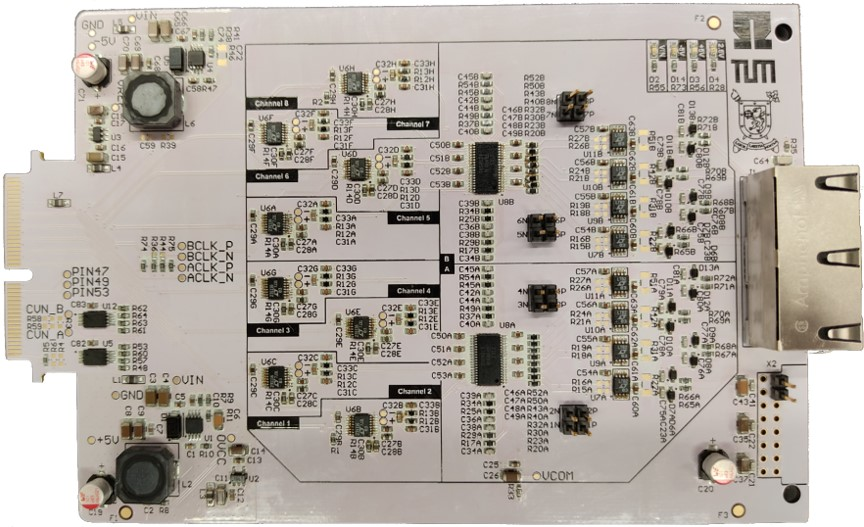
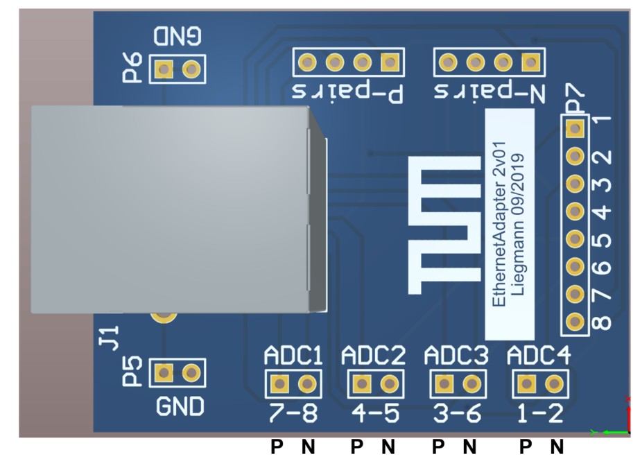
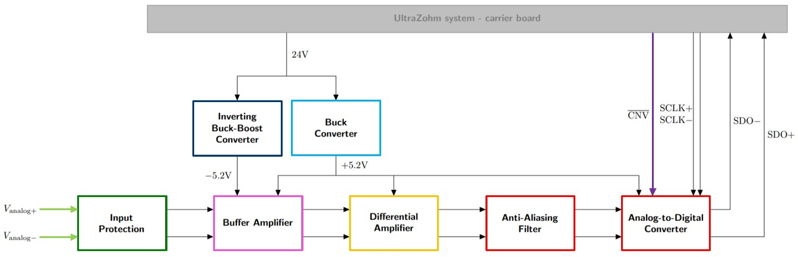
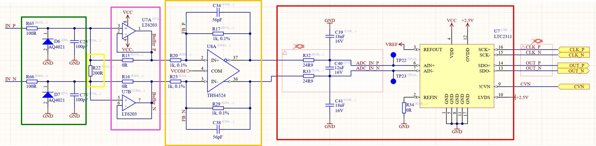
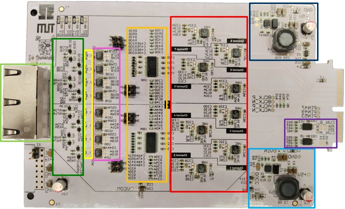
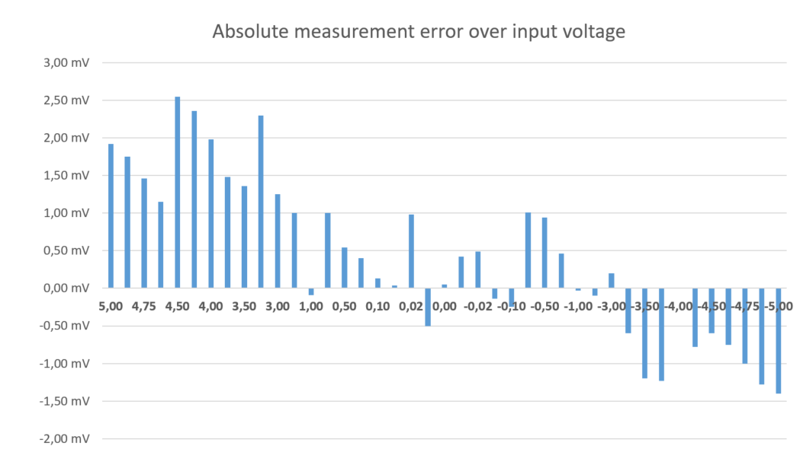
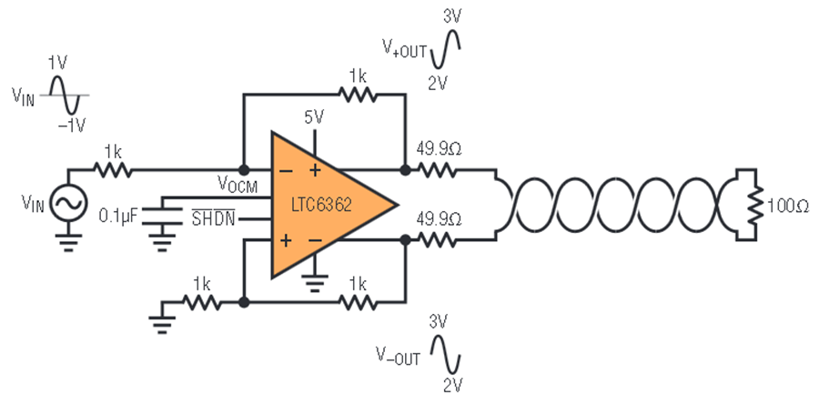
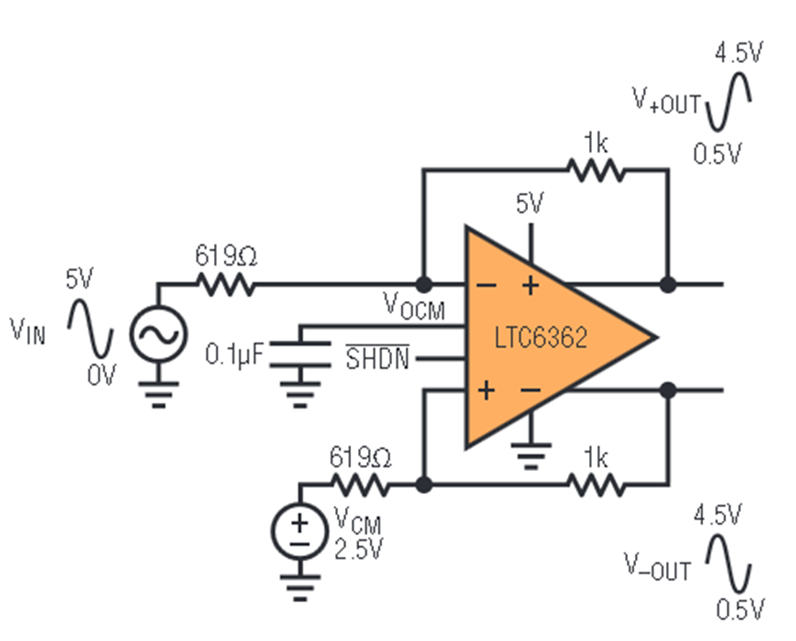
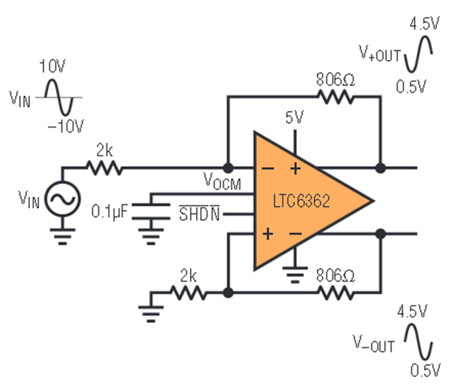
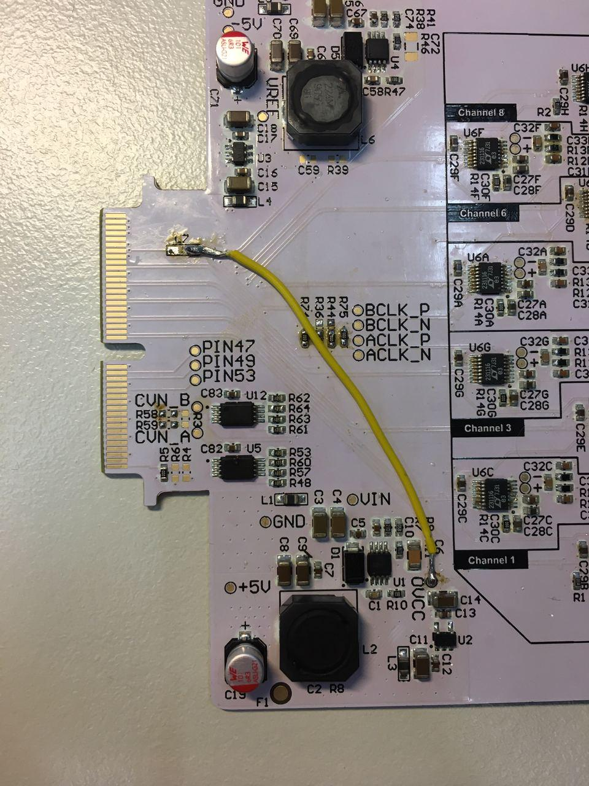

.. _analog_tcl:

=======================
Analog LTC2311-16 3vXX
=======================

* Measurement of 8 differential signals
* Sampling rate of up to 5 MSPS
* Resolution of 16 bit
* Input range is +-5V 
* ADC `LTC2311-16 <https://www.analog.com/media/en/technical-documentation/data-sheets/231116fa.pdf>`_
* ADCs can be triggered in groups of 4.
* Usage of up to three cards possible

Pinout
---------------
The pinout of the RJ45 ethernet plug is **NOT** intuitive, as shown below. 

.. image:: LTC2311_16_v3/RJ45_pinout.png
   :width: 700

Therefore, we provide a breakout board for the RJ45 cable that matches the ADC card. **P** resembles the positive analog input, **N** the negative.

The pairs of the RJ45 ethernet connector map to the ADCs as follows:

=========      ==========================    ==========================    
Connected                         Pin on RJ45                            
---------      -------------------------------------------------------- 
 ADC              :math:`V_\mathrm{in,p}`       :math:`V_\mathrm{in,n}`       
=========      ==========================    ==========================    
ADC 1           7                                8                        
ADC 2           4                                5                          
ADC 3           3                                3                          
ADC 4           1                                2                          
=========      ==========================    ==========================     

Diagramms
-------------
**Block diagram**

**Schematic excerpt** 

**PCB colored**

**From left to right**

Notice, that the picture of the PCB is flipped to match the orientation of the block diagram and schematic. 

================        ===========================================================================
 Color                   Functionality
================        ===========================================================================
light green             Analog inputs on RJ45 
dark green              Input protection (ESD diodes)
yellow                  Measurement shunt resistor (optional, not populated)
pink                    Voltage follower to increase input impedance and avoid loading the sensor
orange                  Differential OpAmp to scale and filter signals
red                     Anti-aliasing filter and ADC
dark blue               Inverting buck-boost converter for -5V
light blue              Buck converter for +5V
purple                  Buffer for CNV signal coming from the FPGA
================        ===========================================================================

Filters
--------------------------
1. The crossover frequency :math:`f_\mathrm{aliasing,-3dB}` of the anti-aliasing filter (red) is formed by the capacitors :math:`C_\mathrm{Diff}` and :math:`C_\mathrm{CM}`. They create a first order low-pass filter with the series resistors :math:`{R_3}` with 

.. math:: 
   f_\mathrm{aliasing,-3dB}=\frac{1}{2 \pi R_0 (2 C_\mathrm{Diff} + C_\mathrm{CM} ) } = \frac{1}{2\pi\ 24.9\,\Omega \cdot (2\cdot16\,\mathrm{nF}  + 12\,\mathrm{nF}) } = 145\, \mathrm{kHz} \,\,.

2. Additionally, :math:`C_\mathrm{f}` and :math:`R_\mathrm{f}` form an active first-order low-pass filter, with 

.. math:: 
   :math:`f_\mathrm{DiffOp,-3dB} = \frac{1}{2\pi R_f C_f} \approx \, 3 \mathrm{MHz}` \,\, .

.. image:: LTC2311_16_v3/op_amp_schematic.jpg
   :width: 800

The resulting transfer function of the signal conditioning stage, i.e. from the RJ45 input connectors to the :math:`V_\mathrm{ADC,in}` (including the buffer and filter stages up to the point where the signal enters the ADC), is measured with the Bode100. The resulting bode plot is depicted below. 

.. image:: LTC2311_16_v3/Bode_152kHzOutput_LT6203.jpg

Measurement accuracy
------------------------------
The signal conditioning stage of the adapter card is validated with a 6 1/2 digit multimeter yielding the following results. This suggests that a measurement error below 2mV can be expected over the full input range.

Before first use
----------------------------
1. For all types of measurements it is recommended to adjust the gains of the differential operational amplifier (orange) to utilize the full input range of the ADC, i.e. :math:`{\pm 5}` V. Initially the gain is set to

.. math:: 

   g=\frac{R_f}{R_g} = \frac{10\,\mathrm{k\Omega}}{10\,\mathrm{k\Omega}} = 1 \,\,. 

.. note :: **Use high precision resistor to set the gains**, i.e. 0.1% or better. 

**The pre-assembled values are**

==========================       =====================================
:math:`{R_f}`                    :math:`{10\,\mathrm{k\Omega}}`
:math:`{R_g}`                    :math:`{10\,\mathrm{k\Omega}}`
:math:`{C_f}`                    :math:`{56\,\mathrm{pF}}` 
:math:`{R_0}`                    :math:`{24.9\,\mathrm{\Omega}}` 
:math:`{C_\mathrm{CM}}`          :math:`{12\,\mathrm{nF}}` 
:math:`{C_\mathrm{Diff}}`        :math:`{16\,\mathrm{nF}}` 
==========================       =====================================

.. note :: You can also use the LTSpice simulation t0 find the correct gains and filter values for your setup. The simulation files are attached at the end of this document. 

Measurement modes
----------------------------
There are four ways to measure an analog signal with this adapter card

* Fully differential
* Single-ended with reference to an offset voltage (bipolar)
* Single-ended with reference to ground potential (unipoar)
* Current signal with a shunt resistor 

.. image::  LTC2311_16_v3/measurement_variants.png
   :width: 250

In all cases the input range is **+-5V**.

1. Fully differential measurement
""""""""""""""""""""""""""""""""""""""""""""""""""""""""""""""""""""""""""""
In_P and In_N are fully differential signals, meaning they inverted signals with a common-mode offset of 2.5V e.g. 

* For 0V input voltage, both In_P and In_N are 2.5V
* For +1V input voltage, In_P is 3V and In_N is 2V
* For -3V input voltage, In_P is 1V and In_N is 3V 

.. image:: LTC2311_16_v2/differential_signal.png
   :width: 500

This will yield the highest signal to noise ratio (SNR) even when using longer cables. For longer cables it is recommended to use a differential line driver on the sensing board of this form:

2. Single-ended measurement with reference to an offset voltage
""""""""""""""""""""""""""""""""""""""""""""""""""""""""""""""""""""""""""""
The negative input In_N is set to a fixed offset voltage, e.g. 2.5V which is often provided by the current sensor. The positive input may vary between 0V to 5V. 
Note that in this case only 15 bits of the 16-bit ADC are used, because the gain of the differential OpAmp is Initially set to 1. To overcome this, adjust the gains as described before.

.. Note :: Both voltages should be transferred over the same twisted-pair cable as the positive input In_P, to get the same common mode noise on both lines, which is then rejected by the differential amplifier. 

3. Single-ended measurement with reference to ground potential
""""""""""""""""""""""""""""""""""""""""""""""""""""""""""""""""""""""""""""
The negative input In_N is set to ground which is preferably transferred over the same cable as the measurement singal In_P 

4. Current signal using the shunt resistor R22, R42
""""""""""""""""""""""""""""""""""""""""""""""""""""""""""""""""""""""""""""
A resistor (package 1206) can be placed between In_P and In_N to terminate a current signal and turn it into a voltage signal that can be measured with this circuit. In this case the voltage follower is absolutely necessary to avoid an undesired current flow into the differential amplifier. 
When sizing the resistor, keep in mind that there are two times 100R in series with the input (e.g. R65 and R66). These should be replaced with 0R. 

.. image:: LTC2311_16_v3/current_mode.jpg
   :width: 600

Known issues
-----------------------
* The buffer ICs (U5, U12) have the wrong supply voltage. 3V3 instead of 1V8 was connected. These ICs are used to buffer the CNV pin for the ADC due to their high fanout. This was fixed by not placing L7 (disconnects 3V3) and adding a bodge wire for supplying the IC with 2V5 from OVCC.

* The formula to calculate the cut-off frequency printed on the back of the PCBs has a typo. The correct formula is stated above, in the sub-section Filters. 

Compatibility 
----------------------
* Slots A1 to A3 can be used without limitations

See also
"""""""""""""""
* :download:`Schematic 3v03 <LTC2311_16_v3/SCH_ADC_LTC2311_16_3v03.pdf>`
* :download:`Assembly Drawing 3v03 <LTC2311_16_v3/ASM_ADC_LTC2311_16_3v03.pdf>`
* :download:`LTSpice simulation <LTC2311_16_v3/UZ_ADC_LTC2311-16_3v3_LTSpice.zip>`
* `Data sheet ADC LTC2311-16 <https://www.analog.com/media/en/technical-documentation/data-sheets/231116fa.pdf>`_
* See also IP Cores->ADC LTC2311

Designed by 
"""""""""""""""
Simon Lukas (TUM), Eyke Liegmann (TUM) in 09/2020

