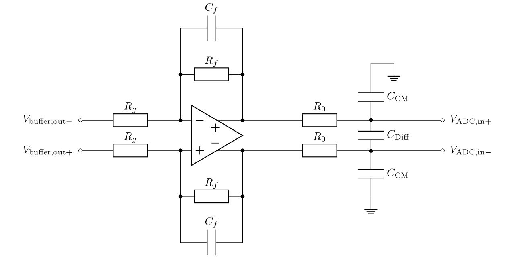

.. _analog_tcl:

=======================
Analog LTC2311-16 3vXX
=======================

.. image:: LTC2311_16_v3/LTC2311_16_v3_PCB.jpg

Functionality
-------------
* Measurement of 8 differential signals
* Sampling rate of up to 5 MSPS
* Resolution of 16 bit
* Input range is +-5V 
* ADC `LTC2311-16 <https://www.analog.com/media/en/technical-documentation/data-sheets/231116fa.pdf>`_
* ADCs can be triggered in groups of 4.
* Usage of up to three cards possible

**Block diagram**

.. image:: LTC2311_16_v3/block_diagram.jpg

**Schematic excerpt** 

.. image:: LTC2311_16_v3/schematic_colored_blocks.jpg

**PCB colored**

.. image:: LTC2311_16_v3/pcb_colored_blocks.jpg

**From left to right**

Notice, that the picture of the PCB is flipped to match the orientation of the block diagram and schematic. 

================        ===========================================================================
 Color                   Functionality
================        ===========================================================================
light green             Analog inputs on RJ45 
dark green              Input protection (ESD diodes)
yellow                  Measurement shunt resistor (optional, not populated)
pink                    Voltage follower to increase input impedance and avoid loading the sensor
orange                  Differential OpAmp to scale and filter signals
red                     Anti-aliasing filter and ADC
dark blue               Inverting buck-boost converter for -5V
light blue              Buck converter for +5V
purple                  Buffer for CNV signal coming from the FPGA
================        ===========================================================================

Before first use
----------------------------
.. note:: 
   For all types of measurements it is recommended to adjust the gains of the differential operational amplifier (orange) to :math:`{\pm 5}` V to utilize the full input range of the ADC. Initially the gain is set to :math:`g=\frac{R_{2}}{R_{1}} = \frac{10k\Omega}{10k\Omega} = 1`. 
   
   **Use high precision resistor to set the gains**, i.e. 0.1% or better. 

   The crossover frequency :math:`f_\mathrm{cross}` of the anti-aliasing filter (red) can be adjusted by the capacitors  :math:`{C_1 \mathrm{and} C_2}`. They create a first order low-pass filter with the series resistors :math:`{R_3}` with :math:`f_\mathrm{cross}=\frac{1}{2\pi R_3 (C_1+C_2} = \frac{1}{1\,\mathrm{k}\Omega \cdot 56\,\mathrm{pF}} = 1.8\, \mathrm{MHz}`. 
   
   Use the LTSpice simulation the find the correct gains for your setup, it is attached at the end of this document. 

   The assembled values are

=================    =======================
:math:`{R_1}`        :math:`{10k\Omega}`      
:math:`{R_2}`        :math:`{10k\Omega}`  
:math:`{R_3}`        :math:`{24.9\Omega}`  
:math:`{C_1}`        :math:`{12nF}`  
:math:`{C_2}`        :math:`{16nF}`  
=================    =======================

.. image::  LTC2311_16_v2/bode_plot.png
   

Variants
----------------------------
There are four ways to measure an analog signal with this adapter card

* Fully differential
* Single-ended with reference to an offset voltage (bipolar)
* Single-ended with reference to ground potential (unipoar)
* Current signal with a shunt resistor 

.. image::  LTC2311_16_v3/measurement_variants.png
   :width: 250

1. Fully differential measurement
""""""""""""""""""""""""""""""""""""""""""""""""""""""""""""""""""""""""""""
In_P and In_N are fully differential signals, meaning they inverted signals with a common-mode offset of 2.5V e.g. 

* For 0V input voltage, both In_P and In_N are 2.5V
* For +1V input voltage, In_P is 3V and In_N is 2V
* For -3V input voltage, In_P is 1V and In_N is 3V 

.. image:: LTC2311_16_v2/differential_signal.png
   :width: 500

In this case the input signal can be connected directly to the input pins of the ADC card. The input range is **+-5V**, with an filter crossover frequency of 3MHz.

This will yield the highest signal to noise ratio (SNR) even when using longer cables. For longer cables it is recommended to use a differential line driver on the sensing board of this form:

.. image:: LTC2311_16_v2/differential_signal_over_cable.png
   :width: 500

2. Single-ended measurement with reference to an offset voltage
""""""""""""""""""""""""""""""""""""""""""""""""""""""""""""""""""""""""""""
The negative input In_N is set to a fixed offset voltage, e.g. 2.5V which is often provided by the current sensor. The positive input may vary between 0V to 5V. 

With the standard configuration, only 15-bits of the 16bit ADC are used, because the gain of the differential OpAmp is :math:`{R_{17}}/{R_{20}} = 1k\Omega/1k\Omega = 1`. To overcome this, R17 and R29 (see figure on the right) can be adjusted to get the desired gain to use the full input range of +-5V of the ADC.

Both voltages should be transferred over the same twisted-pair cable as the positive input In_P, to get the same common mode noise on both lines, which is then canceled out by the differential amplifier. 

.. image:: LTC2311_16_v2/single_ended_to_Vcm.png
   :width: 350

3. Single-ended measurement with reference to ground potential
""""""""""""""""""""""""""""""""""""""""""""""""""""""""""""""""""""""""""""

The negative input In_N is set to ground which is preferably transferred over the same cable as the measurement singal In_P 
Now the best setup depends on the range of the positive input In_P.

* If In_P is between 0.1V and 4.9V, then you only have to change the feedback resistors.
* If In_P is between -4.9 to +4.9V, it is recommended to remove the voltage follower U_7,9,10,11 respectively. This might lead to a undesired loading of the sensor network. It is recommended to simulate the behavior in LTSpice first. The simulation file is provided at the end.

.. image:: LTC2311_16_v2/single_ended_to_GND.png
   :width: 350

This might load your sensor and is not recommended for measuring current signals with the shunt resistor.

In all cases, you should change the feedback resistors from 1k to 10k to get a more linear behavior, see attached excel sheet. This means all the following 32 resistors (if this is relevant for all 8 channels): R_17,20,23,25,29,30,32,34,40,43,50,52,45,54,49,37

4. Current signal using the shunt resistor R22, R42
""""""""""""""""""""""""""""""""""""""""""""""""""""""""""""""""""""""""""""
A resistor can be placed between In_P and In_N to terminate a current signal and turn it into a voltage signal that can be measured with this circuit. In this case the voltage follower is absolutely necessary to avoid an undesired current flow into the differential amplifier. 
Besides that it behaves like a single-ended measurement. Depending on the potential of In_N, you can refer to the suggestions in point 2 and 3. It is recommended to use the reference voltage of the sensor as negative input.

Known issues
-----------------------
* The buffer ICs (U5, U12) have the wrong supply voltage. 3V3 instead of 1V8 was connected. These ICs are used to buffer the CNV pin for the ADC due to their high fanout. This was fixed by not placing L7 (disconnects 3V3) and adding a bodge wire for supplying the IC with 2V5 from OVCC.

.. image:: LTC2311_16_v3/ADC_jumper_wire_foto.jpg
   :height: 400

* The formula to calculate the cut-off frequency printed on the back of the PCBs has a typo. The correct formula is:

Compatibility 
----------------------
* Slots A1 to A3 can be used without limitations

See also
"""""""""""""""
* :download:`Schematic 3v03 <LTC2311_16_v3/SCH_ADC_LTC2311_16_3v03.pdf>`
* :download:`Assembly Drawing 3v03 <LTC2311_16_v3/ASM_ADC_LTC2311_16_3v03.pdf>`
* :download:`LTSpice simulation 3v03 <LTC2311_16_v3/ADC_LT2311_16_sim.asc>`
* `Data sheet ADC LTC2311-16 <https://www.analog.com/media/en/technical-documentation/data-sheets/231116fa.pdf>`_
* See also IP Cores->ADC LTC2311

Designed by 
"""""""""""""""
Simon Lukas (TUM), Eyke Liegmann (TUM) in 09/2020

