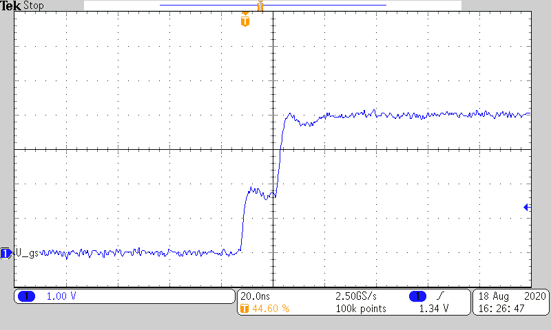
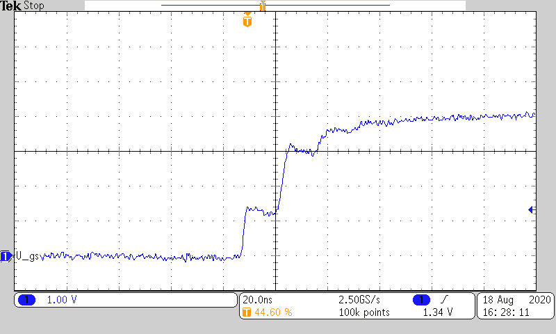
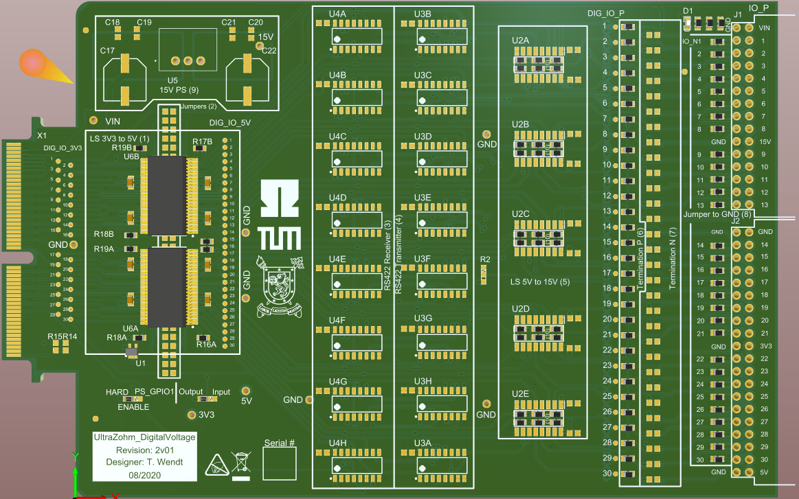
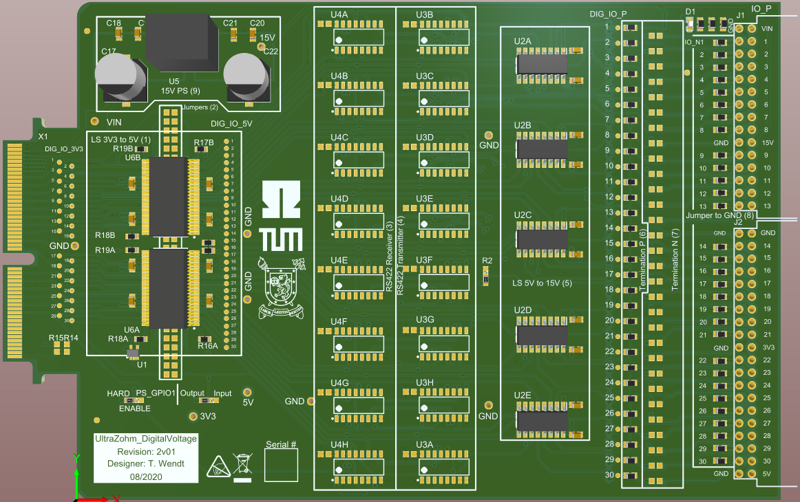
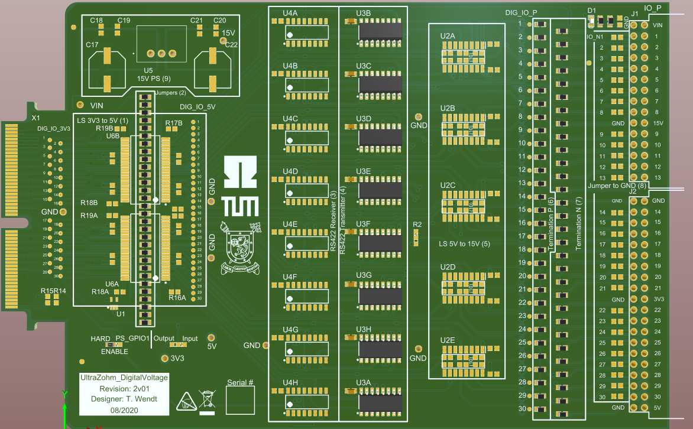
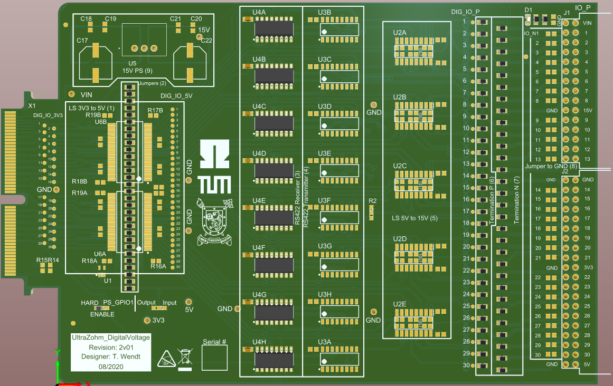
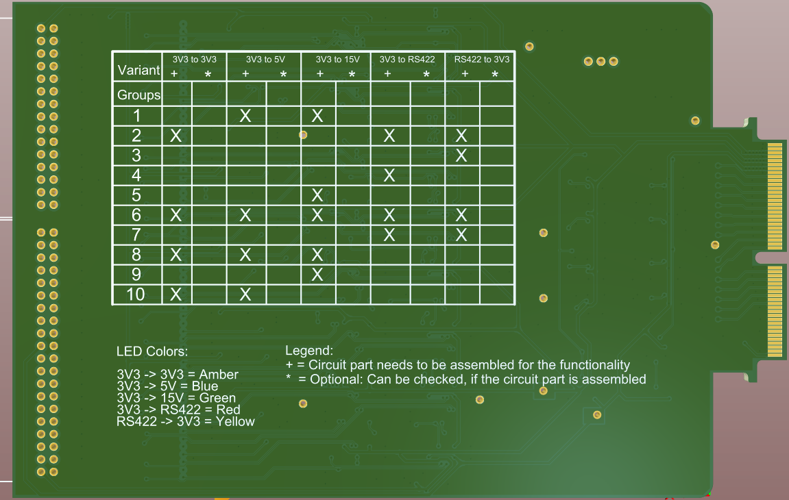

=======================
Digital Voltage 3U 2v01
=======================

Designed by Thilo Wendt (TH Nürnberg), 08/2020

.. image:: files_digital_voltage_2v01/pcb_second_complete.png
   :width: 500px
   
General description
"""""""""""""""""""

Functionality
-------------

The different functions are realized by the use of assembly variants. The following variants exist:

* 3.3V to 3.3V (Input and Output)
* 3.3V to 5V (Input or Output)
* 3.3V to 15V (Output)
* 3.3V to RS422 differential signals (Output)
* RS422 differential signals to 3.3V (Input)

The selected variant is indicated by the LED on the top right corner.

The PCB is grouped in 10 groups that all fulfill a purpose. On the bottom side of the PCB you can find a
table where the required groups for a certain functionality are marked and a second row where you can check
the mounted groups. You can find a description of the LED colors as well. The functional groups are the following:

1. Level Shifter from 3.3V to 5V (Part: `SN74LVCH16T245DLR <http://www.ti.com/lit/gpn/sn74lvch16t245>`_ from Texas Instruments)
2. Jumpers to bypass (1) if (1) is not required
3. RS422 receiver (Part: `DS26LV32ATMX <https://www.ti.com/lit/ds/symlink/ds26lv32at.pdf>`_ from Texas Instruments)
4. RS422 transmitter (Part: `DS26C31TMX <https://www.ti.com/lit/gpn/ds26c31t>`_ from Texas Instruments)
5. Level Shifter from 5V to 15V (Part: `MC14504BDR2G <http://www.onsemi.com/pub/Collateral/MC14504B-D.PDF>`_ from ON Semi)
6. Termination resistors for the positive differential signals respectively the signal path in case of single ended signals
7. Termination resistors for the negative differential signals
8. Jumpers to ground in case of single ended transmission
9. 15V Power supply
10. Jumpers to bypass (5) if not required

IO Interface
------------

In order to enable maximal user flexibility and to save costs, the PCB comes without an IO interface connector. Originaly, the
PCB has been designed for the Samtec `IPL1-120-01-L-D-RA-K <https://www.samtec.com/products/ipl1-120-01-l-d-ra-k>`_
and `IPL1-115-01-L-D-RA-K <https://www.samtec.com/products/ipl1-115-01-l-d-ra-k>`_ connectors but any connector with
a 1" (2.54mm) pin pitch can be used. 

The appropriate plug for the IPL1-115-01-L-D-RA-K is the `IPD1-15-D-K <https://de.farnell.com/samtec/ipd1-15-d-k/buchsengeh-use-30pos-nylon-2-54mm/dp/2984590?ost=2984590>`_
and for the IPL1-120-01-L-D-RA-K it is the `IPD1-20-D-K <https://de.farnell.com/samtec/ipd1-10-d-k/stecker-2-54mm-crimp-20pol/dp/2308543?st=ipd1-20-d-k>`_ .
Additionally, the crimp contact 
`CC79L-2630-01-L <https://de.farnell.com/samtec/cc79l-2630-01-l/buchsenkontakt-30-26awg-ipd1-crimp/dp/2308509?ost=cc79l%E2%80%932630%E2%80%9301%E2%80%93l>`_
is required.

Alternatively, a twisted pair ribbon cable with a 1" pitch can be used. At a cabel length of about 1m, reflections start to be an issue. When using a different cable with a
different characteristic impedance, the termination resistor may be tuned. This can be done by connecting an open ended cable of about 2m and by measuring the output signal 
at the termination resistor. The waveform below shows a typical signal of well compensated signal.

It is recommended to use the PCB with a 100Ohm twisted pair cabel (e.g. CAT6). 
Concerning the termination, the PCB has been tested with an open ended CAT5 cabel with a characteristic impedance of 100Ohms. 
The following values for the serial have been termination resistors have been found:

* 91Ohm for 5V single ended output (only group (6) must be mounted in this case)
* 47Ohm for differential transmission ((6) and (7) must be mounted for differential transmission)

Performance
-----------

.. csv-table:: Propagation delay and rise and fall times. r.e. = rising edge, f.e. = falling edge
  :file: files_digital_voltage_2v01/performance.csv
  :widths: 50 30 30 30 30
  :header-rows: 1

Further documentation
---------------------

A ZIP file with comprehensive documentation can be downloaded 
:download:`here <files_digital_voltage_2v01/UltraZohm_DigitalVoltage_2v01_public_docs.zip>`. It contains

- DOC

	* Schematics of all assembly variants
	* 3D views
	
- ASM

	* Assembly drawings of all assembly variants
	
- BOM

	* Bill of material for all assembly variants
	
Technical background
""""""""""""""""""""

In order to control reflections on the transmission lines between the driver and the receiver, controlled impedance routing has been performed in this project.
In the draftsman output in the :download:`ZIP file <files_digital_voltage_2v01/UltraZohm_DigitalVoltage_2v01_public_docs.zip>`, the layer stack is shown.
The impedance of the traces on th PCB must match the impedance of the cabel that connects the adapter board with the input of the receiver. This is achieved by
controlling the dimensions of the dielectric material between the signal layer and the ground reference plane.

In order to avoid multiple reflections, termination must be applied, if the leads between the driver and the receiver exceed a certain length, which depends on the
steepness of the slopes induced by the driver. In this project this length is about 1m for the level shifter from 3.3V to 5V and for the RS422 drivers. The 15V drivers
are less critical because the have lower steepness.

Since the adapter board is mainly designed for point to point connections and because the operational frequencies are relatively low, the simple serial termination
technique can be applied. With serial termination the signal gets reflected at the far end of the transmission line and it is absorbed by a resistor 
placed in series behind the driver that matches the characteristic impedance of the transmission line. In the waveform shown above this procedure can be observed:
The output impedance of the driver in series with the termination resistor forms a 1:1 voltage devider with the transmission line. This creates the plateau at 50% of the
signal level. After one round trip the signal adds up to the full level. The two figures below show overcompensated (the termination resistor is too big) and
undercompensated cases (the termination resistor is too small).

	
	Serial termination with a termination resistor that is too big.
	
.. figure:: files_digital_voltage_2v01/diff_10ohm.png
	:width: 500px
	:alt: Serial termination with a termination resistor that is too small.
	
	Serial termination with a termination resistor that is too small.
	
The figures also illustrate that the serial termination method is only suitable for point to point connections because a receiver in between would observe the plateau
during the signal round trip. Only the receiver at the far end observes a proper edge with the full signal level. If multipoint signal distribution is required, parallel
termination is the method of choice. The downside of parallel termination is the big DC current flow due to the parallel resistor to ground at the receiver side. If you
wish to implement an application like this please be aware of the current limit set by the carrier board and by the driver.

Compatibility 
"""""""""""""
Slots D1 to D4 can be used without limitations

See also
""""""""

* `CPLD software git <https://bitbucket.org/ultrazohm/cpld_lattice/>`_
* :ref:`label_cpld_programming`

Appendix
---------

The following figures show the different assembly variants.

.. figure:: files_digital_voltage_2v01/3V3_to_3V3.png
	:width: 500px
	:alt: Digital Adapter Board: 3.3V to 3.3V
	
	Digital Adapter Board: 3.3V to 3.3V. The signals from the carrier board are just piped through.
	

	
	Digital Adapter Board: 3.3V to 5V

	

	
	Digital Adapter Board: 3.3V to 15V
	
	

	
	Digital Adapter Board: 3.3V to RS422 differential signals (output)
	
	

	
	Digital Adapter Board: RS422 differential signals to 3.3V (input)
	
	

	
	Table on the bottom side of the PCB.