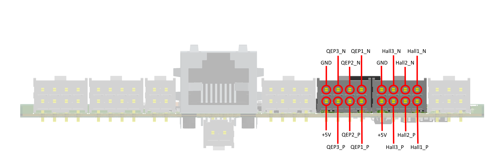
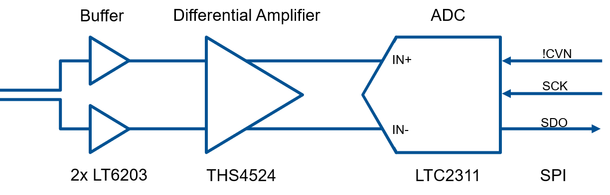

.. _dig_encoder_v1:

==========================
Digital Encoder 1v00
==========================

.. image:: encoder_v1/3D_View_Top.png
   :height: 500

Functionality
-----------------------
Supports the following encoder types:

* **Resolver**: Fully integrated Resolver controller with excitation signal generation, serial interface and optional absolute encoder emulation (shared with one digital hall channel)
* **Digital Hall**: Differential or single ended hall signals
* **Incremental Encoder**: Differential or single ended incremental encoder
* **Analog Hall**: Four differential analog channels, three on RJ45 connector, one on header, serial communication to ADCs
* **Absolute Encoder**: Hardware compatible to SSI, BiSS and others

Detailed Description
-----------------------
The UltraZohm Sensor Board features a variety of different industrial standard interfaces. This makes the board the perfect solution for flexible use in testing environments. 
It supports incremental encoders, resolvers, analog and digital hall sensors as well es absolute encoders via serial connection.
Most of the interfaces can be used simultaneously, which allows for either using many sensors in parallel or for evaluating different sensor systems at once. 
With many placement options the sensor board can be customized to serve the needs of specific applications.

Before first use
----------------------------
* Determine correct placement options for correct function
* Program CPLDs with firmware, see :ref:`label_cpld_programming` for details

Known issues
-----------------------
none

Compatibility (TODO)
----------------------
* TODO

Pinout
----------------------

.. image:: encoder_v1/3D_View_Sideview2_Comments.png
   :height: 500

Interfaces in Detail
-----------------------

Resolver
"""""""""""""""""""""""""""

.. image:: encoder_v1/3D_View_Connectors_Resolver.png
   :height: 300

The resolver interface is equipped with AD2S1210 from Analog Devices. It features excitation signal generation, 10-/12-/14-/16-bit resolution ADC, SPI or parallel interface (currently only SPI is supported), incremental encoder emulation and simple configuration by pullup/pulldown choices.
The devices works in one of three modes selectable by hardware inputs A0 and A1. In position mode, the corresponding data can be obtained directly by toggling the clock line without sending register adresses first. The same applies for velocity mode. Those two are also called normal modes. In the third mode, the configuration mode, allows for further access on the devices registers and configuration. In this mode it is possible to change the excitation frequency or also read back position and velocity data. Only in this mode the ADC resolution can be changed, ignoring the external resistor configuration.

.. figure:: encoder_v1/Position_Plot.png
  :width: 1000
  
  Position Data from Resolver
  
.. figure:: encoder_v1/Velocity_Plot2.png
  :width: 1000
  
  Velocity Data from Resolver

When communicating with the controller, attention has to be payed on the SPI mode. The correct one is MODE1 with clock polarity idle low and clock phase one meaning falling edge.

.. figure:: encoder_v1/Resolver_Data_Transmission_Normal_Mode.png
  :width: 1000
  
  Data Transmission in normal mode (position or velocity), yellow: MISO, blue: FSYNC, red: CLK

.. figure:: encoder_v1/Resolver_Data_Transmission_Config_Mode.png
  :width: 1000
  
  Data Transmission in config mode, yellow: MISO, blue: FSYNC, red: CLK

Digital Hall
"""""""""""""""""""""""""""

Digital inputs provide connectivity for hall sensors. The inputs are called Hallx and QEPx but work identically. In standard configuration the interface works with differential signal pairs. In the first stage a differential to single ended converter provides a logic level signal with 5V level. A level shifter then sets the signals to 3.3V levels.

.. image:: encoder_v1/Digital_Hall_Schematic.png
   :height: 300

In case the signals are single ended the differential to single ended converter can be bypassed with jumper resistors. If the logic level of those signals is 3.3V already the level shifter can be bypassed as well.

Absolute Encoder
"""""""""""""""""""""""""""

.. image:: encoder_v1/3D_View_Connectors_Absolute_Encoder.png
   :height: 300

Fully integrated absolute encoders with industrial standard interfaces like SSI can be connected to the absolute encoder interface of the board. On Hardware level this board provides two RS485 transceivers. Their direction is controlled by specific control lines and they can be used either as serial data, serial clock or other functions, depending on the encoder interface. The 5V level control and data lines to the transceivers are routed to a level shifter and then to the IO-connector.

.. image:: encoder_v1/Absolute_Encoder_Schematic.png
   :height: 300

Placement options provide usage with different interface specifications.

Analog Hall
"""""""""""""""""""""""""""

.. image:: encoder_v1/3D_View_Connectors_Analog_Hall.png
   :height: 300

The analog hall interface is based on the UltraZohm analog board. It is equipped with four independant channels. Each ADC has a serial interface for reading data.

See also (TODO)
"""""""""""""""
* :download:`Schematic 1v00 <incr_encoder_v1/SCH_UltraZohm_Digital_Incremental_Encoder_1v0.pdf>`
* :ref:`label_cpld_programming`

Designed by 
"""""""""""""""
Thomas Effenberger (TUM) in 12/2020
