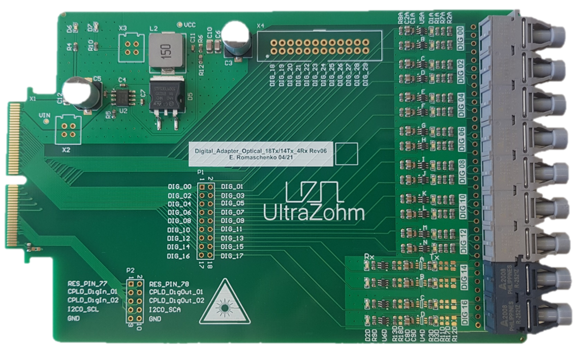
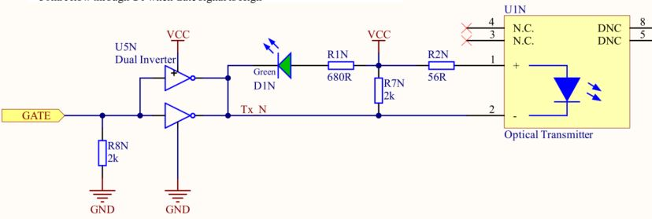
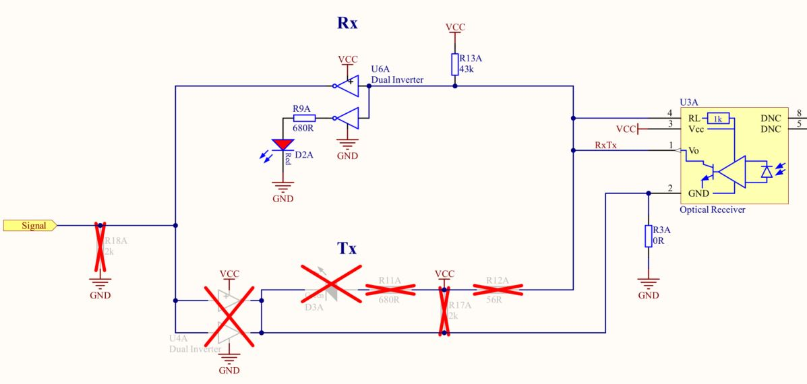
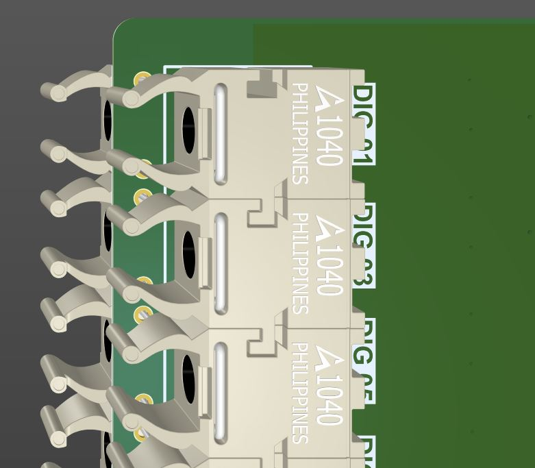

.. _dig_optical_rev06:

==============================
Digital Optical 14Tx4Rx Rev06
==============================

Functionality
-------------
* Transmits up to 14 optical signals, e.g. gate signals. 
* Receives up to 4 optical signals, e.g. error signals. 
* LEDs on PCB signaling the state of the Transmitter/Receiver

Logic table
-----------
The underlying logic is that 

* logic HIGH = LED/Transmitter/Receiver ON
* logic LOW = LED/Transmitter/Receiver OFF

Transmitter Logic 
""""""""""""""""""

   
   
.. list-table:: Logic table transmitter 
   :widths: 25 25 25 25
   :header-rows: 1

   * - GATE
     - Node Tx_N
     - Transmitter LED U1
     - LED D1
   * - LOW
     - HIGH
     - OFF
     - OFF
   * - HIGH
     - LOW
     - ON
     - ON

Receiver Logic 
"""""""""""""""

.. list-table:: Logic table receiver 
   :widths: 25 25 25 25
   :header-rows: 1

   * - Receiver Diode U3
     - Node RxTx
     - Signal
     - LED D2
   * - NO Light
     - HIGH
     - LOW
     - OFF
   * - RED Light
     - LOW
     - HIGH
     - ON

Before first use
----------------
Solder in up to 14 transmitters and 4 receivers. 

* optical transmitters: **Broadcom HFBR-1521Z**
* optical receiver: **Broadcom HFBR-2521Z**

1. Click the optical transmitter and receiver together before soldering them
#. Solder the transmitter/receivers on the top side of the PCB first
#. Shorten the through-hole pins of the transmitter/receivers that now stick out on the bottom side of the PCB.
#. Solder the transmitter/receivers on the bottom side. Through-hole pins 5 and 8 are covered by the components on the top side. This is no problem, they do not have to be soldered, since they do not carry any electrical signal. As can be seen in the screenshot below, they are marked with DNC. 
#. Program CPLDs with firmware, see :ref:`label_cpld_programming` for details. Note, that the signals are simply passed through the CPLD. 
#. Optionally, additional functionality can be implemented in the CPLD, e.g. checking for invalid switching combinations or introducing a dead time.
#. (optional) Manual rework allows to exchange the 4 receiver channels to 4 transmitter channels, resulting in up to 18 transmitter channels, check Schematic and Assembly Drawing at the end of this page for the necessary changes.

.. image:: optical_14tx4rx_rev06/pcb_top_view_closeup.jpg
   :height: 250

Known issues
------------
No known issues

Compatibility 
-------------
* Only compatible with **CarrierBoard Rev04 and later**, since the edge-connector has no chamfer (angle)
* Slots D1 to D4 can be used without limitations, if CPLD is programmed correctly

References
----------
* :download:`Schematic 14Tx4Rx <optical_14tx4rx_rev06/SCH_Digital_Optical_14Tx4Rx_Rev06.pdf>`
* :download:`Assembly Drawing 14Tx4Rx <optical_14tx4rx_rev06/ASM_Digital_Optical_14Tx4Rx_Rev06.pdf>`
* :download:`Schematic 18Tx <optical_14tx4rx_rev06/SCH_Digital_Optical_18Tx_Rev06.pdf>`
* :download:`Assembly Drawing 18Tx <optical_14tx4rx_rev06/ASM_Digital_Optical_18Tx_Rev06.pdf>`
* :ref:`label_cpld_programming`

Designed by 
"""""""""""""""
Eugen Romanschenko (TUM), Eyke Liegmann (TUM) in 04/2021
