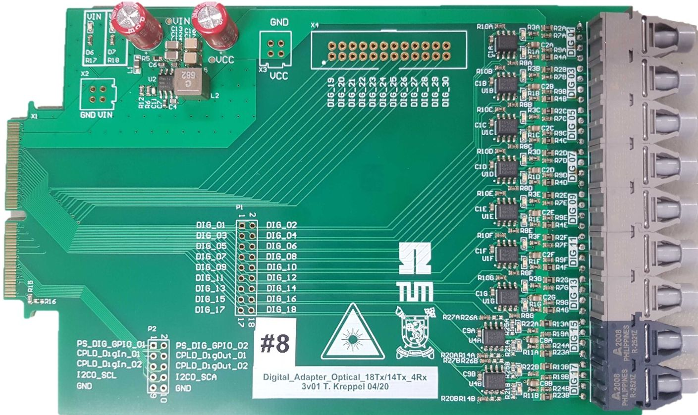
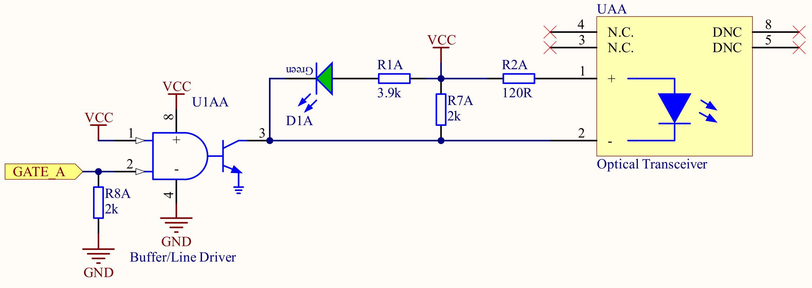
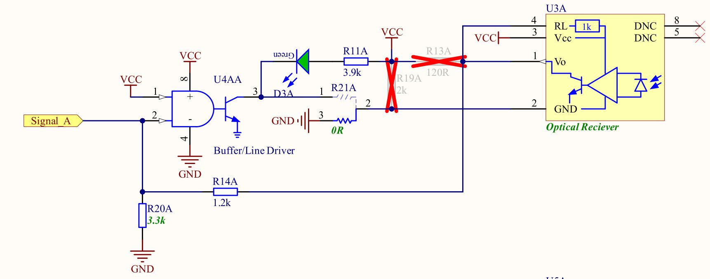

.. _dig_optical_3v01:

=================================
Digital Optical 18Tx_14Tx4Rx 3v01
=================================

Functionality
-------------
* Standard configurations transmits up to 18 optical signals, e.g. gate signals. 
* Can be modified to receive up to 4 optical signals, e.g. error signals. 
* LEDs on PCB signaling the state of the transmitter

Logic table
-----------

Transmitter Logic 
""""""""""""""""""

* GATE Logic HIGH = LED/Transmitter ON
* GATE Logic LOW = LED/Transmitter OFF

   
   
.. list-table:: Logic table transmitter 
   :widths: 25 25 25 25
   :header-rows: 1

   * - GATE_A
     - Output of U1AA (pin3)
     - LED D1A
     - Transmitter LED UAA
   * - LOW
     - HIGH
     - OFF
     - OFF
   * - HIGH
     - LOW
     - ON
     - ON

Receiver Logic 
"""""""""""""""

.. warning:: 
     The receiver logic is inverted!
     
     * Receiver Light ON  = Signal_A Logic LOW
     * Receiver Light OFF = Signal_A Logic HIGH

.. list-table:: Logic table receiver 
   :widths: 25 25 25
   :header-rows: 1

   * - Receiver Diode U3
     - Signal_A
     - LED D3
   * - Light ON
     - LOW
     - ON
   * - Light OFF
     - HIGH
     - OFF

Before first use
----------------
Solder in up to 18 transmitters **Broadcom HFBR-1521Z**

1. Click the optical transmitter and receiver together before soldering them
#. Solder the transmitter/receivers on the top side of the PCB first
#. Shorten the through-hole pins of the transmitter/receivers that now stick out on the bottom side of the PCB.
#. Solder the transmitter/receivers on the bottom side. Through-hole pins 5 and 8 are covered by the components on the top side. This is no problem, they do not have to be soldered, since they do not carry any electrical signal. As can be seen in the screenshot below, they are marked with DNC. 
#. Program CPLDs with firmware, see :ref:`label_cpld_programming` for details. Note, that the signals are simply passed through the CPLD. 
#. Optionally, additional functionality can be implemented in the CPLD, e.g. checking for invalid switching combinations or introducing a dead time.
#. (optional) Manual rework allows to exchange the 4 receiver channels to 4 transmitter channels, resulting in up to 18 transmitter channels, check Schematic and Assembly Drawing at the end of this page for the necessary changes.

Additional features
""""""""""""""""""""""
Manual rework allows to exchange the 4 transmitter channels to 4 receiver channels, resulting in 14 transmitter and 4 receiver channels. 
To change from transmitter to receiver, you need to change the following components:

#. Unsolder R13, R19, R23, R24
#. Change solder position of R21 and R25 to the lower pads
#. Solder in 1 kilo Ohm for R14 and R26
#. R20 and R27 may remain as is, 2kOhm.
#. Solder in optical receivers **Broadcom HFBR-2521Z** instead of the transmitters.

.. image:: optical_14tx4rx_v3/assembly_option_4rx.jpg
   :width: 600

Also check Schematic and Assembly Drawing at the end of this page for the necessary changes.

Known issues
------------
No known issues

Compatibility 
-------------
* Slots D1 to D4 can be used without limitations, if CPLD is programmed correctly

References
----------
* :download:`Schematic 18Tx            <optical_14tx4rx_v3/SCH_Digital_Optical_18Tx_3v01.pdf>`
* :download:`Assembly Drawing 18Tx     <optical_14tx4rx_v3/ASM_Digital_Optical_18Tx_3v01.pdf>`
* :download:`Schematic 14Tx4Rx         <optical_14tx4rx_v3/SCH_Digital_Optical_14Tx4Rx_3v01.pdf>`
* :download:`Assembly Drawing 14Tx4Rx  <optical_14tx4rx_v3/ASM_Digital_Optical_14Tx4Rx_3v01.pdf>`
* :ref:`label_cpld_programming`

Designed by 
"""""""""""""""
Eugen Romanschenko (TUM), Eyke Liegmann (TUM) in 04/2021
