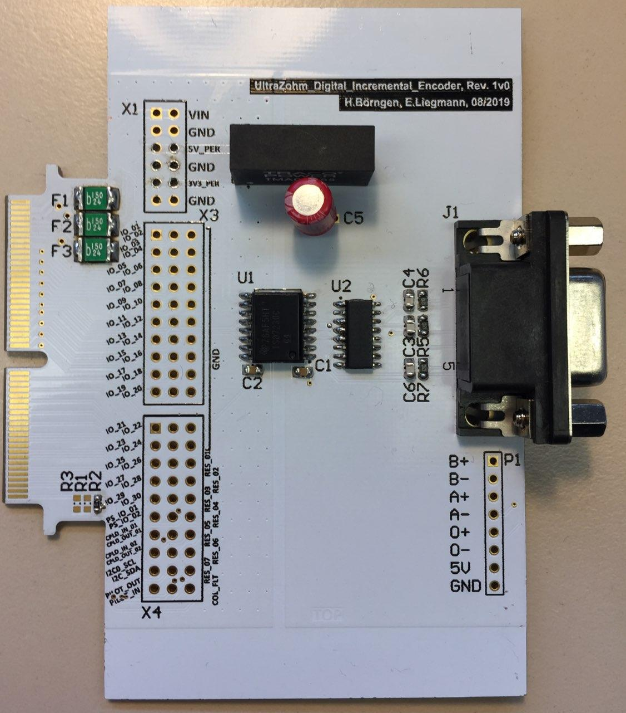
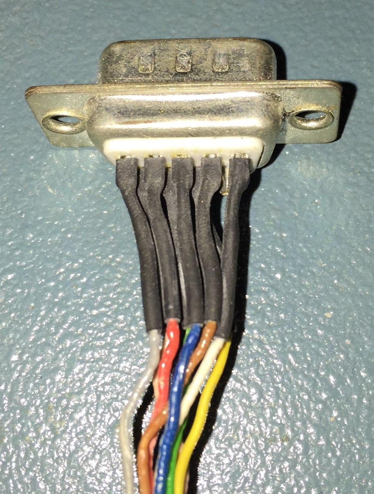

.. _dig_rotPosition:

==========================
Rotational Position 1v00
==========================

Functionality
-----------------------
* Connects incremental encoder to FPGA
* Provides isolated 5V supply to encoder
* Reads differential signals from encoder

Before first use
----------------------------
* Solder D-Sub 9 pin cable
  

.. image:: incr_encoder_v1/incr_encoder_v1_dsub_bot.jpg
   :width: 300

* Program CPLDs with firmware, see :ref:`label_cpld_programming` for details

Known issues
-----------------------
none

Compatibility 
----------------------
* Slots D1 to D5 can be used without limitations, D5 is suggested

Pinout 
"""""""""""""""""""""""""""
=====  ========  ==========  =====================
Pin    D-Sub 9     FPGA        Kubrich Encoder 
=====  ========  ==========  =====================
0+      3        Dig_IO_12    blue
0-      4                     red
A+      8        Dig_IO_13    green
A-      7                     yellow
B+      5        Dig_IO_14    grey
B-      9                     pink
Vcc     2                     brown
GND     1                     white
=====  ========  ==========  =====================

See also
"""""""""""""""
* :download:`Schematic 1v00 <incr_encoder_v1/SCH_UltraZohm_Digital_Incremental_Encoder_1v0.pdf>`
* :ref:`label_cpld_programming`

Designed by 
"""""""""""""""
Eyke Liegmann (TUM) in 08/2019
