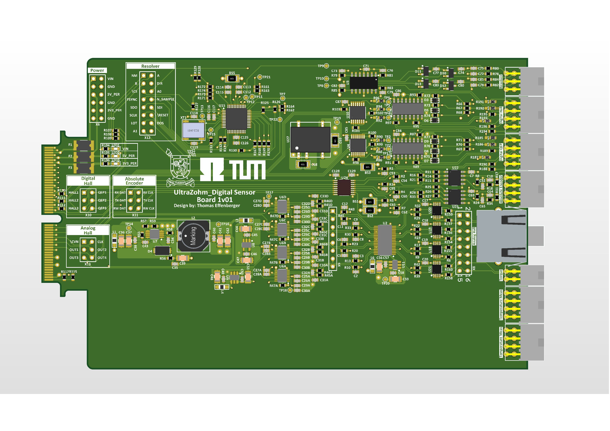
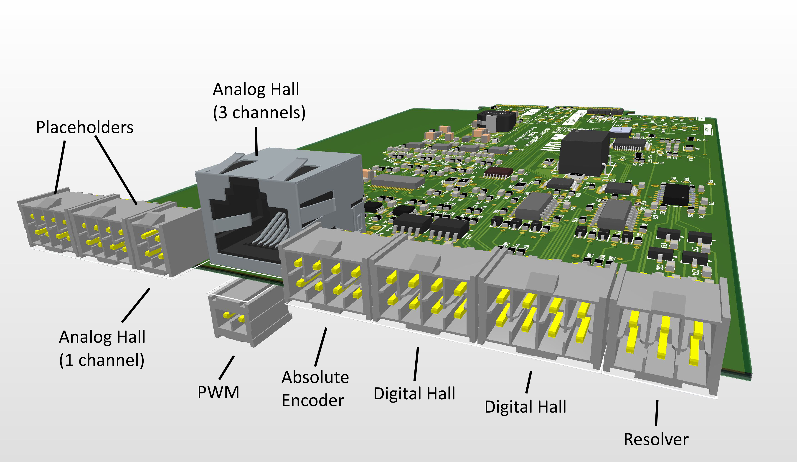
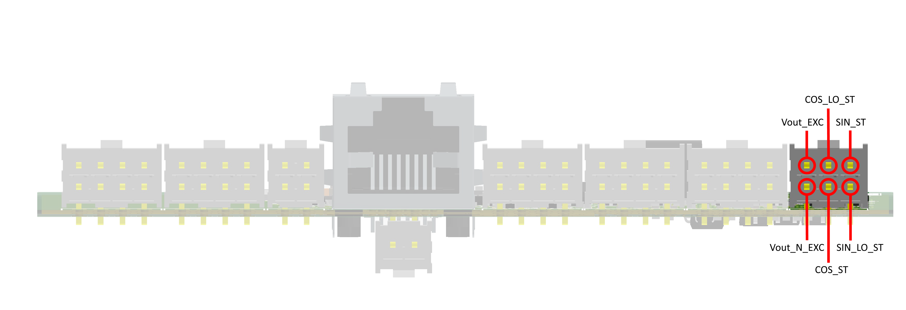
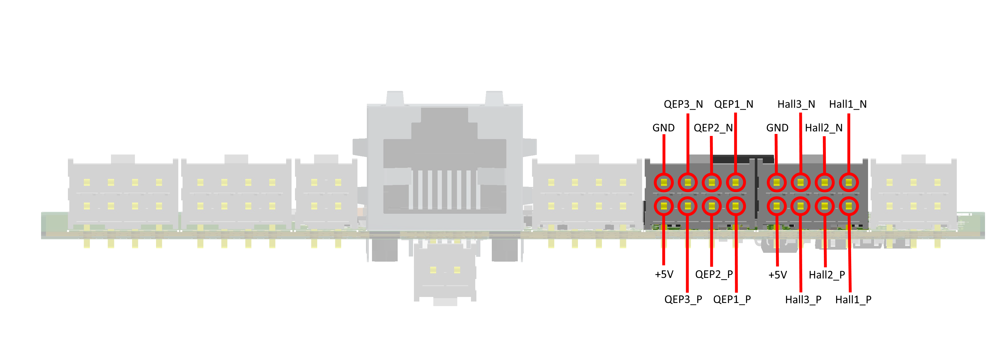
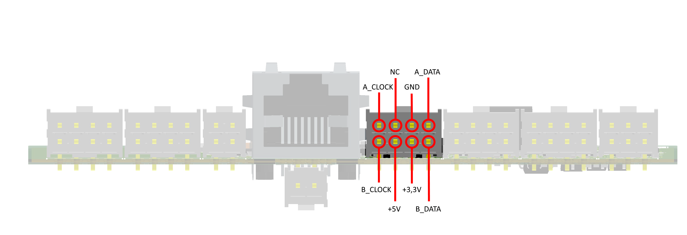
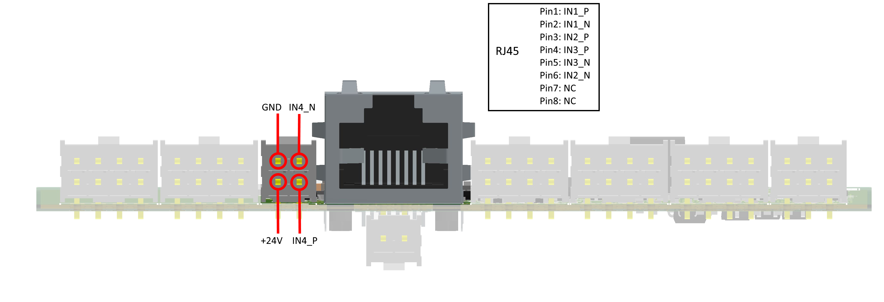

.. _dig_rotPosition:

==========================
Rotational Position 1v00
==========================

Functionality
-----------------------
* Supports four different encoder types: Resolver, Digital Hall Sensor (2x), Analog Hall, Absolute Encoder
* Resolver: Fully integrated Resolver controller with excitation signal generation, serial interface and optional absolute encoder emulation (shared with one digital hall channel)
* Digital Hall: Differential or single ended hall signals, two channels
* Analog Hall: Four differential analog channels, three on RJ45 connector, one on header, serial communication to ADCs
* Absolute Encoder: Hardware compatible to SSI, BiSS and others

Detailed Description
-----------------------
The UltraZohm Sensor Board features a variety of different industrial standard interfaces. This makes the board the perfect solution for flexible use in testing environments. It supports incremental encoders, resolvers, analog and digital hall sensors as well es absolute encoders via serial connection.
Most of the interfaces can be used simultaniosly, which allows for either using many sensors in parallel or for evaluationg different sensor systems at once. With many placement options the sensor board can be customized to serve the needs of specific applications.

Before first use
----------------------------
* Determine correct placement options for correct function
* Program CPLDs with firmware, see :ref:`label_cpld_programming` for details

Known issues
-----------------------
none

Compatibility (TODO)
----------------------
* Slots D1 to D5 can be used without limitations, D5 is suggested

Pinout
"""""""""""""""""""""""""""

Resolver

Digital Hall

Absolute Encoder

Analog Hall

See also (TODO)
"""""""""""""""
* :download:`Schematic 1v00 <incr_encoder_v1/SCH_UltraZohm_Digital_Incremental_Encoder_1v0.pdf>`
* :ref:`label_cpld_programming`

Designed by 
"""""""""""""""
Thomas Effenberger (TUM) in 12/2020
