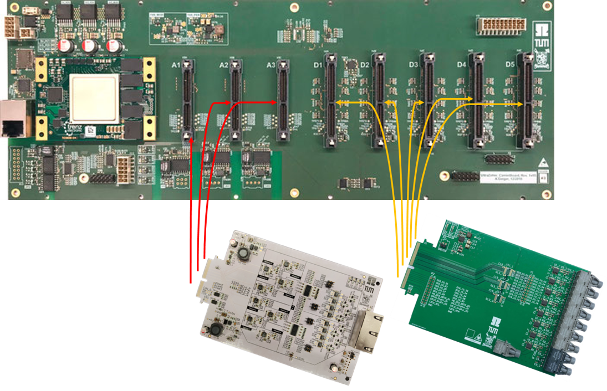

=============
Adapter Cards
=============

..	toctree::
	:maxdepth: 2
	   
	analog/index
	digital/index
	

Create your own adapter cards
=============================

The UltraZohm project is work in progress project and you are welcome to contribute!
To create a adapter card fork one of the following template repositories:
for a `Digital Adapter Card <https://bitbucket.org/ultrazohm/ultrazohm_digital_template/>`_
or for an `Analog Adapter Card <https://bitbucket.org/ultrazohm/ultrazohm_analog_template/>`_

Guidelines
----------

If you create an extension card please make sure you follow the guidelines:

* Include a version number. It follows the scheme <major_revision>v<minor_revision>. The major revisions are typically produced in hardware and minor revisions are revisions in the layout without producing the PCB.
* Include the designer of the PCB with optionally a contact (e.g. QR-Code or e-mail address).
* Before releasing the PCB to the project make sure it is fully tested.
* Create a page in these docs corresponding to the other pages for adapter cards.
* We differentiate between **analog** and **digital** adapter cards. They differ in the number of pins available and how they are routed. For example, the **analog** adapter has 10 fully differential signals, whereas the **digital** adapter has 30 single-ended signals that are routed through a CPLD. Please check the Carrier Board for more details
