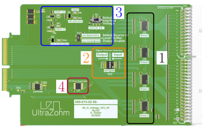
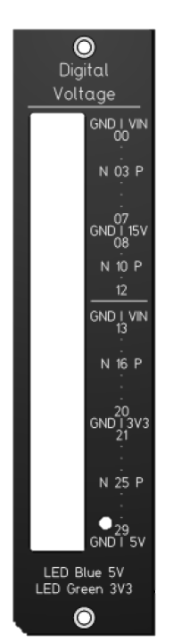

.. _digitalVoltage_3v3_5v:

=============================
Digital Voltage 3V3/5V Rev02
=============================

.. _ uz_d_voltage_3v3_5v_functions:

	Functional blocks of the Voltage Adapter Card

The Voltage_3v3_5v adapter card enables general-purpose digital input/output (GPIO) functionalities across two voltage domains:
3.3 V and 5 V. It is an extension of both the :ref:`digitalVoltage` and :ref:`digitalVoltage3v3rev01` cards. 
The board supports voltage level shifting, voltage domain monitoring,  and i2c-based readability of the hardware configuration.

Functionality
-------------

The functionality of the adapter card is segmented into several key areas, as depicted in the figure above:

1. Four 8Bit Level Shifters

- The adapter includes four 8-bit bidirectional level shifters, enabling voltage translation between the 3.3 V and 5 V domains. 
- Each digital I/O pin features an integrated 10 kΩ pulldown resistor to ensure a defined logic low state when the pin is not actively driven.

2. Signal direction

Each level shifter block can be individually configured for input or output operation via corresponding DIP switches. 
The four DIP switch banks allow groupwise control of the signal direction for each 8-bit block.

.. csv-table:: Grouped signal and dedicated switches
  :file: digital_voltage_3v3_5v/switches.csv
  :widths: 50 80
  :header-rows: 1

A DIP switch in the OFF position corresponds to a logic HIGH on the DIR line, configuring the direction as output (from the SoC). 
Conversely, a DIP switch in the ON position sets the direction to input (to the SoC).

.. note:: Direction control is only available on a per-group basis. For fully flexible pin assignment, refer to :ref:`digitalVoltage3v3rev01`.

3. Power Domain Monitoring, Output Enable Logic, and Source Control

The card monitors both the 3.3 V and 5 V supply rails provided by the carrier board. 
By default, the level shifter output enable (nOE) is governed by these voltage monitors. 
Alternatively, by setting switch S2, control can be transferred to the nOE_Carrierboard signal, which is supported in all hardware revisions :math:`\geq` ``Rev05`` :ref:`carrier_board_rev5`.

4. I2C-Port Expander

An onboard I²C port expander provides additional flexibility and control:

- LED indicators (on the rear side of the card) can be controlled via software to represent output voltage states.
- Signal direction configuration and output voltage selection statuses are accessible via I²C, enabling seamless integration with system control software.

Configuration
--------------

Prior to first use, ensure that the card is correctly configured according to the target system requirements. 
This includes setting DIP switches appropriately for the target voltage revision (e.g., Rev04 with a supervisor switch).
2 Pictures for Rev04 and Rev05

Measurements and technical background
----------------------------------------

andi measurements.

Accessoires
------------

An optional front panel with integrated voltage indication LEDs is available for enhanced usability.

To utilize this functionality, a corresponding software extension must be added manually in the Vitis development environment.
This feature is not integrated and developed yet.
Additionally, the light guide component `LPF-C011304S <https://www.mouser.de/ProductDetail/Lumex/LPF-C011304S?qs=3ZOqpMxxriqLNJacoNbLgw%3D%3D>`_ must be installed on the PCB to support visual indication.

References
==========

.. _dig_3v3_5v_rev02_references:

* :download:`Schematic Rev02 <digital_voltage_3v3_5v/SCH_UZ_D_Voltage_3V3_5V_Default_Rev02.pdf>`
* `Repository with Altium project <https://bitbucket.org/ultrazohm/uz_d_voltage_3v3_5v>`_

Compatibility 
=============

Slots D1 to D5 can be used without limitations.

See also
========

* `CPLD software git <https://bitbucket.org/ultrazohm/cpld_lattice/>`_
* :ref:`label_cpld_programming`

Designer
========

Designed by Andreas Geiger (TH Nürnberg), 03/2025
