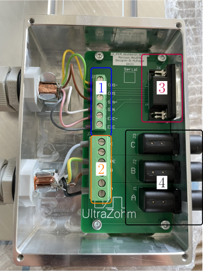

.. _deskbench_terminal:

===============================
uz_per_deskbench_terminal PCB
===============================
      

.. figure:: uz_per_deskbench_terminal.jpg
   :width: 60%

   uz_per_deskbench_terminal PCB

Source
******

- `uz_per_deskbench_terminal PCB repository <https://bitbucket.org/ultrazohm/uz_per_deskbench_terminal/>`_

General description
*******************
This PCB is designed to connect a 3-phase PMSM with a resolver to the Deskbench.
The PCB is housed in an enclosure and serves as an interface between the Deskbench and an inverter, typically the :ref:`dig_si_inverter_rev03`.

Variants
*********

The PCB comes in two variants: one with an optional motor brake connection and another one without it.
Currently, only the variant without the brake connection is used.

.. _deskbench_terminal_function:

   Functional areas of the uz per deskbench terminal PCB

Layout
------

The PCB is structured by functional areas as shown in :ref:`deskbench_terminal_function` above.

1. Terminal Connector for resolver
2. Terminal Connector for motor
3. Output DSUB to UZ with :ref:`dig_resolver_rev01`
4. Lab socket to inverter :ref:`dig_si_inverter_rev03`

.. csv-table:: Mapping Resolver to Terminal
   :file: resolver_mapping.csv
   :widths: 5 5 5
   :header-rows: 1
   :align: center

.. csv-table:: Mapping Motor to Terminal
   :file: motor_mapping.csv
   :widths: 5 5 5
   :header-rows: 1
   :align: center

Downloads
*********

 * :download:`Schematics <SCH_UZ_PER_deskbench_terminal_Differential_Input_Rev01a.pdf>`

Designer
********

Designed by Dennis Hufnagel(TH Nürnberg), 04/2023
