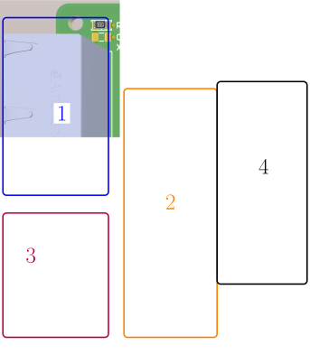

.. _torque_box:

================
Torque Box PCB
================
	   

.. figure:: torque_box.jpg
   :width: 60%

   Torque Box PCB

Source
******

- `Torque box PCB repository <https://bitbucket.org/ultrazohm/uz_per_torque_box/>`_

Revisions
*********

Rev01

General description
*******************

This PCB is designed to supply external torque sensor `Burster 8656 Torque Sensor <https://www.burster.com/en/torque-sensors/p/detail/8656/>`_  and send the signals to the :ref:`Analog_LTC2311_16` Card
The supply is taken from the voltage interface connector of an :ref:`Analog_LTC2311_16` board.
The torque signal (+-10V) is reduced to a level of +-5V and low-pass filtered. 
The torque signal is connected to ADC1 channel of LTC2311 and the remaining 3 Channels ADC2-ADC 4 can still be used without limitations.

.. _torque_box_function:

  Functional areas of the uz per torque pcb

Layout
------

The PCB is structured by functional areas as shown in the :numref:`torque_box_function` on the right.

1. Double Ethernet connector to the ADC adapter board
2. Measurement signal adaption to +-5V and low-pass filtering (708 Hz).
3. Supply voltage 24V and 5V from ADC Card with Samtec cable ``MMSD-08-28-F-xx.xx-D-K-LDX`` 
4. Connector to the Torque Sensor D-Sub 15  

A lot of details, as well as the pin configuration are described in the schematic (see download section below).

Assembly and Connection
*************************

A 3D-printable housing and an engraved aluminum cover designed for the uz_per_torque_box PCB. 
The assembly with all necessary parts is shown below, including a bill of materials (BOM). The PCB can be used without the housing, 
but it is more rugged and much more beautiful with the housing.

.. figure:: torque_box_assembly.png
  :width: 80%

  Assembly drawing of the torque_box

.. csv-table:: BOM for torque_box assembly 
   :file: torque_box_assembly_bom.csv
   :widths: 25 150 100 30 100
   :header-rows: 1

After the assembly the PCB can be connected to the UZ, e.g. to Slot A from ADC A1

|Cover| |Connection to UZ|

.. |Cover| image:: torque_box_cover.jpg
   :width: 49%

.. |Connection to UZ| image:: torque_box_connect.jpg
   :width: 49%

Downloads
*********

Rev01

 * :download:`Schematics <SCH_uz_per_torque_box_Default_Rev01.pdf>`
 * :download:`Bill of Material <BOM_JLC-uz_per_torque_box(Default)_JLC_Upload.xlsx>`
 * :download:`Housing body STL file <housing_body.stl>`
 * :download:`Housing cover fpd file for ordering at Schaeffer AG <uz_per_torque_box.fpd>`

Designer
********

Designed by Michael Hoerner (TH Nürnberg), 07/2024
