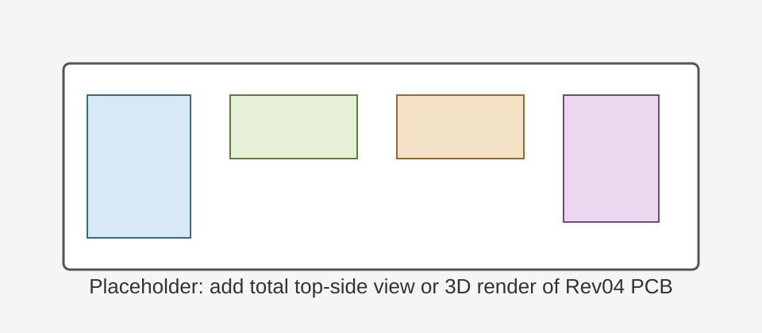
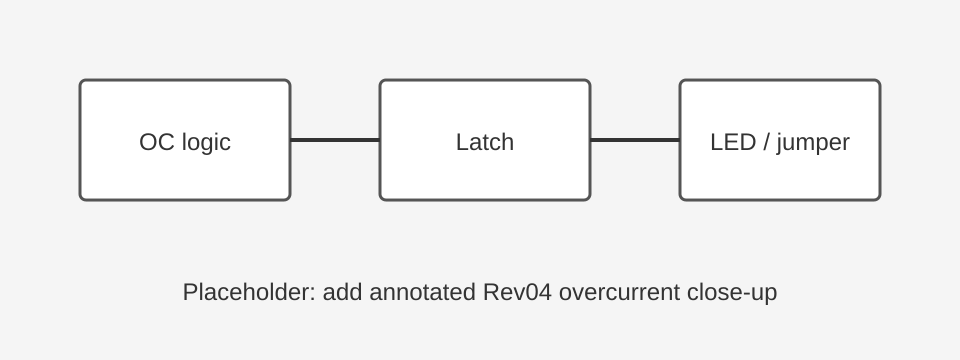
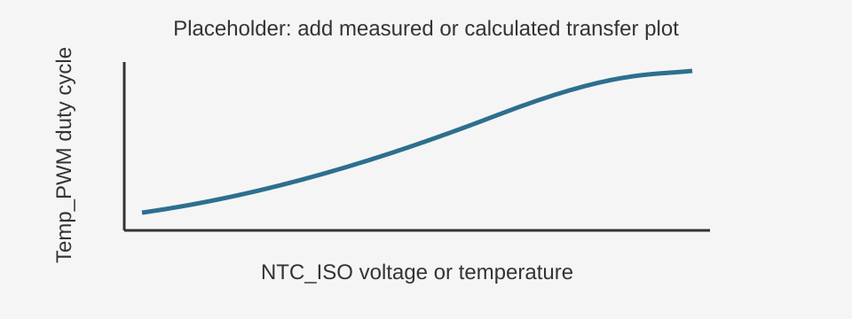
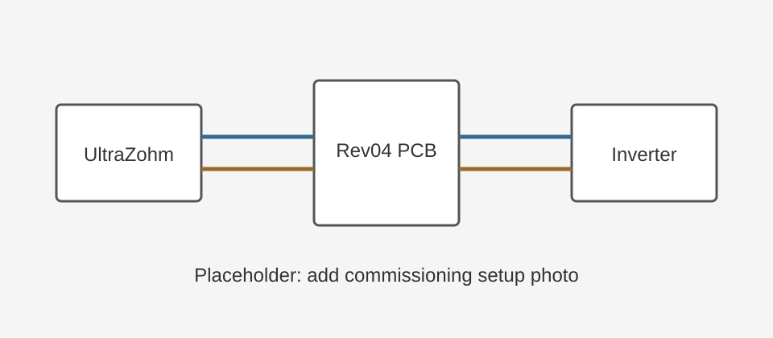

.. _uz_per_wolfspeed_25kw_FM3_rev04:

================================================
Wolfspeed Inverter 2L 25 kW Interface Rev04
================================================

Rev04 is the second productive revision of the ``uz_per_wolfspeed_25kw_FM3`` interface PCB.
It keeps the Rev03 analog measurement concept and adds several digital functions for commissioning and inverter operation.
The Rev04 schematic output was generated on 23.06.2026.

   Figure placeholder: add a total top-side view or 3D render of the assembled Rev04 PCB.

Changes Compared to Rev03
=========================

* Added ``GateAndFanControl.SchDoc``: ``Gate_Driver_Enable`` is converted to the inverter ``GD_DIS`` polarity and also drives the fan-control output.
* Added ``OvercurrentDetectionLogic.SchDoc``: the six overcurrent comparator outputs are combined, latched, reset by gate enable, and routed to the optical ``OC`` output.
* Added ``TempSenseConditioning.SchDoc``: the analog isolated NTC signal is converted to a PWM signal before the optical transmitter.
* Added fan outputs ``FAN1_OUT`` and ``FAN2_OUT`` on the inverter connector.
* Added a red overcurrent latch indicator LED.
* Added a 2x3 jumper header in the overcurrent section for testing overcurrent events.

Analog Signals
==============

Rev04 keeps the Rev03 analog measurement structure.
The inverter-side phase-current and DC-link voltage measurements are converted from single-ended signals to fully differential signals for the UltraZohm ADC board.

.. list-table::
   :header-rows: 1
   :widths: 25 25 30 20

   * - Signal
     - Source
     - Conditioning
     - UltraZohm ADC channel
   * - ``IU_MEAS``
     - Phase current U
     - THS4561 fully differential amplifier
     - Ch1
   * - ``IV_MEAS``
     - Phase current V
     - THS4561 fully differential amplifier
     - Ch2
   * - ``IW_MEAS``
     - Phase current W
     - THS4561 fully differential amplifier
     - Ch3
   * - ``VDC_MEAS``
     - DC-link voltage
     - THS4561 fully differential amplifier
     - Ch4

Digital Signals
===============

.. list-table::
   :header-rows: 1
   :widths: 30 20 25 25

   * - Signal
     - Direction
     - Conditioning
     - Notes
   * - ``U_HS_PWM``, ``U_LS_PWM``, ``V_HS_PWM``, ``V_LS_PWM``, ``W_HS_PWM``, ``W_LS_PWM``
     - UltraZohm to inverter
     - Optical receivers
     - High-side and low-side PWM for three phases; dead time is generated in the UltraZohm.
   * - ``Gate_Driver_Enable``
     - UltraZohm to interface
     - Optical receiver, then inverter logic
     - High enables the gate drivers and arms overcurrent protection.
   * - ``GD_DIS``
     - Interface to inverter
     - SN74LVC2GU04 inverter
     - ``Gate_Driver_Enable`` high drives ``GD_DIS`` low, enabling the inverter gate drivers. ``Gate_Driver_Enable`` low drives ``GD_DIS`` high, disabling the gate drivers.
   * - ``FAN1_OUT``, ``FAN2_OUT``
     - Interface to inverter
     - Derived from ``Gate_Driver_Enable``
     - Fans are on when ``Gate_Driver_Enable`` is high and off when it is low.
   * - ``OC``
     - Interface to UltraZohm
     - SN74HCS08DR logic, SN74LVC1G74 latch, optical transmitter
     - Combined and latched overcurrent feedback. The latch clears when ``Gate_Driver_Enable`` is low.
   * - ``Temp_PWM``
     - Interface to UltraZohm
     - LTC6992 PWM generator and optical transmitter
     - PWM representation of the isolated NTC voltage.

Gate Enable and Fan Control
===========================

Rev04 separates the UltraZohm-side gate-enable command from the inverter-side disable polarity.
The schematic states the following behavior:

.. list-table::
   :header-rows: 1
   :widths: 30 30 40

   * - ``Gate_Driver_Enable``
     - Resulting output
     - Function
   * - High
     - ``GD_DIS`` low, ``FANx_OUT`` high
     - Gate drivers enabled, fans on, overcurrent protection armed.
   * - Low
     - ``GD_DIS`` high, ``FANx_OUT`` low
     - Gate drivers disabled, fans off, overcurrent latch cleared.

Overcurrent Detection
=====================

The Rev04 overcurrent section uses TLV3502 comparators for the six phase-leg overcurrent signals:
``U_HI_OC``, ``U_LO_OC``, ``V_HI_OC``, ``V_LO_OC``, ``W_HI_OC`` and ``W_LO_OC``.
The comparator outputs are combined with SN74HCS08DR logic.
The result is latched with an SN74LVC1G74 flip-flop and routed to the ``OC`` optical transmitter.

The schematic documents ``OC_ALL_OK`` as high when no overcurrent event is present.
When the gates are enabled, protection is armed.
When the gates are disabled, the latch is cleared.

.. note::
   Rev04 includes a 2x3 jumper header in the overcurrent section for testing overcurrent events.
   Add a close-up figure of this header and label the normal-operation jumper setting before releasing operating instructions.

   Figure placeholder: add an annotated Rev04 schematic excerpt or PCB close-up of the overcurrent latch, indicator LED, and test jumper.

Temperature PWM
===============

Rev04 converts the isolated NTC voltage to an optical PWM signal.
The schematic notes that ``NTC_ISO`` is expected to be in the range ``0 V`` to ``2 V`` and that a voltage divider reduces this to ``0 V`` to ``1 V`` for the PWM generator.

The LTC6992 is configured with:

* ``R_SET = 68 kOhm``, resulting in approximately ``46 kHz`` PWM frequency.
* ``DIVCODE = 2`` / ``N_DIV = 16`` from the ``182 kOhm`` and ``976 kOhm`` divider.
* ``POL = 1`` so rising NTC temperature results in increasing duty cycle.

   Figure placeholder: add a small transfer plot showing NTC temperature or ``NTC_ISO`` voltage versus ``Temp_PWM`` duty cycle.

Connector Notes
===============

The Rev04 schematic shows the following relevant HSEC8 edge-card connector assignments.
Use the schematic as the authority for complete pinout verification.

.. list-table::
   :header-rows: 1
   :widths: 25 25 50

   * - Signal
     - HSEC8 pin
     - Notes
   * - ``VDC_MEAS``
     - 27
     - DC-link voltage measurement input from inverter.
   * - ``IU_MEAS``, ``IV_MEAS``, ``IW_MEAS``
     - 33, 37, 39
     - Phase-current measurement inputs from inverter.
   * - ``U_HS_PWM``, ``U_LS_PWM``
     - 49, 51
     - Phase U PWM outputs to inverter.
   * - ``V_HS_PWM``, ``V_LS_PWM``
     - 53, 55
     - Phase V PWM outputs to inverter.
   * - ``W_HS_PWM``, ``W_LS_PWM``
     - 50, 52
     - Phase W PWM outputs to inverter.
   * - ``GD_DIS``
     - 75
     - Inverter-side gate-driver disable signal.
   * - ``FAN1_OUT``, ``FAN2_OUT``
     - 105, 107
     - Fan-control outputs added in Rev04.

Commissioning Notes
===================

Before first operation:

* Verify that ``Gate_Driver_Enable`` polarity is implemented correctly in the FPGA and software.
* Confirm that disabling ``Gate_Driver_Enable`` clears the overcurrent latch.
* Check fan behavior before applying high DC-link voltage.
* Verify the ``Temp_PWM`` duty-cycle interpretation in the software or FPGA logic.
* Check the overcurrent test jumper setting against the schematic before operation.

   Figure placeholder: add a photo of the Rev04 commissioning setup with UltraZohm, interface PCB, Wolfspeed inverter, optical links, RJ45 analog cable, fan wiring, and DC-link/load connections.

Documents
=========

* :download:`Schematic Rev04 <../SCH_uz_per_wolfspeed_25kw_FM3_jlc_Rev04.pdf>`
* `PCB repository uz_per_wolfspeed_25kw_FM3 <https://bitbucket.org/ultrazohm/uz_per_wolfspeed_25kw_fm3/src/main/>`_
