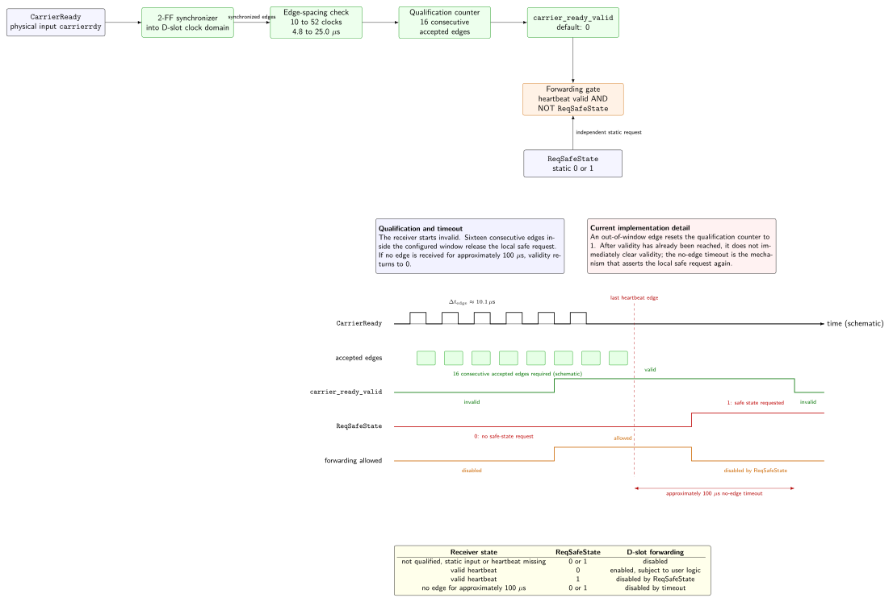

.. _dslot_rev05:

===========
D-Slot CPLD
===========

General
-------

- Device: Lattice Mach XO2
- Part: LCMXO2-2000HC-4TG100C
- Designator: U4A-U4E
- Integrated Flash memory for configuration storage (bitstream)
- Programmable via JTAG, SPI (PS-SPI0) and I2C (PS-I2C0)
- No external clock source integrated on carrier

.. _dslot_cpld_heartbeat_rev05:

Breaking change: CarrierReady heartbeat safe-state handling (07-08/2026)
------------------------------------------------------------------------

.. warning::

   As of ``07/08/2026``, the S3C safe-state interface contains a breaking change:
   ``CarrierReady`` carries a heartbeat as proof of an alive S3C/carrier side, while
   ``ReqSafeState`` remains a static request for disabling outputs.
   S3C and D-Slot programming files must be updated together; implementations that
   still validate ``ReqSafeState`` as heartbeat input are incompatible with this interface.

The heartbeat was introduced because a static safe-state level is not sufficient during all electrical transitions of the carrier board.
During power-down or fault handling, the D-Slot CPLD's 1.8 V I/O supply can fall faster than the CPLD core supply.
In this transition the CPLD can be operated outside its specified supply conditions, so a single static level is not a reliable proof of normal operation.
Normal operation is therefore additionally encoded as an actively toggling ``CarrierReady`` heartbeat.
The D-Slot receiver starts in its local safe state and requires 16 consecutive edges
inside the configured timing window before heartbeat-gated output forwarding can be released.
If heartbeat edges stop, the receiver returns to its local safe state after the no-edge timeout.

The :ref:`digitalVoltage_3v3_5v` card is a special case only when its S2 DIP switch is configured to ``use CarrierBoard``.
In this configuration, the card uses the carrier-board ``SlotOE`` / output-enable signal directly.
This provides a second fallback layer on the adapter card itself: the level shifter outputs are disabled by the card's output-enable path, so the card does not show the power-down glitch behavior that motivated the heartbeat-based safe-state detection for generic D-Slot programs.
If S2 is configured to ``use Supervisors`` instead, the card behaves equivalently to the other D-Slot adapter cards with respect to this heartbeat-based safe-state handling.
The ``CarrierReady`` heartbeat is the system-level proof of normal S3C/carrier operation. ``ReqSafeState`` remains the separate static request that can disable forwarding even while the heartbeat is still valid.

MachXO2 implementation notes
----------------------------

The Rev05+ D-Slot CPLD programs are maintained in the ``cpld_lattice`` repository below ``MACHXO2/D_Slot_CPLD_LCMXO2-2000HC-4TG100C/uz_d_slots``.
Archive and pre-heartbeat folders in the MachXO2 repository are historical snapshots only.
They represent states before the heartbeat-based safe-state handling was introduced or stabilized and are therefore not current design sources.
Do not use these archived/pre-heartbeat folders for new programming files, timing checks or implementation comparisons unless the historical state is explicitly required.
The current source of truth is the active implementation in ``uz_d_slots`` together with the shared ``xo2_libraries/lib_sXc.vhd`` helper library and the maintained implementation list below.
All active implementations use Lattice Diamond with Synplify Pro as synthesis tool and the project strategy enables VHDL-2008.
The common library currently provides the clock/reset helper, tick generator, debouncer and the D-Slot heartbeat receiver.
The heartbeat receiver has the signal-neutral input port ``heartbeat_in``.
For a CarrierReady-compatible output implementation it must be connected to the physical
``carrierrdy`` / ``CarrierReady`` signal:

.. code-block:: vhdl

   dslot_carrierready_receiver: ENTITY work.dslot_heartbeat_receiver
      PORT MAP (
         clk                => clk,
         heartbeat_in       => carrierrdy,
         heartbeat_invalid  => heartbeat_invalid
      );

   carrier_ready_valid <= NOT heartbeat_invalid;

``ReqSafeState`` is evaluated separately as a static S3C request:

.. code-block:: vhdl

   req_safe_state_request <= reqsafestate;
   enable_forwarding <= user_enable_forwarding AND carrier_ready_valid AND NOT req_safe_state_request;

This gives the D-slot CPLD two independent S3C safety conditions:

* ``CarrierReady`` heartbeat valid: the S3C/carrier side is alive and the heartbeat timing is plausible.
* ``ReqSafeState = 0``: the S3C does not request the D-slot outputs to enter the safe state.

Safety-related output forwarding is only allowed if both conditions are fulfilled.
The final forwarding condition may additionally contain card- or program-specific
``user_enable_forwarding`` logic. A missing or static heartbeat cannot complete the
initial qualification. After qualification, a missing heartbeat asserts
``heartbeat_invalid`` after approximately 100 us without an edge. If
``ReqSafeState`` is ``1``, forwarding is disabled immediately even when the
``CarrierReady`` heartbeat is still valid.

.. warning::

   In the current receiver implementation, an out-of-window edge resets the qualification
   counter to one but does not immediately clear an already valid heartbeat state.
   Once validity has been reached, ``heartbeat_invalid`` is asserted again by
   the no-edge timeout. A continuously toggling malformed heartbeat can therefore keep
   an already released receiver valid. This behavior must be considered before release
   if malformed-heartbeat revocation is a safety requirement.

.. note::

   Every output-driving implementation must connect ``heartbeat_in => carrierrdy`` and
   evaluate the static ``reqsafestate`` level independently in its forwarding condition.
   S3C and D-Slot programming files implementing this interface must be deployed together.

   D-Slot heartbeat receiver: initial edge qualification, independent static ``ReqSafeState`` gating and the no-edge timeout.

.. note::

   Pure receive/encoder signal paths do not use the heartbeat as output-enable condition because they do not actively drive the adapter-card outputs that need to be forced into the safe state.
   Some RX/encoder implementations may still contain the common heartbeat receiver template for ``SlotOK``/project consistency, but the safety-relevant heartbeat gating applies to the output-forwarding path only.

The MachXO2 D-Slot project contains the following maintained implementations:

- ``tx30``
- ``tx26_w_enable``
- ``rx30``
- ``optical_14tx_4rx``
- ``uz_d_3ph_inverter``
- ``uz_d_resolver_d1_to_d4``
- ``uz_d_resolver_d5``
- ``uz_d_abs_encoder``
- ``uz_d_temperature_ltc2983``
- ``tx16_14rx``
- ``tx20_10rx``
- The ``Voltage_3v3_5v`` subfolder contains the maintained MachXO2 CPLD implementations for the :ref:`digitalVoltage_3v3_5v` adapter card. Because this card defines its signal directions in four hardware groups, the CPLD repository provides the generated variants below ``Voltage_3v3_5v/voltage_8*_8*_8*_6*``. The name encodes the direction of the four groups in D-Slot order: three groups with eight I/Os each and one group with six I/Os, e.g. ``voltage_8rx_8rx_8tx_6tx``.
- ``template_dslots``

Rebuilding all D-Slot programming files
---------------------------------------

The D-Slot Diamond project contains several independent implementations in one
``uz_d_slots.ldf`` project file. Each implementation has its own top-level VHDL
file and produces one JEDEC programming file for the corresponding D-Slot CPLD
configuration. The VHDL source files themselves are maintained manually in the
implementation ``source`` directories; the build flow does not regenerate these
VHDL files. Instead, the build flow recompiles every listed implementation and
exports the matching ``.jed`` programming file.

For this purpose, the project directory contains the helper script
``build_all_jed_clean.tcl``:

.. code-block:: text

   MACHXO2/
   `-- D_Slot_CPLD_LCMXO2-2000HC-4TG100C/
       `-- uz_d_slots/
           |-- uz_d_slots.ldf
           |-- build_all_jed_clean.tcl
           |-- tx30/
           |-- tx20_10rx/
           |-- Voltage_3v3_5v/
           `-- ...

The script performs the following steps:

#. Read all implementations from ``uz_d_slots.ldf``.
#. Remove old build artifacts and old programming files from the implementation
   directories.
#. Build every implementation with Lattice Diamond in the order listed in the
   project file.
#. Run synthesis, translate, map, place-and-route and JEDEC export for every
   implementation.
#. Remove intermediate files and generated ``.bit`` files after the build.
#. Keep only the implementation ``source`` directory and the newly generated
   ``.jed`` file in each implementation directory.

The intended result is a clean project tree that contains the maintained VHDL
sources and the current JEDEC programming files, but no temporary Diamond build
products.

Run the script from the D-Slot project directory with the Lattice Diamond command
line frontend:

.. code-block:: powershell

   cd C:\cpld\cpld_lattice\MACHXO2\D_Slot_CPLD_LCMXO2-2000HC-4TG100C\uz_d_slots
   C:\lscc\diamond\3.13\bin\nt64\pnmainc.exe build_all_jed_clean.tcl

During execution, the script prints a progress line before each major build
step. This makes long rebuilds easier to monitor from the terminal:

.. code-block:: text

   [####..........................]  13% | implementation 04/29 | step 2/6 synthesis | tx30 | elapsed 05m 12s | ETA 34m 40s

The progress output is updated between Diamond build steps. A single
``prj_run`` command can still be silent for several minutes because Diamond
executes that step internally before control returns to the Tcl script.

.. warning::

   ``build_all_jed_clean.tcl`` intentionally deletes old generated files in the
   implementation directories. Do not run it if intermediate reports, previous
   ``.jed`` files or generated ``.bit`` files still need to be preserved.

.. note::

   The script exports JEDEC files only. Diamond may create additional files
   internally during the build, but the cleanup step removes generated ``.bit``
   files and intermediate artifacts afterwards.
