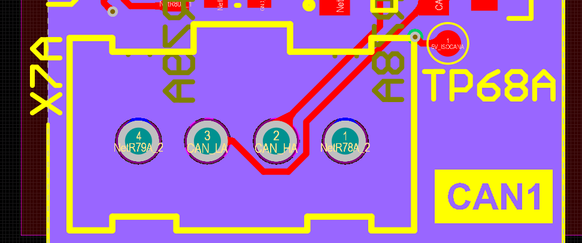
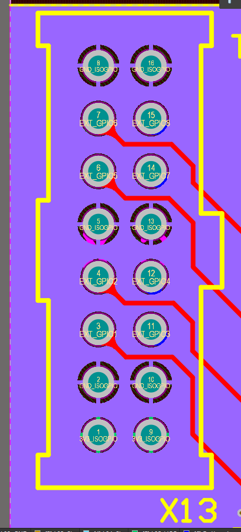

==========
Interfaces
==========

.. image:: interfaces/carrier_interfaces2.svg
  :width: 1200

The carrier board has the following interfaces.

.. csv-table:: List of all carrier board interfaces
  :file: interfaces/interfaces_carrier.csv
  :widths: 30 100
  :header-rows: 1

X1: CPLD-JTAG
-------------

JTAG interface to all CPLDs for D1 to D5.

.. csv-table:: X1: JTAG interface to CPLD
  :file: interfaces/x1.csv
  :widths: 50 50 50
  :header-rows: 1

X2: CPLD-Jumper
---------------

Jumper for the JTAG chain. Set jumper to 1-2, 3-4, 5-6, 7-8, 9-10, 11-12.

.. csv-table:: X2: JTAG jumper
  :file: interfaces/x2.csv
  :widths: 50 50 50
  :header-rows: 1

X3: CPLD-X6E (D5)
-----------------

Digital adapter X6E is not fully connected to the FPGA. X3 is routed to the CPLD of X6E and routes to the PINs DIG_01 to DIG06 and DIG_25 to DIG_30.

.. csv-table:: X3
  :file: interfaces/x3.csv
  :widths: 50 50 50
  :header-rows: 1

X4: Ethernet
------------

Ethernet interface.

X5: Analog adapter
------------------

the board connector X5 is used to connect analog adapter boards to the carrier board.
X5A to X5C feature 10 differential signals which route directly to the FPGA on a voltage level of 1.8 V.
Additionally, there is shared SPI and I2C available on X5.

.. csv-table:: X5 power connection
  :file: interfaces/x5_pwr.csv
  :widths: 50 50 50
  :header-rows: 1

.. csv-table:: X5 banks
  :file: interfaces/x5_banks.csv
  :widths: 50 50 50 50 50
  :header-rows: 1

X6: Digital adapter
-------------------

The board connector X6 is used to connect digital adapter boards to the carrier board.
X6 has 30 IOs (DIG_IO_01 to DIG_IO_30) with a voltage level of 3.3 V which are routed to a CPLD for each digital interface.
The IO signals form X6A, X6B, X6C, X6D are routed to the SoM (J1 to J4).
X6E features 30 IOs of which 12 (DIG_01 to DIG_06 and DIG_25 to DIG_30) are routed from the CPLD to X3 and the other 18 IOs are routed to the FPGA.

.. csv-table:: X6 power connection
  :file: interfaces/x6_pwr.csv
  :widths: 50 50 50
  :header-rows: 1

.. csv-table:: X6 banks
  :file: interfaces/x6_banks.csv
  :widths: 50 50 50 50 50
  :header-rows: 1

Note that, on **D5** the pins 1-6 and and 25-30 are not routed between FPGA and CPLD, instead are accessible on X3. 

X7: CAN
-------

The following applies to X7A and X7B:

1. This connectors are used for CAN. X7A is labeled with CAN1 and X7B with CAN2 on the PCB.

2. The CAN interface is operated by the processor.

3. The connector X7A uses ``CAN_0`` and X7B ``CAN_1`` in the processor.

4. The pins are isolated and have a voltage level of 5V.

.. csv-table:: X7
  :file: interfaces/x7.csv
  :widths: 50 50 50
  :header-rows: 1

X8: MPSoC-JTAG
--------------

JTAG interface for the MPSoC.

.. csv-table:: X8
  :file: interfaces/x8.csv
  :widths: 50 50 50
  :header-rows: 1

X9: PS-JTAG
-----------

JTAG interface to JTAG - not assembled!

X10: Serial bus
---------------

Interface to serial buses (UART1, SPI0, I2C1) of the PS. The interface is not isolated.

.. csv-table:: X10 serial buses of PS
  :file: interfaces/x10.csv
  :widths: 50 50 50
  :header-rows: 1

X11: USB
--------

Interface to USB of PS - not assembled!

X12: SPI1
---------

Isolated SPI1 of PS.

.. csv-table:: X12: Isolated SPI1
  :file: interfaces/x12.csv
  :widths: 50 50 50
  :header-rows: 1

X13: PS GPIO
------------

1. This connector is used for the front panel LEDs. However, it is not limited to this.

2. This connector offers eight GPIOs from the processor (MIO Pins).

3. The pins are isolated and have a voltage level of 3V3.

4. Pin connection:

.. csv-table:: X13 List
  :file: interfaces/X13_list.csv
  :widths: 50 50 50 50 50 50
  :header-rows: 1

X14: Power
----------

Connector for input of power supply with 24 V (DC) and max. 5 A (??).

.. csv-table:: X14
  :file: interfaces/x14.csv
  :widths: 50 50 50
  :header-rows: 1
