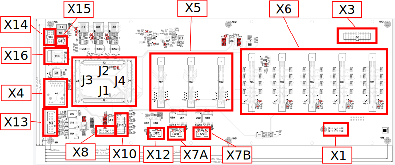
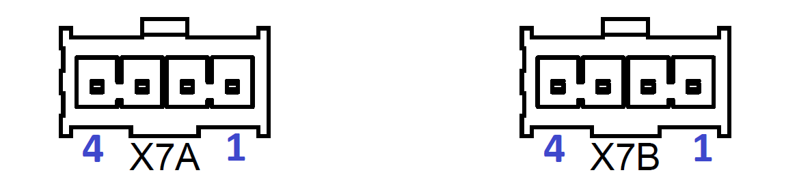
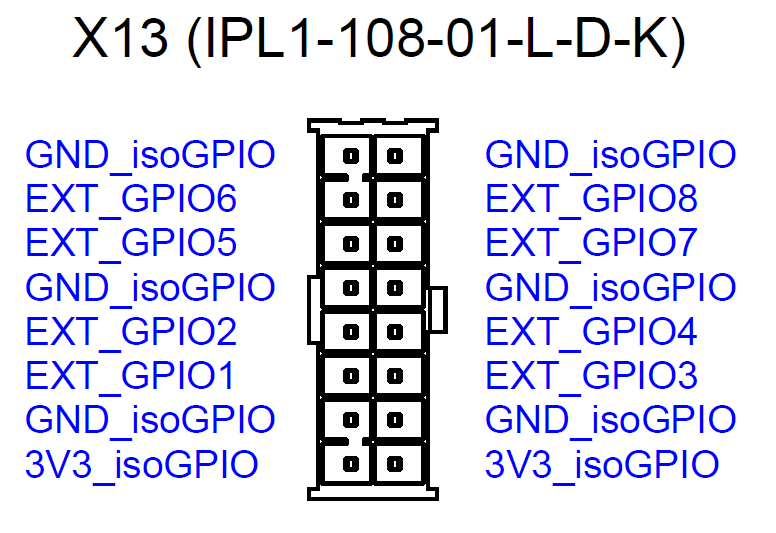

==========
Interfaces
========== 

The carrier board has the following interfaces.

.. csv-table:: List of all carrier board interfaces
  :file: interfaces/interfaces_carrier.csv
  :widths: 20 100
  :header-rows: 1

X1: CPLD-JTAG
-------------

JTAG interface to all CPLDs for D1 to D5. You can use a Trenz TE0590 programmer ( see :ref:`label_cpld_programming`).

.. csv-table:: X1: JTAG interface to CPLD
  :file: interfaces/x1.csv
  :widths: 10 10 20 10
  :header-rows: 1

X2: CPLD-Jumper
---------------

Pin header connector to set jumper for individual programmaing of the CPLDs.
If you would like to program all five CPLDs at once, you have to link them together as a daisy chain: set jumper to 1-2, 3-4, 5-6, 7-8, 9-10, 11-12. (see :ref:`cpldjumper`)

.. csv-table:: X2: CPLD programming jumper
  :file: interfaces/x2.csv
  :widths: 10 10 20 10
  :header-rows: 1

X3: CPLD-X6E (D5)
-----------------

Not all 30 digital signals of X6E is fully connected to the FPGA.
X3 is routed to the primary side (1.8 V) of the CPLD.
The factory CPLD software routes these signals of X3 to the X6E pins DIG_01 to DIG06 and DIG_25 to DIG_30.
The direction of the signals can be determined with your user CPLD software code. The factory default is **input**.

.. csv-table:: X3
  :file: interfaces/x3.csv
  :widths: 30 30 30 30 50
  :header-rows: 1

X4: Ethernet
------------

This RJ45 connector is used for ethernet communication. You can use standard LAN cables.

X5: Analog adapter
------------------

The board connector X5 is used to connect analog adapter boards to the carrier board.
X5A to X5C features each 10 differential signals, which are routed (impedance controlled) directly to the FPGA at a voltage level of 1.8 V with LVDS standard.
The drive strength of the FPGA pins is configurable (4, 8, 12 or 16 mA) by software in Vivado.
For more information see in `Xilinx documentation <https://www.xilinx.com/support/documentation/user_guides/ug571-ultrascale-selectio.pdf>`_.
Additionally, there is shared SPI and I2C available on X5.

.. csv-table:: X5 - Power connection
  :file: interfaces/x5_pwr.csv
  :widths: 50 50 50
  :header-rows: 1

.. csv-table:: X5 - FPGA banks
  :file: interfaces/x5_banks.csv
  :widths: 10 10 10 10 20 20
  :header-rows: 1

.. csv-table:: X5 - Shared SPI
  :file: interfaces/x5_shared_spi.csv
  :widths: 20 20 20 20 20
  :header-rows: 1

.. csv-table:: X5 - Trigger fast ADCs
  :file: interfaces/x5_cs_fastADC.csv
  :widths: 20 20 20 20 20
  :header-rows: 1

.. csv-table:: X5 - GPIO pins
  :file: interfaces/x5_gpio.csv
  :widths: 10 10 20 10 10
  :header-rows: 1

The reserved pins of the X5 connector are currently attached with test points on the carrier board. They are reserved for future purposes.

.. csv-table:: X5 - Reserved pins
  :file: interfaces/x5_reserved.csv
  :widths: 20 20 20 20 20
  :header-rows: 1

The collective fault signal is an error signal that can be provided from each adapter card and will be evaluated on the carrier board.

.. csv-table:: X5 - Collective fault
  :file: interfaces/x5_col_flt.csv
  :widths: 20 20 20 20 20
  :header-rows: 1
  
.. csv-table:: X5 - Pilot line
  :file: interfaces/x5_pilot_line.csv
  :widths: 20 20 20 20 20
  :header-rows: 1

X6: Digital adapter
-------------------

The board connector X6 is used to connect digital adapter boards to the carrier board.
X6 has 30 IOs (DIG_IO_01 to DIG_IO_30) with a voltage level of 3.3 V which are routed to a CPLD for each digital interface.
The IO signals from X6A, X6B, X6C, X6D are routed via the CPLD to the SoM (J1 to J4).
X6E features 30 IOs of which 12 (DIG_01 to DIG_06 and DIG_25 to DIG_30) are routed from the CPLD to X3 and the other 18 IOs are routed to the FPGA.

.. csv-table:: X6 - Power connection
  :file: interfaces/x6_pwr.csv
  :widths: 50 50 50
  :header-rows: 1

.. csv-table:: X6 - FPGA banks via CPLD
  :file: interfaces/x6_banks.csv
  :widths: 50 50 50 50 50
  :header-rows: 1

.. csv-table:: X6 - GPIO pins
  :file: interfaces/x6_gpio.csv
  :widths: 10 10 20 10 10
  :header-rows: 1

.. csv-table:: X6 - Auxiliary CPLD I/Os
  :file: interfaces/x6_cpld_io.csv
  :widths: 10 10 20 10 10
  :header-rows: 1

.. csv-table:: X6 - I2C bus
  :file: interfaces/x6_I2C.csv
  :widths: 10 10 20 10 10
  :header-rows: 1

The reserved pins of the X6 connector are currently attached with test points on the carrier board.
They are reserved for future purposes.

.. csv-table:: X6 - Reserved pins
  :file: interfaces/x6_reserved.csv
  :widths: 20 20 20 20 20
  :header-rows: 1

The collective fault signal is an error signal that can be provided from each adapter card and will be evaluated on the carrier board.

.. csv-table:: X6 - collective fault
  :file: interfaces/x6_col_flt.csv
  :widths: 20 20 20 20 20
  :header-rows: 1

X7: Isolated CAN
----------------

The following applies to X7A and X7B:

1. This connectors are used for CAN. X7A is labeled with CAN1 and X7B with CAN2 on the PCB.

2. The CAN interface is operated by the processor.

3. The connector X7A uses ``CAN_0`` and X7B ``CAN_1`` in the processor.

4. The pins are isolated and have a voltage level of 5V.

5. The CAN termination resistors (120 Ohm) are assembled by default (R76A - R77A, R76B - R77B) and can be found with the assembly drawing ``(LINK)``.

.. csv-table:: X7 - Isolated CAN bus
  :file: interfaces/x7.csv
  :widths: 20 20 20 20 20
  :header-rows: 1

X8: MPSoC-JTAG
--------------

JTAG interface for the MPSoC.

.. csv-table:: X8
  :file: interfaces/x8.csv
  :widths: 20 20 20 20 20
  :header-rows: 1

X9: PS-JTAG
-----------

JTAG interface to JTAG - not assembled!

X10: Serial bus
---------------

Interface to serial buses (UART1, SPI0, I2C1) of the processing system (PS) for external devices. The interface is not isolated.

.. csv-table:: X10 serial buses of PS
  :file: interfaces/x10.csv
  :widths: 20 20 20 20 20
  :header-rows: 1

X11: USB
--------

Interface to USB of PS - not assembled!

X12: Isolated SPI1
------------------

Isolated SPI1 of processing system (PS).

.. csv-table:: X12: Isolated SPI
  :file: interfaces/x12.csv
  :widths: 20 20 20 20 20
  :header-rows: 1

X13: Isolated PS GPIO Pins
--------------------------

1. This connector is used for the front panel LEDs. However, it is not limited to this.

2. This connector offers eight GPIOs from the processor (MIO Pins).

3. The pins are isolated and have a voltage level of 3.3 V.

4. The direction is given by the isolator chips U24 and U26.

5. Pin connection:

.. csv-table:: X13 List
  :file: interfaces/X13_list.csv
  :widths: 20 20 20 20 20 20 20 20
  :header-rows: 1

X14: Carrier Board Power Input
------------------------------

Connector for input of power supply with 24 V (DC), protected at 5.0 A (fast acting fuse).

.. csv-table:: X14
  :file: interfaces/x14.csv
  :widths: 20 20 20 20 20
  :header-rows: 1

X15: Internal Power Distribution
--------------------------------

Connector with protected power to supply other external devices with 24 V (DC) inside the UltraZohm system.
Attention: don't misunderstand this connector as power input to the carrier board! It provides the board power "VIN" for external usage as power supply.

.. csv-table:: X15
  :file: interfaces/x15.csv
  :widths: 10 10 20 10 20
  :header-rows: 1
