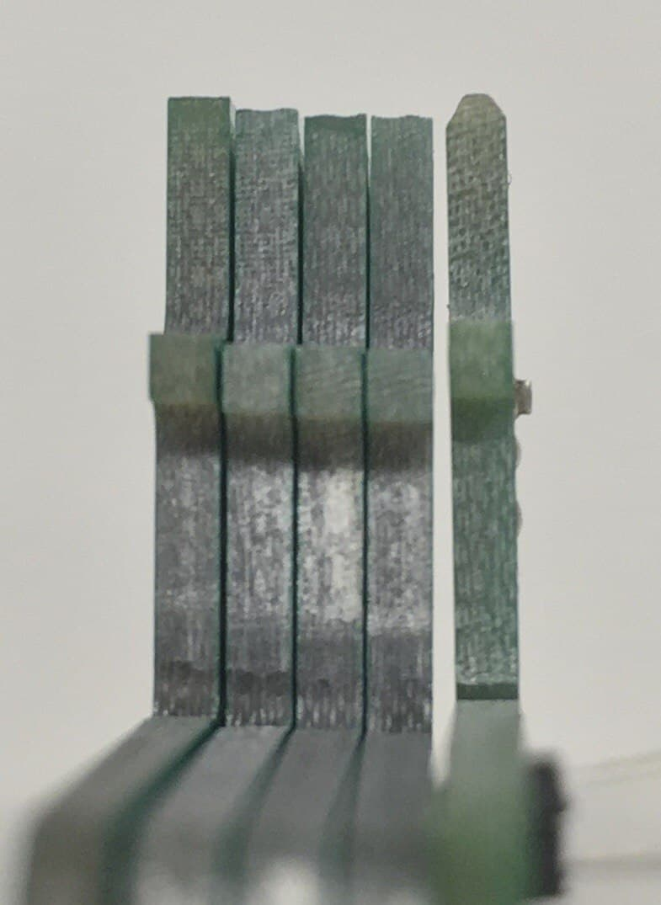

.. _carrier_known_issues:

============
Known issues
============

Ethernet PHY Reset pins
-----------------------
**Problem description**

The Ethernet PHYs (one or two, dependant on the HW version) own a reset pin ``RESETn`` which should be toggled by an GPIO after power-up. Due to a design mistake, those 
``RESETn`` pins were not connected to any GPIO. Therefore, on some UltraZohm systems the PHYs might end up in an undefined state after power-up und not reachable via ethernet connection.

**Remedy**

Hardware revision ``Rev04`` (two PHYs):
Replace resistors ``R210`` and ``R230`` with a 10kOhm resistor (package 0603).

Hardware revision ``< Rev04`` (one PHY):
Replace resistor ``R210`` with a 10kOhm resistor (package 0603).

Solder some proper jumper wires to the pads of the resistors as shown below and wrap them around the edge of the carrier board to the bottom side.

.. image:: pictures/PHYfixResistors.png
   :width: 800

.. image:: pictures/PHYfixTOP.png
   :width: 800

Next, attach them to the respective pads of X9 as shown below.

.. image:: pictures/PHYfixMIOs.png
   :width: 600

.. image:: pictures/PHYfixBOT.png
   :width: 600

A proper software driver for toggeling the PHY reset pins is shipped by default with ultrazohm_sw ``v1.0.2`` and newer.

This issues is present in version ``1v5`` to ``Rev04`` and is resolved in revisions newer than that. 
For further technical details, see `Carrier Board Issue 122 <https://bitbucket.org/ultrazohm/ultrazohm_carrierboard/issues/122/gpio-to-toggle-phy-reset-might-solve-phy>`_

Manual Reset (MR) pin
---------------------
**Problem description**

The MR pin on the JTAG adapter is directly routed to the MR interface on the Trenz SoM.
However, there is a mismatch in the voltage level: the JTAG adapter has **1.8V** logic level and the MR pin of the SoM is **3.3V** logic level. 

.. warning::
   This mismatch can lead to unexpected hard resets of the SoM. Clearing the PL and PS configuration (much like turning the entire system off and back on again).

**Remedy**

Cut off the MR pin from the JTAG adapter ``X8-11``, as shown below. 

.. image:: pictures/MR_pin_2_red.jpg
   :width: 800

.. image:: pictures/MR_pin_1.jpg
   :width: 600

This issues is present in version ``1v5`` to ``3v0`` and is resolved in ``4v0``. 
For further technical details, see `Carrier Board Issue 46 <https://bitbucket.org/ultrazohm/ultrazohm_carrierboard/issues/46/remove-mr-manual-reset-pin-from-jtag>`_

Bend pins in adapter card connectors X5 and X6
-----------------------------------------------------
**Problem description**

It can happen that the pins on the edge connector sockets X5 and X6 (where the adapter cards are plugged in) are bend downwards, as shown below. 

.. image:: pictures/bend_pins.jpg
   :height: 600

We noticed that this can happen for **two** reason: 

1. The mating specified alignment is violated. This can easily happen if the adapter cards are plugged in without using the alignment rails.

.. image:: pictures/bend_pins_alignment.png
   :width: 600

2. The adapter card does not have a chamfer. The edge connector should have an angled finish. Below shows an example, left without chamfer, right with proper chamfer. 

**Remedy**

1. Use the alignment rails in the housing when plugging in adapter cards. Do not plug in any cards when the carrier board is not in the housing. 
2. When ordering PCBs for adapter cards, make sure the option "chamfer" is checked, any angle between 30° and 45° works. The PCB thickness should be 1.6mm. With JLCPCB, we had issues that they forgot to add the chamfer even though this was specified in the order. In this case, complain and you will get a replacement or refund. 
3. From carrier board version ``4v0`` and onwards we change to the (pin-compatible) HTEC8 connector. This connector protects the pins from bending and no chamfer is needed. The only drawback is that these connectors do not have the board lock option (yet). 

.. image:: pictures/bend_pins_HTEC8.png
   :width: 600

This issues is present in version ``1v5`` to ``3v0`` and is resolved in ``4v0``. 
For further technical details, see `Carrier Board Issue 17 <https://bitbucket.org/ultrazohm/ultrazohm_carrierboard/issues/17/pins-on-the-analog-and-digital-connectors>`_

Level-Shifter not working
---------------------------
**Problem description**

Level-Shifter U14, U25, and U30 do not work properly. 
In the schematic, some resistors are connected at the wrong position.

**Remedy**

Replace resistors **R149**, **R211**, and **R225**  with 0 Ohm resistor.

This issues is present in version ``3v0`` and is resolved in ``4v0``. 
For further technical details, see `Carrier Board Issue 36 <https://bitbucket.org/ultrazohm/ultrazohm_carrierboard/issues/36/test-solutions-of-new-level-shifter-u14>`_

Issues on Carrier Board 1v5
-------------------------------------

.. warning::
   * Power Mode Dip Switches: EN_GT is disabled, because of a bug in the layout for "EN_GT_L". Anyway, this is for FireFly and not necessary so far.

.. warning::
   * PUDC_B: This issue is only necessary for the carrier board version ``1v5``!
   * Do not Place R19 at all on the carrier board. Keep the pin open (floating Pin).
   * The Trenz Module has an internal Pull-Up to 1V8. (Pin J2-127).
   * Pull-up during configuration (pulled-up to PL_1V8).

