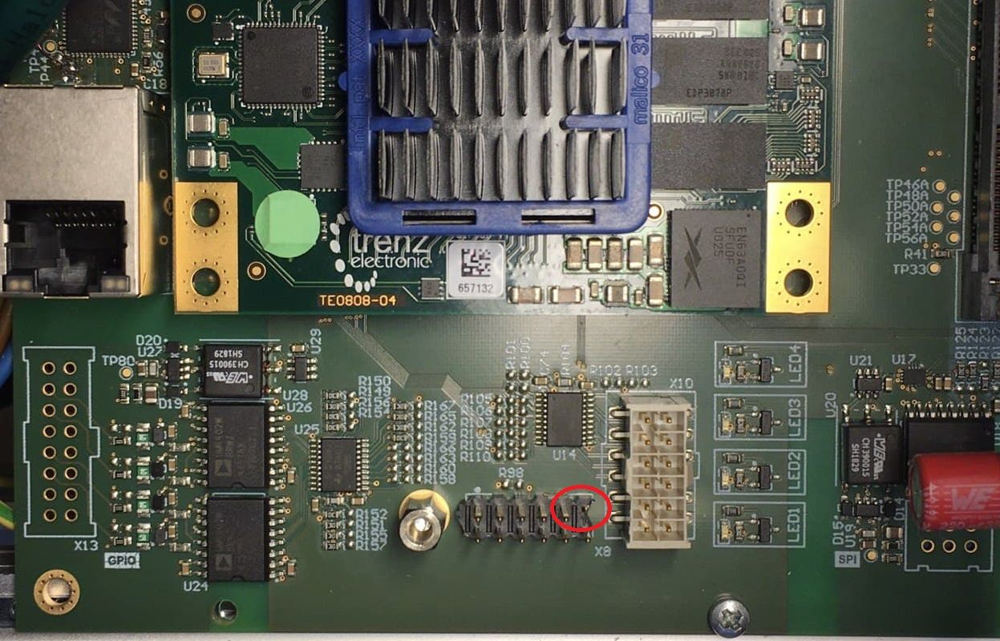
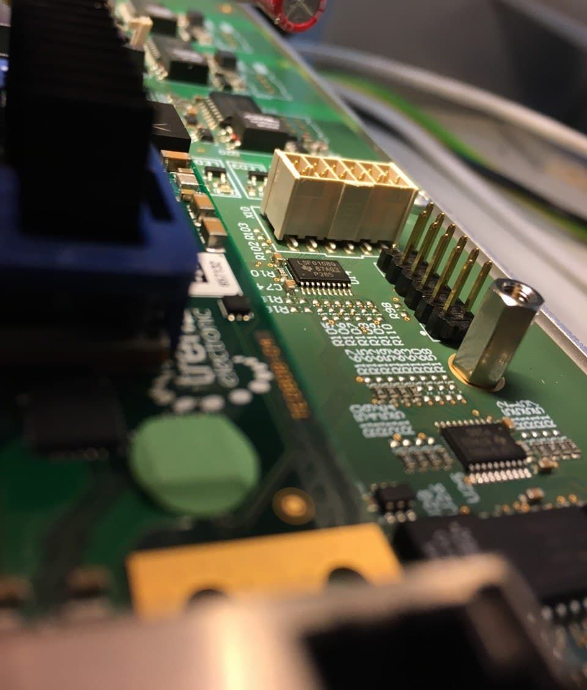

.. _carrier_known_issues:

============
Known issues
============

Manual Reset (MR) pin
---------------------
**Problem description**

The MR pin on the JTAG adapter is directly routed to the MR interface on the Trenz SoM.
However, there is a mismatch in the voltage level: the JTAG adapter has **1.8V** logic level and the MR pin of the SoM is **3.3V** logic level. 

.. warning::
   This mismatch can lead to unexpected hard resets of the SoM. Clearing the PL and PS configuration (much like turning the entire system off and back on again).

**Remedy**

Cut off the MR pin from the JTAG adapter ``X8-11``, as shown below. 

This issues is present in version ``1v5`` to ``3v0`` and is resolved in ``4v0``. 
For further technical details, see `Carrier Board Issue 46 <https://bitbucket.org/ultrazohm/ultrazohm_carrierboard/issues/46/remove-mr-manual-reset-pin-from-jtag>`_

Issues on Carrier Board 1v5
-------------------------------------

.. warning::
   * Power Mode Dip Switches: EN_GT is disabled, because of a bug in the layout for "EN_GT_L". Anyway, this is for FireFly and not necessary so far.

.. warning::
   * PUDC_B: This issue is only necessary for the carrier board version ``1v5``!
   * Do not Place R19 at all on the carrier board. Keep the pin open (floating Pin).
   * The Trenz Module has an internal Pull-Up to 1V8. (Pin J2-127).
   * Pull-up during configuration (pulled-up to PL_1V8).

