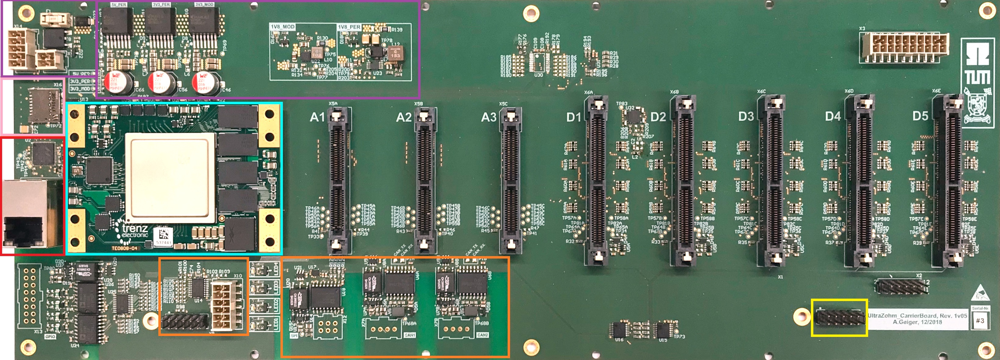
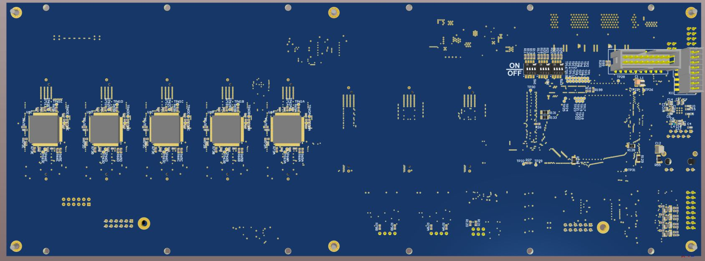

========
Overview
========

* Zynq UltraScale+ MPSoC module (cyan)
* Power Supply (purple)
* Gigabit Ethernet (red)
* Communication Interfaces (isolated SPI, 2x isolated CAN, I2C, SPI, UART) (orange)
* SD Card (pink)
* JTAG for CPLDs (yellow)
* Analog Sockets (A1-A3) 
* Digital Sockets (D1-D5)

.. image:: pictures/carrier_board_top_3D.jpg
   :width: 800

Useful things to buy
--------------------

* `USB Hub with Ethernet Adapter <https://www.amazon.de/gp/product/B073PVB9MM/>`_
* `Cable USB Mini B <https://www.amazon.de/AmazonBasics-IFRI-Stecker-Mini-B-Stecker-Schwarz/dp/B00NH13S44>`_
* `Short LAN cables <https://www.amazon.de/Cat-7-Netzwerkkabel-1m-Ethernetkabel-Patchkabel/dp/B01MZHGZ5Y/>`_
* `Replaceable fuse **F1** on Carrier Board <https://de.rs-online.com/web/p/nicht-rueckstellende-sicherungen-smd/1740681/>`_
* `Fuse in 230V mains connector <https://de.rs-online.com/web/p/feinsicherungen/5371004/>`_
* `Soldered Fuse on Adapter Cards <https://de.rs-online.com/web/p/rueckstellende-sicherungen-smd/1740837/>`_

Downloads
---------

Carrier Board 2v00
******************

:download:`Schematic 2v00 <altium_output/SCH_UltraZOhm_CarrierBoard_2v00.pdf>`

:download:`Assembly Drawing 2v00 <altium_output/ASM_UltraZOhm_CarrierBoard_2v00.pdf>`

Carrier Board 3v00
******************

:download:`Schematic 3v00 <altium_output/SCH_UltraZOhm_CarrierBoard_3v00.pdf>`

:download:`Assembly Drawing 3v00 <altium_output/ASM_UltraZOhm_CarrierBoard_3v00.pdf>`

:download:`Draftsman 3v00 <altium_output/DFT_UltraZOhm_CarrierBoard_3v00.pdf>`