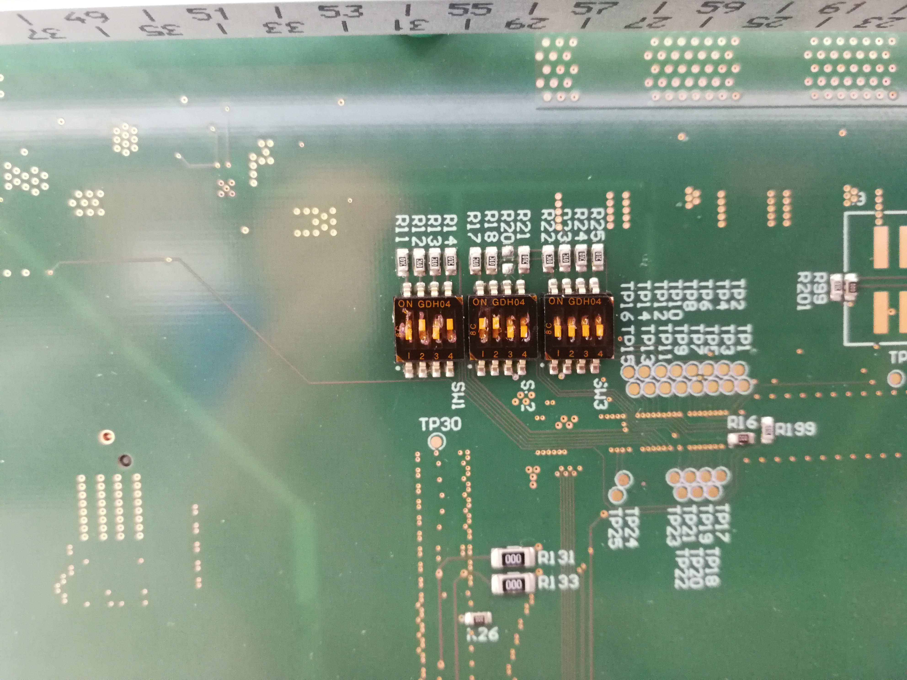

.. _label_switches_jumpers:

====================
Switches and Jumpers
====================

**Motivation**

The carrier board has several dip switches on the back to change the boot mode and to activate or deactivate the power supply for various functions.
The settings of the switches are chosen regarding the "TRM-TEBT0808-01" manual.
 

SW1 - Boot Mode
---------------

1. Adjustments for booting (Boot Mode Settings ->page 7 of TRM-TEBT0808.01):

2. The ``default configuration`` for the UltraZohm is using SD1.

.. list-table:: Boot Mode
   :widths: 10 10 10 10 20 20 20 
   :header-rows: 1

   * - SW1-1
     - SW1-2
     - SW1-3
     - SW1-4
     - Bootmode Hex
     - Bootmode
     - Comment
   * - M0
     - M1
     - M2
     - M3
     -
     -
     -
   * - ON
     - ON
     - ON
     - ON
     - 0x0
     - PS Main JTAG (TE0790 USB JTAG)
     - Needed for SPI Flash Programming
   * - ON
     - OFF
     - ON
     - ON
     - 0x2
     - SPI Flash (dual parallel, 4bit x 2, 32bit Addressing)
     - Default
   * -
     -
     -
     -
     - 0x3
     - SD0: Supports SD 2.0.
     - MIO[25:13]
   * - ``OFF``
     - ``ON``
     - ``OFF``
     - ``ON``
     - 0x5
     - SD1: Supports SD 2.0.
     - MIO[51:38]

3. A more detailed description is given in Table 9 of <https://wiki.trenz-electronic.de/display/PD/TE0808+TRM>

SW2 - Power Mode First Part
---------------------------

1. EN_GT is disabled, because of a Bug in the layout for "EN_GT_L" -> Anyway, this is for FireFly and not necessary so far.

2. The ``default configuration`` for the UltraZohm is highlighted.

.. list-table:: Power Mode
   :widths: 40 15 15 15 15 
   :header-rows: 1

   * - Power Mode
     - SW2-1
     - SW2-2
     - SW2-3
     - SW2-4
   * - 
     - EN_PSGT
     - EN_GT_R
     - EN_GT_L
     - EN_PLL_PWR
   * - Power Enabled
     - OFF
     - OFF
     - ``OFF``
     - ``OFF``
   * - Power Disabled
     - ``ON``
     - ``ON``
     - ON
     - ON

SW3 - Power Mode Second Part
----------------------------

1. All Switches are changed to "Off" in order to give 3.3V to the Enable Pins and switch on this DC/DC converters on the Trenz module.

2. The ``default configuration`` for the UltraZohm is highlighted.

.. list-table:: Power Mode
   :widths: 40 15 15 15 15 
   :header-rows: 1

   * - Power Mode
     - SW3-1
     - SW3-2
     - SW3-3
     - SW3-4
   * - 
     - EN_DDR
     - EN_LPD
     - EN_PL
     - EN_FPD
   * - Power Enabled
     - ``OFF``
     - ``OFF``
     - ``OFF``
     - ``OFF``
   * - Power Disabled
     - ON
     - ON
     - ON
     - ON

Default adjustments for the UltraZohm
-------------------------------------

Known issues
------------------------

.. warning::
   * Power Mode Dip Switches: EN_GT is disabled, because of a bug in the layout for "EN_GT_L". Anyway, this is for FireFly and not necessary so far.

.. warning::
   * PUDC_B: This issue is only necessary for the carrier board version ``1v5``!
   * Do not Place R19 at all on the carrier board. Keep the pin open (floating Pin).
   * The Trenz Module has an internal Pull-Up to 1V8. (Pin J2-127).
   * Pull-up during configuration (pulled-up to PL_1V8).
   * `This issue is also described herein. <https://wiki.trenz-electronic.de/display/PD/TE0808+TRM>`_

See also
"""""""""""""""
* `Xilinx boot mode section <https://www.xilinx.com/support/documentation/user_guides/ug1085-zynq-ultrascale-trm.pdf>`_
* `Trenz Dip Switch Wiki in Table 9 <https://wiki.trenz-electronic.de/display/PD/TE0808+TRM>`_

Checked by
""""""""""

Sebastian Wendel (THN) in 02/2020

