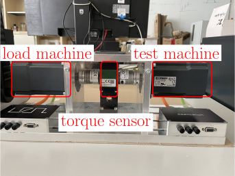
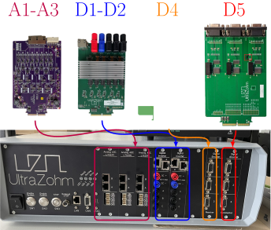

.. _deskbench:

===================
Deskbench
===================

The Deskbench is an office-compatible, compact test bench and efficient solution designed for motor control development in an office or laboratory environment. 
Tailored to meet the needs of engineers and researchers, this versatile test bench provides precise testing capabilities with a focus on motor performance and control system validation.

Variants
=========

The test bench has two variants: one with a Burster torque sensor for real-time torque measurement, and one without torque measurement.
The Burster sensor variant provides high-precision torque data, ideal for detailed performance analysis and torque-dependent tests. 
The variant without torque measurement offers a simpler, cost-effective setup for basic motor testing where torque is not critical. 
Choosing between these variants depends on whether torque measurement is essential to the testing objectives.
The following documentation describes the variant with torque measurement.

   Deskbench front view

Functionality
=============

Key functionalities include:

- Load Machine: A reliable load machine that simulates real-world operational conditions for motors, ensuring thorough performance evaluation.
- Test Machine: The test machine enables accurate measurement and analysis of motor characteristics during operation.
- Torque measurement: The test bench can be equipped with a torque sensor that can measure up to 5 Nm of torque, to validate the developed algorithms.

Ideal for refining motor control algorithms, the Deskbench supports the development and optimization of high-performance motor control systems in a controlled, desk-friendly setup.
:numref:`torque_box_function` shows the UZ with all required cards to operate the test bench.

.. _ deskbench_setup.:

   UZ with the required adapter cards

.. toctree::
   :maxdepth: 1

   Assembly
   Software