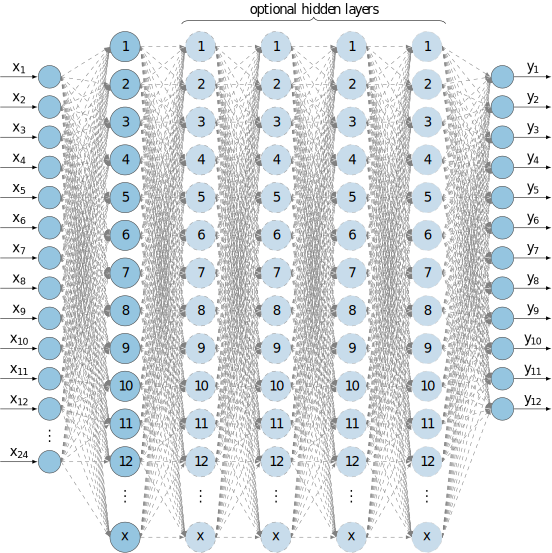

.. _uz_NN_acc:

=========
uz_NN_acc
=========

This IP core implements a **configurable MLP network**, which was developed using Vitis HLS 2022.2.
The implementation and nomenclature follows the principles outlined in :ref:`uz_nn`.

.. Attention:: 
   - Variable layer setup of up to **5 hidden layers** with :ref:`activation_function_relu` activation function for hidden layers.
   - Output in the IP core is hard coded to use :ref:`activation_function_linear` activation. A different activation function for the output layer is done via software.
   - The number of **neurons** in the hidden layers is variable.
   - Variable number of up to **24 Observations**.
   - Variable number of up to **12 Actions**.
   - Execution time of **~11-12µs** for 3x64 setup.
   - Change of layer or neuron count :ref:`requires resynthesis of the IP core in Vitis HLS<uz_NN_customize_setup>`.
   - Synthesis configuration to prioritize performance or reduce resources.
   - One default IP core with 3x64 setup is provided.

Features
--------
- Feedforward calculation in **floating point**
- Bias and weights are written to the IP core during initialization
- Fully compatible with :ref:`uz_nn` to use IP core as an accelerator
- Uses :ref:`uz_matrix` as input and outputs
- IP core is configured and triggered exclusively by the PS
- Blocking and non-blocking operation (see :ref:`Execution<uz_NN_execution>`)
- Correct size of the observation, weights, bias and action arrays will be asserted
- Execution time for a 3x64 setup, with 20 observations and 4 actions takes roughly **~11µs**
- Unsafe math optimization in Vitis HLS is used

Functionality
-------------

The usage of the IP core driver depends heavily on :ref:`uz_nn`.
First, an instance of the software network has to be initialized, e.g., by loading parameters from a header.
Additionally, an array for the output data of the IP core has to be declared (see :ref:`uz_matrix`).
The ``uz_NN_acc_init`` function writes the memory addresses of the weight and bias arrays to the IP core.
Subsequently, the IP core reads all the weights & bias data from system memory.
The weights & bias data are only read once during initialization of the IP core.
During runtime, the weights & bias are stored in BRAM and are fixed.
Only the observation and action data are read and written, respectively, during runtime.

Usage
-----

The following step-by-step description guides the user in order to properly implement the IP core and the respective software driver.

Vivado
======

.. _uz_NN_vivado:

First, the IP core has to be added to the block design in Vivado:

#. In Vivado, open the project and navigate to ``Window->IP-Catalog`` and ``right-click->Refresh All Repository``.
#. Open the already existing ``uz_user`` hierarchy in the block design.
#. Inside this hierarchy, click on the plus (``+``) button to add a new IP core and select one of the following IP cores:

   .. note::
      - Use the ``uz_NN_3_64_acc`` IP core for a preconfigured IP core with 3 hidden layers and 64 neurons each.
      - Use customized ``uz_NN_X_YYY`` IP cores for different neuronal network setups. These can be generated using :ref:`this guide <uz_NN_customize_setup>`.

#. Connect the ``ap_clk`` and ``ap_rst_n`` ports as shown in the image below. The IP core is designed for 100 MHz.
#. Add an additional AXI Port on the next reachable ``AXI SmartConnect`` IP core and connect it to the ``s_axi_control`` port of the IP core.

   .. figure:: uz_NN_acc_blockdesign_1.png
      :width: 600
      :align: center

      Block design after steps above

#. Double-click on the ``zynq_ultra_ps_e`` block in the top hierarchy.
#. Navigate to ``PS-PL Configuration`` -> ``PS-PL Interface`` -> ``Slave Interface``.
#. Add a new ``AXI HPx FPD`` Interface and set the Data Width to ``32``. If more than one uz_NN_acc IP core is being implemented, add a corresponding amount of ``AXI HPx FPD`` interfaces.

   .. figure:: uz_NN_acc_blockdesign_2.png
      :width: 600
      :align: center

      View of the Zynq configuration

#. Press ``OK``.
#. Connect the ``saxihpX_fpd_aclk`` port to the 100 MHz clock signal.

   .. figure:: uz_NN_acc_blockdesign_3.png
      :width: 600
      :align: center

      Zynq clock connection

#. Connect the S_AXI_HPX_FPD port to the output ``m_axi_arrays`` port of the ``uz_NN_acc`` IP core.

   .. figure:: uz_NN_acc_blockdesign_4.png
      :width: 600
      :align: center

      Zynq axi connection

#. Open the ``Address Editor`` and right-click and select ``Assign all``. This assigns the addresses of the M_axi and S_axi interfaces for the IP core.
#. After assignment, it should look similar to this.

   .. figure:: uz_NN_acc_blockdesign_5.png
      :width: 600
      :align: center

      Address assignment

#. Generate the bitstream and export the hardware.
#. In Vitis, generate the workspace with the exported hardware.

Software
========

#. In the :ref:`global_configuration`, include at least one ``uz_NN_acc`` IP core driver instance, :ref:`one software network instance<uz_nn>` and ``(your amount of hidden layers +1)`` :ref:`NN_LAYER instance(s) <uz_nn_layer>`.

   .. code-block:: c
      :caption: ``uz_global_configuration.h`` example code for a 3x64 setup

      #define UZ_NN_ACC_IP_MAX_INSTANCES    1U
      #define UZ_NN_LAYER_MAX_INSTANCES     4U
      #define UZ_NN_MAX_INSTANCES           1U

#. In the ``globalData.h`` file, add the following code to the ``object_pointers_t`` struct:

   .. code-block:: c
      :caption: Code for ``globalData.h`` file

      #include "uz/uz_nn/uz_nn.h"
      #include "uz/uz_matrix/uz_matrix.h"
      #include "IP_Cores/uz_NN_acc/uz_NN_acc.h"
      ...
      typedef struct{
      ...
      uz_matrix_t* matrix_input_acc;
      uz_matrix_t* matrix_output_acc;
      uz_nn_t* nn_layer_acc;
      uz_NN_acc_t* NN_acc_Instance;
      }object_pointers_t;

#. Create a header file (e.g., ``init_network_ip_core.h``) for the ``init_network`` function:

   .. code-block:: c
      :caption: Code for ``init_network_ip_core.h``

      #ifndef INIT_NETWORK_IP_CORE_H
      #define INIT_NETWORK_IP_CORE_H

      void init_network(void);

      #endif /* INIT_NETWORK_IP_CORE_H */

#. Create an initialization C file (e.g., ``init_network_ip_core.c``) for the ``init_network`` function:

   .. warning::
      **Every array and uz_matrix_t object** has to be declared with the **MEMORY_ALIGN** attribute.
      It aligns the arrays (and therefore its pointers) to 32 byte.
      Otherwise, undefined behavior regarding the read/write process of the IP core can occur.

   .. code-block:: c
      :caption: Code for ``init_network_ip_core.c`` for initialization of network and IP core

      #include "../uz/uz_nn/uz_nn.h"
      #include "../IP_Cores/uz_NN_acc/uz_NN_acc.h"
      #include "../../main.h"
      #include "init_network_ip_core.h"
      extern DS_Data Global_Data;

      #define NUMBER_OF_INPUTS 13U
      #define NUMBER_OF_NEURONS_IN_FIRST_LAYER 64U
      #define NUMBER_OF_NEURONS_IN_SECOND_LAYER 64U
      #define NUMBER_OF_NEURONS_IN_THIRD_LAYER 64U
      #define NUMBER_OF_OUTPUTS 4
      #define NUMBER_OF_HIDDEN_LAYER 3

      float x[NUMBER_OF_INPUTS] MEMORY_ALIGN = {1.0f, 2.0f, 3.0f, 4.0f, 5.0f, 6.0f, 7.0f, 8.0f, 9.0f, 10.0f, 11.0f, 12.0f, 13.0f};
      float w_1[NUMBER_OF_INPUTS * NUMBER_OF_NEURONS_IN_FIRST_LAYER] MEMORY_ALIGN = {
      #include "layer1_weights.csv"
      };
      float b_1[NUMBER_OF_NEURONS_IN_FIRST_LAYER] MEMORY_ALIGN = {
      #include "layer1_bias.csv"
      };
      float y_1[NUMBER_OF_NEURONS_IN_FIRST_LAYER] MEMORY_ALIGN = {0};

      float w_2[NUMBER_OF_NEURONS_IN_FIRST_LAYER * NUMBER_OF_NEURONS_IN_SECOND_LAYER] MEMORY_ALIGN = {
      #include "layer2_weights.csv"
      };
      float b_2[NUMBER_OF_NEURONS_IN_SECOND_LAYER] MEMORY_ALIGN = {
      #include "layer2_bias.csv"
      };
      float y_2[NUMBER_OF_NEURONS_IN_SECOND_LAYER] MEMORY_ALIGN = {0};

      float w_3[NUMBER_OF_NEURONS_IN_FIRST_LAYER * NUMBER_OF_NEURONS_IN_SECOND_LAYER] MEMORY_ALIGN = {
      #include "layer3_weights.csv"
      };
      float b_3[NUMBER_OF_NEURONS_IN_THIRD_LAYER] MEMORY_ALIGN = {
      #include "layer3_bias.csv"
      };
      float y_3[NUMBER_OF_NEURONS_IN_THIRD_LAYER] MEMORY_ALIGN = {0};

      float w_4[NUMBER_OF_NEURONS_IN_THIRD_LAYER * NUMBER_OF_OUTPUTS] MEMORY_ALIGN = {
      #include "layer4_weights.csv"
      };
      float b_4[NUMBER_OF_OUTPUTS] MEMORY_ALIGN = {
      #include "layer4_bias.csv"
      };
      float y_4[NUMBER_OF_OUTPUTS] MEMORY_ALIGN = {0};

      struct uz_nn_layer_config software_nn_config[4] = {
          [0] = {
              .activation_function = activation_ReLU,
              .number_of_neurons = NUMBER_OF_NEURONS_IN_FIRST_LAYER,
              .number_of_inputs = NUMBER_OF_INPUTS,
              .length_of_weights = UZ_MATRIX_SIZE(w_1),
              .length_of_bias = UZ_MATRIX_SIZE(b_1),
              .length_of_output = UZ_MATRIX_SIZE(y_1),
              .weights = w_1,
              .bias = b_1,
              .output = y_1},
          [1] = {.activation_function = activation_ReLU, .number_of_neurons = NUMBER_OF_NEURONS_IN_SECOND_LAYER, .number_of_inputs = NUMBER_OF_NEURONS_IN_SECOND_LAYER, .length_of_weights = UZ_MATRIX_SIZE(w_2), .length_of_bias = UZ_MATRIX_SIZE(b_2), .length_of_output = UZ_MATRIX_SIZE(y_2), .weights = w_2, .bias = b_2, .output = y_2},
          [2] = {.activation_function = activation_ReLU, .number_of_neurons = NUMBER_OF_NEURONS_IN_THIRD_LAYER, .number_of_inputs = NUMBER_OF_NEURONS_IN_THIRD_LAYER, .length_of_weights = UZ_MATRIX_SIZE(w_3), .length_of_bias = UZ_MATRIX_SIZE(b_3), .length_of_output = UZ_MATRIX_SIZE(y_3), .weights = w_3, .bias = b_3, .output = y_3},
          //Note:Although IP-Core is hardcoded to activation_linear for the output the specified activation function for the last layer will be applied in software
          [3] = {.activation_function = activation_tanh, .number_of_neurons = NUMBER_OF_OUTPUTS, .number_of_inputs = NUMBER_OF_NEURONS_IN_THIRD_LAYER, .length_of_weights = UZ_MATRIX_SIZE(w_4), .length_of_bias = UZ_MATRIX_SIZE(b_4), .length_of_output = UZ_MATRIX_SIZE(y_4), .weights = w_4, .bias = b_4, .output = y_4}};

      struct uz_matrix_t input_matrix MEMORY_ALIGN={0};
      struct uz_matrix_t output_matrix MEMORY_ALIGN={0};

      void init_network(void){
         Global_Data.objects.matrix_input_acc=uz_matrix_init(&input_matrix,x,UZ_MATRIX_SIZE(x),1U,NUMBER_OF_INPUTS);
         Global_Data.objects.matrix_output_acc=uz_matrix_init(&output_matrix,y_4,UZ_MATRIX_SIZE(y_4),1U,NUMBER_OF_OUTPUTS);
         Global_Data.objects.nn_layer_acc = uz_nn_init(software_nn_config, 4U); //Warning is a GCC 11 bug

         struct uz_NN_acc_config_t IP_config = {
                         .software_network = Global_Data.objects.nn_layer_acc,
                         .base_address = XPAR_UZ_USER_UZ_NN_ACC_0_S_AXI_CONTROL_BASEADDR //May needs adjusting
         };
         Global_Data.objects.NN_acc_Instance = uz_NN_acc_init(IP_config, Global_Data.objects.matrix_input_acc, Global_Data.objects.matrix_output_acc);
       }

#. After including your header file (``init_network_ip_core.h``) in the ``main.h``, add the init function to the main.c file:

   .. code-block:: c
      :caption: Code for main.c

      ...
      switch (initialization_chain)
         {
         ....
         case init_ip_cores:
             ...
             init_network();
             ...
             initialization_chain = print_msg;
             break;
         case print_msg:
         ....

#. To use the IP core in the ISR, add the following code to the ``isr.c``:

   .. code-block:: c
      :caption: Code example for blocking operation ``isr.c``

      float Output[4] = {0};
      float Observation[13] = {0};
      ...
      void ISR_Control(void *data)
      {
         ...
         Observation[0] = ...;
         Observation[1] = ...;
         Observation[2] = ...;
         Observation[3] = ...;
         Observation[4] = ...;
         Observation[5] = ...;
         Observation[6] = ...;
         Observation[7] = ...;
         Observation[8] = ...;
         Observation[9] = ...;
         Observation[10] = ...;
         Observation[11] = ...;
         Observation[12] = ...;
         if (current_state==control_state) {
            for (uint32_t i = 0; i < 13U; i++) {
                 uz_matrix_set_element_zero_based(Global_Data.objects.matrix_input_acc,Observation[i],0U,i);
            }
            uz_NN_acc_ff_blocking(Global_Data.objects.NN_acc_Instance);
            Output[0] = uz_matrix_get_element_zero_based(Global_Data.objects.matrix_output_acc,0U,0U);
            Output[1] = uz_matrix_get_element_zero_based(Global_Data.objects.matrix_output_acc,0U,1U);
            Output[2] = uz_matrix_get_element_zero_based(Global_Data.objects.matrix_output_acc,0U,2U);
            Output[3] = uz_matrix_get_element_zero_based(Global_Data.objects.matrix_output_acc,0U,3U);
         }
         ...

   .. code-block:: c
      :caption: Code example for non-blocking operation ``isr.c``

      float Output[4] = {0};
      float Observation[13] = {0};
      ...
      void ISR_Control(void *data)
      {
         ...
         Observation[0] = ...;
         Observation[1] = ...;
         Observation[2] = ...;
         Observation[3] = ...;
         Observation[4] = ...;
         Observation[5] = ...;
         Observation[6] = ...;
         Observation[7] = ...;
         Observation[8] = ...;
         Observation[9] = ...;
         Observation[10] = ...;
         Observation[11] = ...;
         Observation[12] = ...;
         if (current_state==control_state) {
            for (uint32_t i = 0; i < 13U; i++) {
                 uz_matrix_set_element_zero_based(Global_Data.objects.matrix_input_acc,Observation[i],0U,i);
            }
            uz_NN_acc_ff_non_blocking(Global_Data.objects.NN_acc_Instance);
            //do something else here
            uz_NN_acc_get_result_blocking(Global_Data.objects.NN_acc_Instance);
            Output[0] = uz_matrix_get_element_zero_based(Global_Data.objects.matrix_output_acc,0U,0U);
            Output[1] = uz_matrix_get_element_zero_based(Global_Data.objects.matrix_output_acc,0U,1U);
            Output[2] = uz_matrix_get_element_zero_based(Global_Data.objects.matrix_output_acc,0U,2U);
            Output[3] = uz_matrix_get_element_zero_based(Global_Data.objects.matrix_output_acc,0U,3U);
         }
         ...

Execution
---------

.. _uz_NN_execution:

The regular calculation with the IP core using the software driver and writing the inputs and waiting for the output is a **blocking** operation.
The driver triggers the calculation and waits until it is finished.
The processor can not do any other tasks.

.. code-block::

    uz_NN_acc_ff_blocking(instance);        // Triggering & Calculation takes 12us (example)
    uz_sleep_useconds(10);                  // Takes 10us
                                            // Takes 22us total

.. mermaid::

   sequenceDiagram
       participant Processor
       participant Driver
       Processor->>Driver: uz_NN_acc_ff_blocking
       Driver->>IP-Core: Flush cache for input
       Driver->>IP-Core: Trigger calculation
       loop
           Driver->>IP-Core: Read valid output
           Driver->>Driver: Valid output true?
       end
       Driver->>Processor: Invalidate cache for output

An alternative to the blocking calculation is a concurrent approach.
In this, the IP core calculation is triggered, the processor is free to do other tasks, and the data are fetched after the calculation is finished.
This way, the calculation between trigger and retrieval of result does not add to the total required time if the task in between takes less time than the IP core calculation.
Note that this means the actual calculation time of network without the communication overhead of the read/write operations. 

.. code-block::

    uz_NN_acc_ff_non_blocking(instance);        // Triggering takes 2us
    uz_sleep_useconds(10);                      // Takes 10us //Calculation runs concurrently
    uz_NN_acc_get_result_blocking(instance);    // Takes 3us
                                                // Takes 15us total

.. mermaid::

   sequenceDiagram
       participant Processor
       participant Driver
       Processor->>Driver: uz_NN_acc_ff_non_blocking
       Driver->>IP-Core: Flush cache for input
       Driver->>IP-Core: Trigger calculation
       Processor->>Software: Do something else
       Software->>Processor: return
       Processor->>Driver: uz_NN_acc_get_result_blocking
       Driver->>IP-Core: Trigger writing output
       loop
           Driver->>IP-Core: Read valid output
           Driver->>Driver: Valid output true?
       end
       Driver->>Processor: Invalidate cache for output

Customize IP core
-----------------

.. _uz_NN_customize_setup:

The IP core can be configured according to your needs (neuron count & layer setup).
However, for this to work, the IP core will need to be synthesized again using the new setup.
This guide will walk you through the process.

#. On Windows, make sure that Vitis HLS is added to your path variables.
#. Navigate to ``ip_cores\uz_NN_acc\uz_NN`` and open the ``uz_MMult_MaxSize.h`` file.
#. Change the user-definable variable to your needs.

   .. note::
      - A maximum of **5** hidden layers can be configured.
      - Neurons can be configured on a per-hidden-layer basis as desired.
        The output layer size is automatically appropriately sized to the last hidden layer (if hidden layers < 5).
        Note, however, that increasing the neuron count increases the resource usage significantly.
        **Increasing the number of layers is more resource-efficient in terms of FPGA usage.**
      - The ``Performance_Target`` variable can be used if the generated IP core resources are too much for your specific FPGA.
        Whilst 1==best performance, a higher number reduces the resource usage by decreasing performance.
        A maximum of Performance_Target==Neurons_per_HiddenLayer can be set.
      - Examples of the resource usage for different configurations can be found :ref:`here<uz_NN_resources>`.

   .. code-block:: c
      :caption: User-definable variables in ``uz_MMult_MaxSize.h``

      //User define
      #define Hidden_Layers 3 //max 5
      #define Neurons_1st_Hidden_Layer 64
      #define Neurons_2nd_Hidden_Layer 32
      #define Neurons_3rd_Hidden_Layer 96
      #define Neurons_4th_Hidden_Layer 32
      #define Neurons_5th_Hidden_Layer 64
      #define Performance_Target 1

#. Save the file and navigate to  ``ip_cores\uz_NN_acc``

   .. note::
      - Up to 5 custom IP cores can be generated and stored.
      - To facilitate this, 5 different synthesis solutions are provided.
      - The name of the IP core can be configured in this solution. This is necessary to avoid clashes in Vivado.
      - Example for description: ``5x128_setup``
      - Example for IP core display name: ``uz_NN_5_128_acc``
      - Example for IP core name: ``uz_NN_5_128``

#. Configure solution1 by opening the file ``uz_NN/solution1/script.tcl``.
#. Edit the entry in line 27

   .. code-block:: c
      :caption: Changes to ``script.tcl``

      -description XxYYY_setup -display_name uz_NN_X_YYY_acc -ipname uz_NN_X_YYY
      ...

#. Give the IP core an appropriate name and description. E.g., ``-description 5x128_setup -display_name uz_NN_5_128_acc -ipname uz_NN_5_128``.
#. Save the file.
#. Open the terminal and enter ``vitis_hls -f uz_NN/solution1/script.tcl``.
#. Vitis HLS will now create the project, synthesis your design, and export the RTL code.
#. After you see ``[HLS 200-111] Finished Command export_design``, the synthesis and export are finished.
#. A resource estimation can be found in ``uz_NN_acc\uz_NN\solution1\syn\report`` under ``csynth.rpt``.
   In Vivado, the resource usage (except for DSP Slices) is a bit lower than stated in HLS.
#. [Optional] You can now open the project in the Vitis HLS GUI or with ``vitis_hls -p uz_NN``.
#. In Vivado, open the project and navigate to ``Window->IP-Catalog`` and ``right-click->Refresh All Repository``.
#. After that, follow the :ref:`guide to add the IP core to the block design<uz_NN_vivado>`.
#. [Optional] You can now generate another IP core with a different configuration, by following :ref:`this guide again<uz_NN_customize_setup>`. Modify ``uz_MMult_MaxSize.h`` again and then use solution2-5.

Resource utilization
====================

.. _uz_NN_resources:

The resource utilization depends heavily on the configuration of the IP core.
The following table shows the resource usage in Vivado for different configurations.
Generally, more hidden layers is more resource efficient than more neurons per layer.
Yours may vary slightly.

====== ====== ====== ====== ====== ======
Setup  BRAM    DSP   FF      LUT   LUTRAM
====== ====== ====== ====== ====== ======
1x32   30.5   161    16k    15k    707
5x32   96.5   161    22k    23k    1081
1x64   47     321    27k    24k    729
3x64   112    321    34k    32k    542
5x64   177    321    39k    39k    1097
1x128  80     641    50k    45k    783
5x128  338    641    72k    74k    1469
1x256  147    1281   95k    93k    658
5x256  665    1281   170k   153k   848
====== ====== ====== ====== ====== ======

By adjusting the ``#define Performance_Target 1`` to, e.g., ``4``, the resources for BRAM, LUTs and DSP slices are reduced at the cost of higher latency.

====== ====== ====== ====== ====== ======
Setup  BRAM    DSP   FF      LUT   LUTRAM
====== ====== ====== ====== ====== ======
5x64   48     81     45k    32k    1557
5x128  89     161    83k    59k    2371
5x256  302    321    169k   122k   13005
====== ====== ====== ====== ====== ======

Further improvements
====================

Further improvements are planned for the IP core and in development:

- Updating weights & bias during runtime.

Driver reference
----------------

.. doxygentypedef:: uz_NN_acc_t

.. doxygenstruct:: uz_NN_acc_config_t
    :members:

.. doxygenfunction:: uz_NN_acc_init

.. doxygenfunction:: uz_NN_acc_ff_blocking

.. doxygenfunction:: uz_NN_acc_ff_non_blocking

.. doxygenfunction:: uz_NN_acc_get_result_blocking