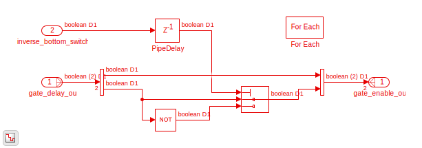

.. _uz_interlockDeadtime2L:

##################################
Interlock and Deadtime module (2L)
##################################

The interlock and dead time IP-Core prevents the TOP and BOT gate signal being high at the same time and introduces a variable dead time between high states.
The dead time has a range of :math:`0\,\mu s` to :math:`10.23\,\mu s` with :math:`10\,ns` resolution if the IP-Core is driven by a :math:`100\,MHz` clock.
If the requested dead time is not an integer multiple of the inverse IP-Core clock frequency (e.g., :math:`10\,ns`) the driver rounds up using ``ceil``.

.. warning::

   It is possible to set the dead time to :math:`0\,\mu s`!
   Check if your power electronics can handle this!

The module features three legs, i.e., is intended for two level voltage inverters.
IP-Core is generated using Simulink HDL-Coder version 2021a.

.. _InterlockDeadtime_driver:

***************
Software Driver
***************

The software driver for the module is located at ``ultrazohm_sw/vitis/export/Baremetal/IP_Cores/uz_interlockDeadtime2L``.
The driver interface is located in ``uz_interlockDeadtime2L.h`` and has four public methods:

 * uz_interlockDeadtime2L_set_enable_output
 * uz_interlockDeadtime2L_get_enable_output
 * uz_interlockDeadtime2L_set_deadtime_us
 * uz_interlockDeadtime2L_get_deadtime_us

Additionally, the static allocator has to be used for initialization and allocation of instances of the struct.

How-to use
----------

An example initialization and usage is listed in the following.

.. code-block:: c
   :linenos:
   :caption: Example initialization and enable output

   #include "IP_Cores/uz_interlockDeadtime2L/uz_interlockDeadtime2L_staticAllocator.h"
   int main(void){
   uz_interlockDeadtime2L_handle deadtime_slotd1 = uz_interlockDeadtime2L_staticAllocator_slotD1();
   uz_interlockDeadtime2L_set_enable_output(deadtime_slotd1, true);
   }

In configure the configuration values in the static allocator function using the base address from ``xparameters.h``.

.. code-block:: c
   :linenos:
   :caption: Example configuration with deadtime of :math:`1\,us` and no inverted bottom switch signals. Code snippet from ``uz_interlockDeadtime2L_staticAllocator_slotD1``

   static uz_interlockDeadtime2L interlock_slotD1 = { 
       .base_address = XPAR_GATES_UZ_INTERLOCKDEADTIME_0_BASEADDR,
       .clock_frequency_MHz = 100,
       .deadtime_us = 1,
       .inverse_bottom_switch = false 
   };

To change the dead time of the module at runtime disable the output and set the dead time:

.. code-block:: c
   :linenos:
   :caption: Changing the dead time at runtime

   uz_interlockDeadtime2L_set_enable_output(deadtime_slotd1,false);
   uz_interlockDeadtime2L_set_deadtime_us(deadtime_slotd1,1.0f);
   uz_interlockDeadtime2L_set_enable_output(deadtime_slotd1,true);

It is not possible to change other values of the module after initialization.

****************
IP-Core Hardware
****************

.. _InterlockDeadtime_ModuleOverview:

.. figure:: ./interlock_deadtime.svg
   :width: 800
   :align: center

   Top view of the Module.

:numref:`InterlockDeadtime_ModuleOverview` shows the module.
The module takes the gate signals of a three phase inverter ``S0..S5`` as input and outputs them as ``S0_out..S5_out``.
The output is enabled if ``AXI_EnableOutput`` is ``true``.
The enable signal is routed to ``enableFB`` to be used by other IP-Cores in the PL.
The :ref:`InterlockDeadtime_interlock` prevents TOP and BOT (S0 & S1, S2 & S3, S4 & S5) of each signal to be ``true`` at the same time.
The :ref:`InterlockDeadtime_deadtime` adds a variable length delay to each rising edge of the input signal.
The number of IP-Core clock cycles added is determined by ``AXI_DelayCycles``.
It is possible to inverse the signal of the bottom switch by setting ``AXI_InverseBotSwitch`` to true, see :ref:`InterlockDeadtime_invBot`.
New values for IP-Core are written by the :ref:`InterlockDeadtime_driver`.

.. _InterlockDeadtime_Interface:

Interface
---------

.. csv-table:: Interfaces of interlock deadtime module
   :file: ./InterlockDeadtime_interfaces.csv
   :widths: 50 50 50 50
   :header-rows: 1

.. _InterlockDeadtime_invBot:

Inverse Bottom switch
---------------------

   Inverses the signal of the BOT switches (S1, S3, S5), if ``AXI_fb_InverseBotSwitch`` is ``true``.

.. _InterlockDeadtime_interlock:

Interlock
---------

..	figure:: ./interlock_module1.svg
   :width: 800
   :align: center

   Interlock prevents the TOP/BOT to switch to ``true`` if BOT/TOP is already ``true``.

.. _InterlockDeadtime_deadtime:

Deadtime
--------

..	figure:: ./deadtime_module.svg
   :width: 800
   :align: center

   Deadtime module

The deadtime module adds a delay to every rising edge on the signals ``S0..S5``.
If TOP_IN/BOT_IN is ``true`` the 10 bit counter starts counting until the value of ``DelayCycles`` is reached.
The switch changes to pass through input one, which in turn makes the ``AND`` switch to true.
The ``true`` signal is held by the resettable delay block.
As soon as TOP_IN/BOT_In switches to ``false`` the ``AND`` switches to ``false``.
The counter for the delay is reset after TOP_IN/BOT_IN switches from ``true`` to ``false``.

**************
Vivado Example
**************

.. figure:: ./ID_vivado.png
    :width: 400
    :align: center

    Screenshot of IP-Core in Vivado.

The clock frequency for ``IPCORE_CLK`` and ``AXI4_Lite_ACLK`` is 100 MHz.

.. csv-table:: Vivado block design interfaces of interlock deadtime module
   :file: ./InterlockDeadtime_VivadoInterface.csv
   :widths: 50 50 50
   :header-rows: 1