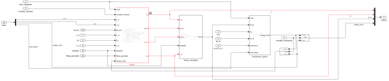

.. _uz_pmsmModel:

==========
PMSM Model
==========

- IP-Core of a PMSM model
- Simulates a PMSM on the FPGA
- Intended for controller-in-the-loop (CIL) on the UltraZohm
- Time discrete transformation is done by *zero order hold* transformation
- Sample frequency of the integrator is :math:`T_s=\frac{1}{500\,kHz}`
- IP-Core clock frequency **must** be :math:`f_{clk}=100\,MHz`!
- IP-Core has single precision AXI ports
- All calculations in the IP-Core are done in single precision!

System description
==================

Electrical System
------------------

The model assumes a symmetric machine with a sinusoidal input voltage as well as the common assumptions for the dq-transformation (neglecting the zero-component).
Small letter values indicate time dependency without explicitly stating it.

Linear model
------------

In the simplified linear case, the PMSM model is based on its differential equation using the flux-linkage as state values in the dq-plane [[#Schroeder_Regelung]_, p. 1092]:

.. math:: 

    \frac{d \psi_d}{dt} &= u_d - R_1 i_d + \omega_{el} \psi_q

    \frac{d \psi_q}{dt} &= u_q - R_1 i_q - \omega_{el} \psi_d

The flux-linkages of the direct and quadrature axis are given by [[#Schroeder_Regelung]_, p. 1092]:

.. math::

    \psi_d &= \psi_{pm} + L_d i_d

    \psi_q &= L_q i_q

Rearranging to calculate the current from the flux-linkage:

.. math::

    i_d &= \frac{\psi_d - \psi_{pm}}{L_d}

    i_q &= \frac{\psi_q}{L_q}

With the rotational speed linked to the electrical rotation speed in dq-coordinates by the number of pole pairs [[#Schroeder_Regelung]_, p. 1092]:

.. math::

    \omega_{el}=p \cdot \omega_{mech}

The PMSM generates an inner torque :math:`T_I` according to:

.. math::

    T_I=\frac{3}{2}p(\psi_d i_q - \psi_q i_d)

This can be rearranged to the following equation [[#Schroeder_Regelung]_, p. 1092]. Note that the flux-based equation above is implemented in the model.

.. math::

    T_I=\frac{3}{2} p \big(i_q \psi_{pm} + i_d i_q (L_d -L_q) \big)

Model with non-linear effects
-----------------------------

This model takes saturation and cross-coupling effects into consideration. The flux-linkage is now dependent on the dq-currrents. 

.. math::

    \frac{d\psi_d}{dt} = \frac{\partial \psi_d}{\partial i_d}\frac{di_d}{dt}+ \frac{\partial \psi_d}{\partial i_q}\frac{di_q}{dt}

    \frac{d\psi_q}{dt} = \frac{\partial \psi_q}{\partial i_d}\frac{di_d}{dt}+ \frac{\partial \psi_q}{\partial i_q}\frac{di_q}{dt}

For the partial derivatives of the flux with respect to the currents, abbreviations are introduced. These are called differential self-inductances :math:`L_{dd}` and :math:`L_{qq}`, as well as the differential cross-coupling inductances :math:`L_{dq}` and :math:`L_{qd}`.

.. math::
  
    L_dd = \frac{\partial \psi_{d}^{\left(i_{d},i_{q}\right)}}{\partial i_{d}}
    
    L_{qq} = \frac{\partial \psi_{q}^{\left(i_{d},i_{q}\right)}}{\partial i_{q}}
    
    L_{dq} = \frac{\partial \psi_{d}^{\left(i_{d},i_{q}\right)}}{\partial i_{q}}
    
    L_{qd} = \frac{\partial \psi_{q}^{\left(i_{d},i_{q}\right)}}{\partial i_{d}} 

Rearranging the equations again to calculate the current from the flux-linkage:

.. math::

    \frac{di_{d}}{dt}=\frac{u_{d}-R_{s}\cdot i_{d}-L_{dq} \frac{di_{q}}{dt}+\omega_{el} \psi_{q}}{L_{dd}}
    
    \frac{di_{q}}{dt}=\frac{u_{q}-R_{s} \cdot i_{q}-L_{qd} \frac{di_{d}}{dt}-\omega_{el} \psi_{d}}{L_{qq}}

The inner torque :math:`T_I`  is calculated using the flux-linkages.

.. math::

    T_I=\frac{3}{2}p(\psi_d(id,iq) i_q - \psi_q(id,iq) i_d)

Mechanical system
-----------------

The mechanical system is modeled by the following equations.
The inertia of the complete system is summed into the inertia :math:`J_{sum}`, i.e., rigid coupling of the system is assumed.

.. math::

  \frac{d \omega_{mech}}{dt} = \frac{ T_I - T_F - T_L }{J_{sum}}

.. tikz:: Block diagram of mechanical system 
  :libs: shapes, arrows

  \begin{tikzpicture}[auto, node distance=1.5cm,>=latex']
  \tikzstyle{block} = [draw, fill=black!10, rectangle, minimum height=3em, minimum width=3em]
  \node[name=Mi]{$M_I$};
  \node[draw,circle,name=torque_sum,right of=Mi] {};
  \node[name=load_torque,above of=torque_sum] {$T_L$};
  \node[block,name=inertia,right of=torque_sum] {$\frac{1}{J_{sum}}$};
  \node[block,name=integrator,right of=inertia] {$\frac{1}{s}$};
  \node[block,name=friction,below of=integrator] {$T_F(\omega)$ };
  \node[fill=black,circle,inner sep=1pt,name=output_node,right of=integrator] {};
  \node[name=output,right of=output_node] {};
  
  \draw[->] (Mi) -- (torque_sum);
  \draw[->] (torque_sum) -- (inertia);
  \draw[->] (inertia) -- (integrator);
  \draw[-] (output_node) |- (friction);
  \draw[->] (friction) -| node[pos=0.9,right] {$-$} (torque_sum);
  \draw[->] (load_torque) -- node[pos=0.9] {$-$} (torque_sum);
  \draw[-] (integrator) -- (output_node);
  \draw[->] (output_node) -- node {$\omega_{mech}$} (output);
  \end{tikzpicture}

Friction
^^^^^^^^

The friction :math:`M_F(\omega)`  [ [#Ruderman_ZurModellierungReibung]_, p. 12 ff] is implemented with the simplified viscous friction model:

.. math::

  M_F = sign(\omega_{mech}) \cdot M_c + \sigma \omega_{mech}

With the constant coulomb friction :math:`M_c`, and the friction coefficient :math:`\sigma`.

.. tikz:: Friction model [ [#Ruderman_ZurModellierungReibung]_, p. 13]
  :libs: 

  \begin{tikzpicture}
  \draw[->] (0,-2) -- node[above left,very near end] {$M_F$}(0,2);
  \draw[->] (-2,0) -- node[below right, near end] {$\omega_{mech}$} (2,0);
  \draw[-,thick] (-2,-2) -- (0,-1) -- (0,1) -- node[below right, near end] {$\sigma \omega_{mech}$} (2,2);
  \draw[->,dashed] (-0.1,0) -- node[left] {$M_C$} (-0.1,1);
  \end{tikzpicture}

IP-Core overview
================

.. tikz:: Block diagram of IP-Core
  :libs: shapes, arrows, positioning, calc

  \begin{tikzpicture}[auto, node distance=2.5cm,>=latex']
  \tikzstyle{block} = [draw, fill=black!10, rectangle, minimum height=3em, minimum width=3em]
  \node[name=ud]{$u_d$};
  \node[name=uq,below = 0.5cm of ud]{$u_q$};
  \node[draw,rectangle,fill=black!10,name=electrical,label=Electrical,below right= -1.0cm and 0.2cm of ud, minimum height=6em, minimum width=3em] {};
  \node[draw,rectangle,fill=black!10,name=torque,label=Torque, right of=electrical,minimum height=6em, minimum width=3em] {};
  \node[draw,rectangle,fill=black!10,name=mechanical,label=Mechanical, right of=torque,minimum height=6em, minimum width=3em] {};
  \node[inner sep=0 pt, name=output, right of= mechanical] {};
  \node[inner sep=0pt, name=ghostnode, below of=mechanical] {};
  \draw[->] (ud.east) -- ([yshift=0.5 cm]electrical.west);
  \draw[->] (uq.east) -- ([yshift=-0.55 cm]electrical.west);
  \draw[->] ([yshift=0.9 cm]electrical.east) --  node[] {$i_d$} ([yshift=0.9 cm]torque.west);
  \draw[->] ([yshift=0.3 cm]electrical.east) --  node[] {$i_q$} ([yshift=0.3 cm]torque.west);
  \draw[->] ([yshift=-0.3 cm]electrical.east) -- node[] {$\psi_d$} ([yshift=-0.3 cm]torque.west);
  \draw[->] ([yshift=-0.9 cm]electrical.east) -- node[] {$\psi_q$} ([yshift=-0.9 cm]torque.west);
  \draw[->] (torque) -- node[name=mi] {$M_I$}(mechanical);
  \node[name=ml,below= 0.2cm of mi] {$M_L$};
  \draw[->] (ml) -- ([yshift=-0.5 cm]mechanical.west);
  \draw[->] (mechanical) -- node {$\omega_{mech}$}(output);
  \draw[-, dashed] (mechanical) -- (ghostnode);
  \draw[->, dashed] (ghostnode) -| node {$\omega_{mech}$} (electrical);
  \end{tikzpicture}

All time-dependent variables are either inputs or outputs that are written/read by AXI4-full.
That is, :math:`u_d`, :math:`u_q`, :math:`\omega_{mech}`, and :math:`M_L` are inputs.
Furthermore, :math:`i_d`, :math:`i_q`, :math:`M_I`, and :math:`\omega_{mech}` are outputs.
The IP-Core inputs :math:`\boldsymbol{u}(k)=[{v}_{d} ~ v_{q} ~ T_{L}]` and outputs :math:`\boldsymbol{y}(k)=[i_{d} ~ i_{q} ~ T_{L} ~ \omega_{m}]` are accessible by AXI4 (including burst transactions).
Furthermore, all machine parameters, e.g., stator resistance, can be written by AXI at runtime.
All AXI-transactions use single-precision variables.
The inputs :math:`\boldsymbol{u}(k)` and outputs :math:`\boldsymbol{y}(k)` use a shadow register that holds the value of the register until a sample signal is triggered.
Upon triggering, the inputs from the shadow register are passed to the actual input registers of the IP-Core, and the current output :math:`\boldsymbol{y}(k)` is stored in the output shadow register (strobe functions of driver).
The shadow registers can be triggered according to the requirements of the controller in the loop and ensure synchronous read/write operations. 
The inputs and outputs are implemented as an vector, therefore the HDL-Coder adds the strobe / shadow register automatically - it is not visible in the model itself.
Note that :math:`\omega_{mech}` is an input as well as an output.
The IP-Core has two modes regarding the rotational speed :math:`\omega_{mech}`:

1. Simulate the mechanical system and calcualte :math:`\omega_{mech}` according to the equations in `Friction`_.
2. Use the rotational frequency :math:`\omega_{mech}` that is written as an input (written by AXI).
   
When the flag ``simulate_mechanical_system`` is true, the rotational speed in the output struct is calculated by the IP-Core, and the input value of the rotational speed has no effect.
When the flag ``simulate_mechanical_system`` is false, the rotational speed in the output struct is equal to the rotational speed of the input.
This behavior is implemented in the hardware of the IP-Core with switches.
The IP-Core also has a mode regarding saturation and cross-coupling effects.
When the flag ``simulate_nonlinear`` is true, the flux-linkages :math:`\psi_d` and :math:`\psi_q` are dependent on the currents with the equations in `Model with non-linear effects`_.
When the flag ``simulate_nonlinear`` is false, the flux-linkages are used as state values with the equations in `Linear model`_.
The input and output values are intended to be written and read in a periodical function, e.g., the ISR.

In addition to the time-dependent values, the PMSM model parameters are configured by AXI.

Integration
-----------

The differential equations of the electrical and mechanical system are discretized using the explicit Euler method [ [#Sanchez_LimitsOfFloat]_, p. 3 ].
Using this method is justified by the small integration step of the implementation (:math:`t_s=0.5~\mu s`) and is a commonly used approach [#Sanchez_LimitsOfFloat]_, p. 3 ].
The new value at time :math:`k+1` of the state variable is calcualted for every time step based on the *old* values (:math:`k`):

.. math:: 

    \psi_d(k+1) &= t_s \bigg( u_d(k) - R_1 i_d(k) + \omega_{el} \psi_q(k) \bigg) + \psi_d(k)

    \psi_q(k+1) &=t_s \bigg( u_q(k) - R_1 i_q(k) - \omega_{el} \psi_d(k) \bigg) + \psi_q(k)

For the mechanical system:

.. math::

    \omega_{mech}(k+1) =ts \bigg( \frac{ T_I(k) - T_F(k) - T_L(k) }{J_{sum}} \bigg) + \omega_{mech}(k)

IP-Core Hardware
----------------

- The module uses single precision. 
- All input values are adjustable at run-time
- The sample time is fixed!
- The IP-Core uses `Native Floating Point of the HDL-Coder <https://de.mathworks.com/help/hdlcoder/native-floating-point.html>`_
- Several parameters are written as their reciprocal to the AXI register to make the calculations on hardware simple (handled by the driver!)
- The IP-Core uses an oversampling factor of 200
- Floating Point latency Strategy is set to ``MIN``
- Handle denormals is activated 

  Test bench of PMSM plant model

  Overview of PMSM IP-Core

  Calculation of PMSM subsystem

  Torque calculation subsystem

.. figure:: pmsm_model_inside_mechanical.svg
  :width: 800
  :align: center

  Mechanical calculation subsystem

Example usage
=============

Vivado
------

- Add IP-Core to Vivado and connect to AXI (smartconnect)
- Source IPCORE_CLK with a :math:`100\,MHz` clock!
- Connect other ports accordingly
- Assign address to IP-Core
- Build bitstream, export .xsa, update Vitis platform

.. figure:: pmsm_vivado.png
   :width: 800
   :align: center

   Example connection of PMSM IP-Core

Vitis
-----

- Initialize the driver in main and couple the base address with the driver instance

.. code-block:: c
  :caption: Changes in ``main.c`` (R5)

  #include "IP_Cores/uz_pmsmMmodel/uz_pmsmModel.h"
  #include "xparameters.h"
  uz_pmsmModel_t *pmsm=NULL;

  int main(void) {
  // other code...

  struct uz_pmsmModel_config_t pmsm_config={
    .base_address=XPAR_UZ_PMSM_MODEL_0_BASEADDR,
    .ip_core_frequency_Hz=100000000,
      .simulate_mechanical_system = true,
      .r_1 = 2.1f,
      .L_d = 0.03f,
      .L_q = 0.05f,
      .psi_pm = 0.05f,
      .polepairs = 2.0f,
      .inertia = 0.001,
      .coulomb_friction_constant = 0.01f,
      .friction_coefficient = 0.001f};
  
  pmsm=uz_pmsmModel_init(pmsm_config);
  // before ISR Init!
  // more code of main

- Read and write the inputs in ``isr.c``
- Add before ISR with global scope to use the driver and :ref:`wave_generator`:

.. code-block:: c
  :caption: Changes in ``isr.c``

  #include "../uz/uz_wavegen/uz_wavegen.h"
  #include "../IP_Cores/uz_pmsmMmodel/uz_pmsmModel.h"
  extern uz_pmsmModel_t *pmsm;

  float i_d_soll=0.0f;
  float i_q_soll=0.0f;
  struct uz_pmsmModel_inputs_t pmsm_inputs={
      .omega_mech_1_s=0.0f,
      .v_d_V=0.0f,
      .v_q_V=0.0f,
      .load_torque=0.0f
  };
  
  struct uz_pmsmModel_outputs_t pmsm_outputs={
      .i_d_A=0.0f,
      .i_q_A=0.0f,
      .torque_Nm=0.0f,
      .omega_mech_1_s=0.0f
  };

  void ISR_Control(void *data){
  // other code
  uz_pmsmModel_trigger_input_strobe(pmsm);
	uz_pmsmModel_trigger_output_strobe(pmsm);
  pmsm_outputs=uz_pmsmModel_get_outputs(pmsm);
  pmsm_inputs.v_q_V=uz_wavegen_pulse(10.0f, 0.10f, 0.5f);
  pmsm_inputs.v_d_V=-pmsm_inputs.v_q_V;
  uz_pmsmModel_set_inputs(pmsm, pmsm_inputs);
  // [...]
  }

- Change the Javascope  ``enum`` to transfer the required measurement data

.. code-block:: c
  :caption: Adjust ``JS_OberservableData`` enum in ``javascope.h`` (R5) to measure pmsm_outputs

  // Do not change the first (zero) and last (end) entries.
  enum JS_OberservableData {
    JSO_ZEROVALUE=0,
    JSO_i_q,
    JSO_i_d,
    JSO_omega,
    JSO_v_d,
    JSO_ENDMARKER
  };

- Configure the Javascope to transmit the pmsm output data:

.. code-block:: c
  :caption: Adjust ``JavaScope_initalize`` function in ``javascope.c`` (R5) to measure pmsm_outputs
    
    #include "../IP_Cores/uz_pmsmMmodel/uz_pmsmModel.h"
    extern struct uz_pmsmModel_outputs_t pmsm_outputs;
    extern struct uz_pmsmModel_inputs_t pmsm_inputs;

    int JavaScope_initalize(DS_Data* data){
    // existing code
    // [...]
    // Store every observable signal into the Pointer-Array.
    // With the JavaScope, 4 signals can be displayed simultaneously
    // Changing between the observable signals is possible at runtime in the JavaScope.
    // the addresses in Global_Data do not change during runtime, this can be done in the init
    js_ch_observable[JSO_i_q] = &pmsm_outputs.i_q_A;
    js_ch_observable[JSO_i_d] = &pmsm_outputs.i_d_A;
    js_ch_observable[JSO_omega] = &pmsm_outputs.omega_mech_1_s;
    js_ch_observable[JSO_v_d] = &pmsm_inputs.v_d_V;
    return Status;
    }

Javascope
---------

- Make sure that in ``properties.ini``, ``smallestTimeStepUSEC = 50`` is set

Flux approximation
------------------

The flux-linkages are approximated using analytic-Prototype functions.
This is based on the approach and findings from [#Shih_Wei_Su_flux_approximation]_.
For a more in depth look at the derivation, see [ [#Philipp_Doelger_MA]_, p. 30 ].

The entire range of the flux-linkages can be approximated with the following equations. 
Note that the terms :math:`\int \hat{\psi}_{cross}^{q,s1}(I_{q1}) di_{q}` and :math:`\int \hat{\psi}_{cross}^{d,s1}(I_{d1}) di_{d}` are constant values and will be used in the fitting parameters.

.. math::

    \hat{\psi}_{d}(i_{d},i_{q}) = \hat{\psi}_{d,self}(i_{d}) - \underbrace{\frac{1}{\int \hat{\psi}_{cross}^{q,s1}(i_{q}) \, di_{q}} \left( \hat{\psi}_{cross}^{d,s1}(i_{d},i_{q}=I_{q1}) \right) \left( \int \hat{\psi}_{cross}^{q,s1}(i_{q}) \, di_{q} \right)}_{=\hat{\psi}_{cross}^{d}(i_{d},i_{q})}

.. math::

    \hat{\psi}_{q}(i_{d},i_{q}) = \hat{\psi}_{q,self}(i_{q}) - \underbrace{\frac{1}{\int \hat{\psi}_{cross}^{d,s1}(i_{d}) \, di_{d}} \left( \hat{\psi}_{cross}^{q,s1}(i_{d}=I_{d1},i_{q}) \right) \left( \int \hat{\psi}_{cross}^{d,s1}(i_{d}) \, di_{d} \right)}_{=\hat{\psi}_{cross}^{q}(i_{d},i_{q})}

Approximation Example usage
---------------------------

In this example usage, flux-linkages of an example motor are getting approximated.

- There needs to be a Excel data sheet in the same directory as the PMSM IP-Core at ``ultrazohm_sw\ip_cores\uz_pmsm_model``.

- The naming in the script has to be adjusted. 

.. code-block:: matlab
    :linenos:
    :caption: Example to get data out of a Excel data sheet.

    ...
    FluxMapData = readtable('FluxMapData_Prototyp_1000rpm_');
    ...

- Afterwards the area where the Array is in the excel sheet has to be specified. 
  
.. code-block:: matlab
    :linenos:
    :caption: Example to specify array location and size.

    ...
    % Currents
    id = FluxMapData{1,1:20};
    iq = FluxMapData{22:41,1};
    %Psi_d
    psi_d = FluxMapData{43:62,1:20}*(1e-3);
    %Psi_q
    psi_q = FluxMapData{108:127,1:20}*(1e-3);
    ...

- To run the approximation script, first the ``uz_pmsm_model_init_parameter.m`` file has to be ran.
- If the the script ran successfully the fitting parameters are in the MATLAB workspace and can be used in the IP-Core for nonlinear behavior or for different use in the sw-framework. 

Comparison between reference and IP-Core
----------------------------------------

- Program UltraZohm with included PMSM IP-Core and software as described above
- Start Javascope
- Connect to javascope, set scope to running and time scale to 100x
- Start logging of data after a falling edge on the setpoint and stop at the next fallning edge
- Copy measured ``.csv`` data to ``ultrazohm_sw/ip-cores/uz_pmsm_model``
- Rename it to ``open_loop_mearuement.csv``
- Run ``compare_simulation_to_measurement.m`` in ``ultrazohm_sw/ip-cores/uz_pmsm_model``

   Comparison of step response between the reference model and IP-Core implementation measured by Javascope

Closed loop
-----------

.. code-block:: c

    uz_pmsmModel_trigger_input_strobe(pmsm);
    uz_pmsmModel_trigger_output_strobe(pmsm);
    pmsm_outputs=uz_pmsmModel_get_outputs(pmsm);
    referenceValue=uz_wavegen_pulse(1.0f, 0.10f, 0.5f);
    pmsm_inputs.v_q_V=uz_PI_Controller_sample(pi_q, referenceValue, pmsm_outputs_old.i_q_A, false);
    pmsm_inputs.v_d_V=uz_PI_Controller_sample(pi_d, -referenceValue, pmsm_outputs_old.i_d_A, false);
    pmsm_inputs.v_q_V+=pmsm_config.polepairs*pmsm_outputs_old.omega_mech_1_s*(pmsm_config.L_d*pmsm_outputs_old.i_d_A+pmsm_config.psi_pm);
    pmsm_inputs.v_d_V-=pmsm_config.polepairs*pmsm_outputs_old.omega_mech_1_s*(pmsm_config.L_q*pmsm_outputs_old.i_q_A);
    uz_pmsmModel_set_inputs(pmsm, pmsm_inputs);
    pmsm_outputs_old=pmsm_outputs;

Driver reference
================

.. doxygentypedef:: uz_pmsmModel_t

.. doxygenstruct:: uz_pmsmModel_config_t
  :members:

.. doxygenstruct:: uz_pmsmModel_outputs_t
  :members:

.. doxygenstruct:: uz_pmsmModel_inputs_t
  :members:  
  
.. doxygenfunction:: uz_pmsmModel_init

.. doxygenfunction:: uz_pmsmModel_set_inputs

.. doxygenfunction:: uz_pmsmModel_get_outputs

.. doxygenfunction:: uz_pmsmModel_reset

.. doxygenfunction:: uz_pmsmModel_trigger_input_strobe

.. doxygenfunction:: uz_pmsmModel_trigger_output_strobe

Sources
-------

.. [#Ruderman_ZurModellierungReibung] Zur Modellierung und Kompensationdynamischer Reibung in Aktuatorsystemen, Michael Ruderman, Dissertation, 2012, TU Dortmund (German)
.. [#Schroeder_Regelung] Elektrische Antriebe - Regelung von Antriebssystemen, Dierk Schröder, Springer, 2015, 4. Edition (German)
.. [#Sanchez_LimitsOfFloat] Exploring the Limits of Floating-Point Resolution for Hardware-In-the-Loop Implemented with FPGAs, Alberto Sanchez, Elías Todorovich, and Angel De Castro, Applications of Power Electronics, https://doi.org/10.3390/electronics7100219
.. [#Shih_Wei_Su_flux_approximation] Analytical Prototype Functions for Flux Linkage Approximation in Synchronous Machines, Shih-Wei Su, Christoph M. Hackl, and Ralph Kennel, IEEE Open Journal of the Industrial Electronics Society, vol. 3, pp. 265-282, 2022, doi: 10.1109/OJIES.2022.3162336
.. [#Philipp_Doelger_MA] Feldorientierte Regelung von hoch ausgenutzten permanenterregten Synchronmaschinen, Philipp Dölger (German)