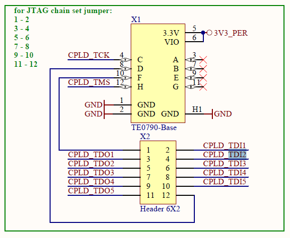
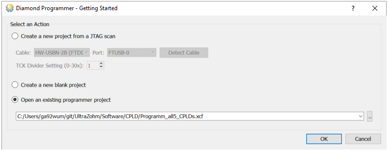
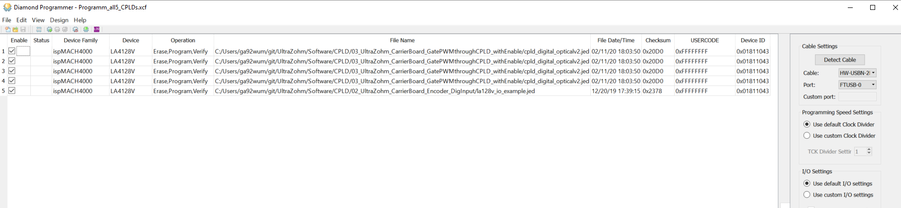
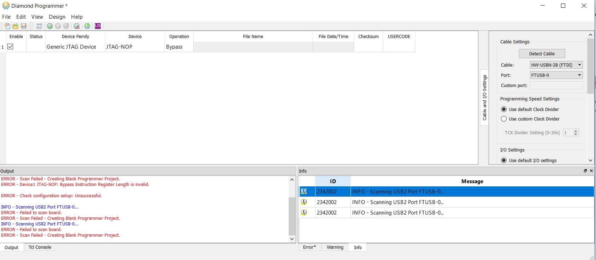

.. _label_cpld_programming:

====
CPLD
====

..	toctree::
	:maxdepth: 2
	:caption: CPLD

**Motivation**

The Carrier Board has one CPLD for each digital interface slot (D1-D5).
They are used to shift the voltage level from 1.8V (FPGA) to 3.3V (Adapter Cards) .
Additional safety can be implemented, e.g. checking switch combinations or ensuring deadtime.

Step-by-step
------------

0. Install the Diamond Programmer by Lattice and download the CPLD software git, see links below.

1. Remove the programmer (normally used for programming the Zynq) from X8 of the Carrier Board.

.. image:: cpld_programming/Programmer_Zynq_position.jpg
   :width: 500

2. Set the DIP-switches S2 on the programmer to **(1on-2off-3off-4off)**.

3. Plug the programmer onto X1. Make sure that the hole in the programmer aligns exactly with the mounting hole on the carrier board.

.. image:: cpld_programming/Programmer_CPLD_position.jpg
   :width: 500

4. Have all jumpers on the Carrier Board plugged on to X2 to create the daisy chain.

.. image:: cpld_programming/jumper_chain.png
   :width: 500

5. Start the Diamond Programmer by Lattice and open the file in the git ``Programm_all5_CPLDs.xcf``

6. Chose the proper CPLD software and chose which CPLDs you want to program. Recommended setup is to have D1-D4 with "03_UltraZohm_CarrierBoard_GatePWMthroughCPLD_withEnable" and D5 for the encoder with "02_UltraZohm_CarrierBoard_Encoder_DigInput". Note that it is possible to program only one of the CPLDs by the enable check box in each line.

7. Plug in the USB cable and turn on power on the UltraZohm. The Programmer on X1 should light up.

8. Click on "Program", after successful programming it should look like this:

.. image:: cpld_programming/diamond_programmer_successful_closeup.png
   :width: 500

9. Turn off the UltraZohm. Remove the programmer from X1 of the Carrier Board, put the DIP switches back in their original position **(1on-2off-3off-4on)** and plug it back to X8 next to the Zynq processor. Make sure that the mounting hole in the programmer aligns exactly with the hole on the carrier board.

.. image:: cpld_programming/Programmer_Zynq_position.jpg
   :width: 500

Known issues
------------
* **Not possible to find the CPLDs**

Close all Vivado and Vitis instances and retry. Restart your PC and retry.

See also
""""""""
* `Lattice Diamond Programmer download <http://www.latticesemi.com/programmer>`_
* `CPLD software git <https://bitbucket.org/ultrazohm/cpld_lattice/src/master/>`_
* `Carrier Board schematic git <https://bitbucket.org/ultrazohm/ultrazohm_carrierboard_2v00_openaccess/src/master/>`_
* `Trenz Programmer Wiki <https://wiki.trenz-electronic.de/display/PD/TE0790+TRM>`_
