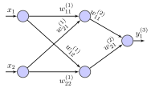

.. _uz_nn:

==============
Neural network
==============

Software module for fully connected `multilayer perceptron networks <https://en.wikipedia.org/wiki/Multilayer_perceptron>`_, a class of feedforward neutral networks (no recurrent connections).
Based on the :ref:`matrix_math` module.

A network with one input layer, one hidden layer and one output layer has :math:`l=2` layers (``Hiddenlayer=1``) (hidden layer +1, input layer is neglected).
The network has ``numInputs=2`` and ``numOut=1``.
The number of neurons in each hidden layer is ``NeuronsPerLayer=2``.
The weight from the first input $x_1$ to the first perceptron of the first hidden layer is called :math:`w^{1}_{11}`.
From the first input to the second perceptron :math:`w^{1}_{12}` and from the second input to the first neuron of the first hidden layer :math:`w^{1}_{21}`.
Generalized:

.. math::

   w^{l}_{i,j}

The index of the layer :math:`l` is counted by :math:`w^{l}`, :math:`w^{1}` is the comlpete matrix with all weights of the layer :math:`l=1`.
The row of the weight matrix is defined by the number of connections which end in the layer.
That is ``numInput`` for the first hidden layer (:math:`w^{1}`) and for all other hidden layer the number of rows (:math:`m`) is equal to ``NeuronsPerLayer``, since the implementation only allows for fully connected neutworks with an equal number of perceptrons per layer.
Therefore each neuron in a hidden layer :math:`l` has one connection to every perceptron of the following layer :math:`l+1`.

The weight matrix has the following dimensions (generic).

.. figure:: img/weights.svg
   :align: center

   Dimensions of weight matrix

For each layer :math:`l` there is a weight and a bias matrix.
The matrix is number by the layer :math:`l` of which the weight belongs to (= the layer to which the weight flows).
The first subscript :math:`i` notes the number (counted from up to down in the layer) of the starting perceptron (or the input).
The second subscript :math:`j` notes the number of the perceptron where the connection ends.

   Simple neural network

The weights and bias of the depicted network are represented by the following equations.

.. math::

   w^{(1)}_{ij}=\left[ \begin{array}{rr} w_{11} & w_{12} \\ w_{21} & w_{22} \\ \end{array}\right]

.. math::

   w^{(2)}_{ij}=\left[ \begin{array}{rr} w_{11} \\ w_{21} \\ \end{array}\right]

The bias are only shown in the top picture and represented as following:

.. math::
   
   b^{(l)}_{ij}=\left[ \begin{array}{rr} b_{11} \\ b_{21} \\ \end{array}\right]
    

Structure of NN
===============

MLP are implemented with the following definition and representation of the neural network.

The MLP has a number of input variables `numInput` (:math:`x`):

.. math::

    x=y^{(0)}=\left[ \begin{array}{rr} y_{1} \\ y_{2} \\ \end{array}\right]

The MLP has a number of output variables `numOut`:

.. math::

    y^{(3)}=\left[ \begin{array}{rr} y_{1} \\ y_{2} \\ \end{array}\right]

The neural network has a number of layers which consists of the input layer, the output layer and the number of hidden layer :math:`l` (`Hiddenlayer`).
The implementation does not hold any parameters for the input layer.
**Note** that the activation function is the same for all perceptrons in a layer!
**Note** that all hidden layer have the same activation function, only the output layer can have a different activation function!
The number of neurons per layer is set by `NeuronsPerLayer` and is the same for all hidden layers.

.. figure:: img/nn_structure.svg
   :align: center

   Structure of a neural network