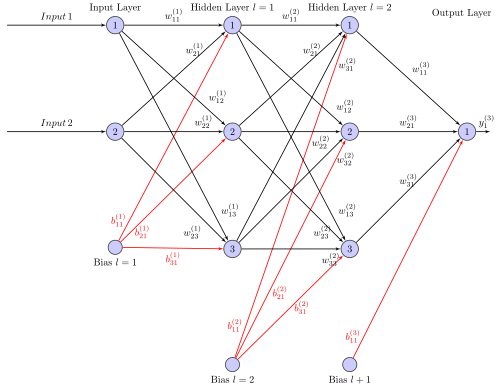

.. _uz_nn:

==============
Neural network
==============

Software module for fully connected `multilayer perceptron networks <https://en.wikipedia.org/wiki/Multilayer_perceptron>`_, a class of feedforward neutral networks.
The module is based on the :ref:`matrix_math` module.

Features and limitations:

- Multiplayer perceptron
- No recurrent connections
- Configurable number of outputs
- Configurable number of inputs
- Configurable number of hidden layer
- Number of neurons in each hidden layer are equal
- Activation function of all hidden layer are equal
- Output layer activation function is independent of hidden layer activation function

Network and dimension definition
================================

A neural network consists of an input layer, one or multiple hidden layer, and an output layer.
Each layer has one or multiple neurons (also called perceptorn or nodes). 
A network with one input layer, one hidden layer and one output layer has :math:`l=2` layers (``Hiddenlayer=1``) (hidden layer +1, input layer is not counted).
A network can have different number of inputs and outputs, e.g., two inputs (``numInputs=2``) and one output (``numOut=1``).
The number of neurons in each hidden layer is defined by ``NeuronsPerLayer=2``.

The weight connecting the first input :math:`x_1` to the first neuron of the first hidden layer is called :math:`w^{(1)}_{11}`.
From the first input to the second neuron :math:`w^{(1)}_{12}` and from the second input to the first neuron of the first hidden layer :math:`w^{(1)}_{21}`.
Generalized:

.. math::

   w^{(l)}_{i,j}

The index of the layer :math:`l` is counted by :math:`w^{(l)}`, :math:`w^{(1)}` is the comlpete matrix with all weights of the layer :math:`l=1`.
The row of the weight matrix is defined by the number of connections which end in the layer.
That is, ``numInput`` for the first hidden layer (:math:`w^{(1)}`) and for all other hidden layer the number of rows (:math:`m`) is equal to ``NeuronsPerLayer`` since the implementation only allows for fully connected neutworks with an equal number of neurons per layer.
Therefore each neuron in a hidden layer :math:`l` has one connection to every neuron of the following layer :math:`l+1`.

The weight matrix has the following dimensions (generic).

.. figure:: img/weights.svg
   :align: center

   Dimensions of weight matrix

For each layer :math:`l` there is a weight and a bias matrix.
The matrix is number by the layer :math:`l` of which the weight belongs to (= the layer to which the weight connects to / where the arrow ends).
The first subscript :math:`i` notes the number (counted from up to down in the layer) of the starting neuron (or the input).
The second subscript :math:`j` notes the number of the neuron where the connection ends.

.. _simple_nn_twolayer:

.. figure:: img/simple_nn_twolayer.svg
   :align: center

   Simple neural network with naming scheme of weights

The weights and bias of network in :numref:`simple_nn_twolayer` are represented by the following equations.

.. math::

   w^{(1)}_{ij}=\left[ \begin{array}{rr} w_{11} & w_{12} \\ w_{21} & w_{22} \\ \end{array}\right]

.. math::

   w^{(2)}_{ij}=\left[ \begin{array}{rr} w_{11} \\ w_{21} \\ \end{array}\right]

The bias are not shown but represented as following:

.. math::
   
   b^{(1)}_{j}=\left[ \begin{array}{rr} b_{1} & b_{2} \\ \end{array}\right]

.. math::
   
   b^{(2)}_{j}=\left[ \begin{array}{rr} b_{1}\\ \end{array}\right]

Structure of NN
===============

Neurons
*******

.. _nn_neuron_definition:

.. figure:: img/neuron.svg
   :align: center

   First neuron :math:`j=1` of layer :math:`l` with inputs :math:`y^l`, weights :math:`w^l_{i,j}`, bias :math:`b^l_j` and output :math:`y^l_j` (definition according to [#intelligente_verfahren]_)

Neurons are the basic building block of neural networks.
A neuron sums over its weighted input values as well as the bias and calculates the output based on an arbitrary activation function :math:`\mathcal{F}(\cdot)`.
The notation of  this software module is based on [#intelligente_verfahren]_, which denotes the number of the layer with the superscript :math:`l` for all parameters.
The weight connecting the output :math:`y^{l-1}_i` of the :math:`i`th neuron of the previous layer :math:`l-1` with the input of the :math:`j`th neuron of the layer :math:`l` is denoted by :math:`w^l_{i,j}`.
The following equation calculates the dot product of the weight vector :math:`\boldsymbol{w}^l_j` and the input vector :math:`\boldsymbol{y}^l_j` of the :math:`j`th neuron of layer :math:`l` with the length :math:`n` and adds the bias :math:`b^l_j` to yield the sum :math:`s^l_j` of the neuron inputs.

.. math::

   s^l_j =\sum^n_{i=1} w^l_{ij} y^{l-1}_{ij} +b^l_j

The output value :math:`y^l_j` of the neuron is calculated by the activation function for all hidden layers.

.. math::

   y^l_j = \mathcal{F}(s^l_j)

Layer
*****

The module is based around a layer concept.
That is, a network is constructed by having one input layer without weights and baises that represents the input to the network as a row vector (number of column is one).
, one output layer and multiple 

Network
*******

MLP are implemented with the following definition and representation of the neural network.
The following example illustrates the implementation structure.

The neural network has a number of layers which consists of the input layer, the output layer and the number of hidden layer :math:`l` (`Hiddenlayer`).
The implementation does not hold any parameters for the input layer.
The number of neurons per layer is set by `NeuronsPerLayer` and is the same for all hidden layers.

   Structure of a neural network

The MLP has a number of input variables `numInput` (:math:`x`), e.g., two:

.. math::

    x &=y^{(0)}=\left[ \begin{array}{rr} x_{1} & x_{2} \\ \end{array}\right] \\
    x &=y^{(0)}=\left[ \begin{array}{rr} 1 & 2 \\ \end{array}\right] 

The MLP has a number of output variables `numOut`, e.g., one:

.. math::

    y^{(3)}=\left[ \begin{array}{rr} y_{1} \\ \end{array}\right]

The MLP has a number of hidden layer, e.g., two with a number of neurons (three in this case).
This results in the following weight matrices and bias vectors.

For the first hidden layer:

.. math::

   w^{(1)} &=\left[ \begin{array}{rr} w_{11} & w_{12} &  w_{13} \\ w_{21} & w_{22} & w_{23} \\ \end{array}\right] \\
   w^{(1)} &=\left[ \begin{array}{rr} 1 & 2 &  3 \\ 4 & 5 & 6 \\ \end{array}\right] \\
   b^{(1)} &=\left[ \begin{array}{rr} b_1 & b_2 &  b_3 \\ \end{array}\right] \\
   b^{(1)} &=\left[ \begin{array}{rr} 1 & 2 & 3 \\ \end{array}\right]

For the second hidden layer:

.. math::

   w^{(2)} &=\left[ \begin{array}{rr} w_{11} & w_{12} &  w_{13} \\ w_{21} & w_{22} & w_{23} \\ w_{31} & w_{32} & w_{33} \end{array}\right] \\
   w^{(2)} &=\left[ \begin{array}{rr} -7 & -8 &  -9 \\ -10 & -11 & -12 \\ 13 & 14 & -15 \\ \end{array}\right] \\
   b^{(2)} &=\left[ \begin{array}{rr} b_1 & b_2 &  b_3 \\ \end{array}\right] \\
   b^{(2)} &=\left[ \begin{array}{rr} 4 & 5 & 6 \\ \end{array}\right]

For the output layer:

.. math::

   w^{(3)} &=\left[ \begin{array}{rr} w_{11} \\ w_{21} \\ w_{31} \end{array}\right] \\
   w^{(3)} &=\left[ \begin{array}{rr} 16 \\ 17 \\ -18 \end{array}\right] \\
   b^{(3)} &=\left[ \begin{array}{rr} b_1 \\ \end{array}\right] \\
   b^{(3)} &=\left[ \begin{array}{rr} 7 \\ \end{array}\right]

The activation function of the hidden layer is set to ReLU, the output activation function to linear.

First layer
***********

.. math::

   \boldsymbol{x} \boldsymbol{w^{(1)}} + \boldsymbol{b^{(1)}} &= \boldsymbol{s^{(1)}} \\  
   \left[ \begin{array}{rr} 1 & 2 \\ \end{array}\right]
   \left[ \begin{array}{rr} 1 & 2 &  3 \\ 4 & 5 & 6 \\ \end{array}\right] 
   +
   \left[ \begin{array}{rr} 1 & 2 & 3 \\ \end{array}\right]
   &= 
   \left[ \begin{array}{rr} 9 & 12 & 15 \\ \end{array}\right]

Activation function:

.. math::

      y^{1} &= ReLU(\boldsymbol{s^{(1)}}) \\
      y^{1} &= ReLU(   \left[ \begin{array}{rr} 10 & 14 & 18 \\ \end{array}\right])\\
      &=  \left[ \begin{array}{rr} 10 & 14 & 18 \\ \end{array}\right]

Second layer
************

The input of the second hidden layer is the output of the first hidden layer :math:`y^{(1)}`:

.. math::

   \boldsymbol{y^{(1)}} \boldsymbol{w^{(2)}} + \boldsymbol{b^{(2)}} &= \boldsymbol{s^{(2)}} \\  
   \left[ \begin{array}{rr} 10 & 14 & 18 \\ \end{array}\right]
   \left[ \begin{array}{rr} -7 & -8 & -9 \\ -10 & -11 & -12 \\ 13 & 14 & -15 \\ \end{array}\right] 
   +
   \left[ \begin{array}{rr} 4 & 5 & 6 \\ \end{array}\right]
   &= 
   \left[ \begin{array}{rr} 28 & 23 & -522 \\ \end{array}\right]

Activation function:

.. math::

      y^{2} &= ReLU(\boldsymbol{s^{(2)}}) \\
      y^{2} &= ReLU(   \left[ \begin{array}{rr} 28 & 23 & -522 \\ \end{array}\right])\\
      &=  \left[ \begin{array}{rr} 28 & 23 & 0 \\ \end{array}\right]

Output layer
************

The input of the output layer is the output of the second hidden layer :math:`y^{(2)}`:

.. math::

   \boldsymbol{y^{(2)}} \boldsymbol{w^{(3)}} + \boldsymbol{b^{(3)}} &= \boldsymbol{s^{(3)}} \\  
   \left[ \begin{array}{rr} 28 & 23 & 0 \\ \end{array}\right]
   \left[ \begin{array}{rr} 16 \\ 17 \\ -18 \end{array}\right] 
   +
   \left[ \begin{array}{rr} 7 \\ \end{array}\right]
   &= 
   \left[ \begin{array}{rr} 846 \\ \end{array}\right]

Activation function:

.. math::

      y^{3} &= linear(\boldsymbol{s^{(3)}}) \\
      y^{3} &= linear(   \left[ \begin{array}{rr} 443 \\ \end{array}\right])\\
      &=  \left[ \begin{array}{rr} 443 \\ \end{array}\right]

Additional functions
====================

..	toctree::
    :maxdepth: 2
    :hidden:
    :glob:

    *

Sources
=======

.. [#intelligente_verfahren] Schröder, Dierk, "Intelligente Verfahren", Springer, 2010.
.. [#realTimeInference] T. Schindler and A. Dietz, "Real-Time Inference of Neural Networks on FPGAs for Motor Control Applications," 2020 10th International Electric Drives Production Conference (EDPC), 2020, pp. 1-6, doi: 10.1109/EDPC51184.2020.9388185.

