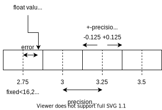

.. uz_fixedpoint:

===================
Fixed point library
===================

Fixed point data types store fractional numbers as integer values with a fixed number of bits used for the integer part of the value and a fixed number of bits used for the fractional part.
Fixed point data type can have an arbitrary number of total bits (maximum number of bits is 32) and are distinguished between signed and unsigned data.
The fixed point library provides a definition data type for the PS to ease the handling of them.
The library is only intended to be used in the lowest software layer of IP-Core drivers to read/write to and from the PL (i.e., functions that are named with ``_hw``).
It is aimed to provide a clean way to interact with IP-Cores that use fixed-point data representation.
Thus, all functions accept ``float`` values as their inputs and return ``float`` values, all fixed point handling is done internally.
The read and write functions check against boundaries of the fixed point data type - the data itself is always a 32 bit integer internally on the PS that is not exposed to the user.
That is due to the AXI data width of 32-bit.
This software module is not intended to do fixed point math on the processor and does not provide functions for it!

- Data is stored as 32 bit on the processor (signed/unsigned)
- Data is divided into fractional and integer bits
- The first :math:`N`-bits are the fractional bits depending on the representation
- The following :math:`M`-bits are the integer bits depending on the representation

.. _fixedpoint_bitmap:

.. figure:: fixedpoint_bitfield.drawio.svg

  Binary representation of fixed point values in memory.

:numref:`fixedpoint_bitmap` showcases the split-up of a 32 bit integer variable.
Note that this is just a metal model for the user, the processor nor the compiler do know about the split up.

The represented fixed point number is scaled (multiplied) by a fixed scaling factor.
The software assumes binary scaling, that is, base 2 is used for scaling the fixed point value.
The scaling factor :math:`s` is determined by the number of fractional bits :math:`n` by :math:`s=2^{-N}`.
A ``float`` value :math:`r` is converted to a fixed point number (stored integer) :math:`x` by :math:`x = r \cdot s = r \cdot 2^{-N}`.
The inverse conversion is done by :math:`r = x \cdot 2^{N}`.

The fixed point data type uses `two's complement <https://en.wikipedia.org/wiki/Two%27s_complement>`_ for Vitis HLS and Matlab HDL-Coder (https://de.mathworks.com/help/simulink/ug/fixed-point-numbers.html)
Please note that are conflicting definitions of fixed point data types.
The definition outlined here is consistent with Vitis HLS (see https://www.xilinx.com/html_docs/xilinx2021_1/vitis_doc/use_arbitrary_precision_data_type.html) and Matlab HDL-Coder (https://de.mathworks.com/help/dsp/ug/concepts-and-terminology.html).
See https://de.mathworks.com/help/simulink/ug/scaling-precision-range-quantization.html for a description of the range of the values.

Unsigned fixed point data
*************************

The smallest representable value of unsigned fixed point data is zero (:math:`min=0`).
The biggest representable value is **ADD FORMULA**

Signed fixed point data
***********************

For signed data, the MSB indicates the sign of the value.
A signed fixed point data with :math:`N` integer bits can represent all integers from :math:`-(2^{(N-1)})` to :math:`2^{(N-1)} -1`.

Rounding
********

Currently, the rounding is done by casing the result of ``ldexf`` to ``int``, thus the floating point is truncated (the fractional part is dropped).

.. warning:: Todo: Add rounding versions with roundf, floorf, and so on as an enum for the conversion functions.

.. _fixedpoint_float_rep:

  Relationship of fixed point precision, error and representation of a floating point variable (``float``).

Example
=======

Write
*****

Write a value that is a ``float`` in the processor to an IP-Core that expects signed fixed point data with 3 integer and 4 fraction bits.

.. code-block:: c

    #include "uz_fixedpoint.h"
    #define TEST_ADDRESS 0x00F
    float write_value=1.0f;
    struct uz_fixedpoint_definition_t def={
        .is_signed=true,
        .fractional_bits=4,
        .integer_bits=3
    };
    uz_fixedpoint_axi_write(TEST_ADDRESS,write_value,def);

Read
****

Read a value from an IP-Core that is an unsigned fixed point with 10 integer bits and 2 fractional bits and pass it to the processor as a ``float``.

.. code-block:: c

    #include "uz_fixedpoint.h"
    #define TEST_ADDRESS 0x00F
    struct uz_fixedpoint_definition_t def={
        .is_signed=false,
        .fractional_bits=2,
        .integer_bits=10
    };
    float data=uz_fixedpoint_axi_read(TEST_ADDRESS,def);

Reference
=========

.. doxygenstruct:: uz_fixedpoint_definition_t
  :members:

.. doxygenfunction:: uz_fixedpoint_axi_read

.. doxygenfunction:: uz_fixedpoint_axi_write

.. doxygenfunction:: uz_fixedpoint_check_limits

.. doxygenfunction:: uz_fixedpoint_get_precision

.. doxygenfunction:: uz_fixedpoint_get_max_representable_value

.. doxygenfunction:: uz_fixedpoint_get_min_representable_value

Resources
=========

- https://github.com/PetteriAimonen/libfixmath
- https://en.wikipedia.org/wiki/Q_(number_format)
- https://github.com/jcarrano/fixed_point_arith
- https://en.wikipedia.org/wiki/Fixed-point_arithmetic