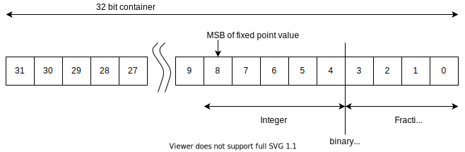
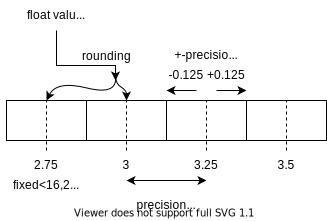

.. _uz_fixedpoint:

===================
Fixed point library
===================

Fixed point data types represent fractional numbers as integer values with a fixed number of bits used for the integer part of the value and a fixed number of bits used for the fractional part.
Fixed point data types can have an arbitrary number of total bits and are distinguished between signed and unsigned data.
This software module only supports a total bit number of 32.
The fixed point library provides a definition data type for the PS to ease the handling of them.

This software module is not intended to do fixed point math on the processor and does not provide functions for it!
It is only intended to be used in the lowest software layer of IP-Core drivers to read/write to and from the PL (i.e., functions that are named with ``_hw``).
The aim is to provide a clean way to interact with IP-Cores that use fixed-point data representation.
Thus, all functions accept ``float`` values as their inputs and return ``float`` values, all fixed point handling is done internally.
The read and write functions check against boundaries of the fixed point data type - the data itself is always a 32 bit integer internally on the PS, which is not exposed to the user.
The 32-bit limitation is due to the AXI data width of 32-bit.

- Data is passed and received from the software module as ``float`` values
- Data is stored as 32 bit integers on the processor internally (signed/unsigned).
- The integer is divided into fractional and integer bits
- The first :math:`N`-bits are the fractional bits depending on the representation
- The following :math:`M`-bits are the integer bits depending on the representation
- The fixed point data is :math:`K=N+M` bits wide with :math:`K \leq 32`

.. _fixedpoint_bitmap:

  Binary representation of fixed point values in memory.

:numref:`fixedpoint_bitmap` showcases the split-up of a 32 bit integer variable.
Note that this is just a mental model for the user, the processor nor the compiler do know about the split up.

Scaling and precision
*********************

The represented fixed point number is scaled by a fixed scaling factor :math:`s`.
The software assumes binary scaling, that is, base 2 is used for scaling the fixed point value.
The scaling factor :math:`s` is determined by the number of fractional bits :math:`N`:

.. math::
 
  s=2^{N}

A floating-point value :math:`x_f` is converted to a fixed point number (stored integer) :math:`x_i` by:

.. math::

  x_i = x_f \cdot s = x_f \cdot 2^{N}

The inverse conversion from the stored integer :math:`x_i` to the floating-point representation :math:`x_f` is done by:

.. math::

  x_f = x_i \cdot 2^{-N}

Please note that there are conflicting definitions of fixed point data types.
The fixed point data type used by Vitis HLS and Matlab HDL-Coder is defined as `two's complement <https://en.wikipedia.org/wiki/Two%27s_complement>`_.
The definition outlined of the software module is therefore consistent with Vitis HLS and Matlab HDL-Coder.
See the following information for more details:

- https://www.xilinx.com/html_docs/xilinx2021_1/vitis_doc/use_arbitrary_precision_data_type.html
- https://de.mathworks.com/help/simulink/ug/fixed-point-numbers.html
- https://de.mathworks.com/help/dsp/ug/concepts-and-terminology.html
- https://de.mathworks.com/help/simulink/ug/scaling-precision-range-quantization.html

Unsigned fixed point data
*************************

For unsigned fixed point data, the smallest and largest values that the data type can represent are calculated by:

.. math::

  min &= 0 \\
  max &= 2^{M}-2^{-N}

Example: unsigned fixed point with 16 bits of which :math:`N=5` bits are used for the fraction and :math:`M=16-5=11` bits are used for the integer part.
The smallest representable value of unsigned fixed point data type is zero (:math:`min=0`).
The largest number is:

.. math::

  max=2^{M}-2^{-N}=2^{11}-0.0312=2047.96875

Signed fixed point data
***********************

A signed fixed point data with :math:`M` integer bits and :math:`N` fractional bits can represent integers from:

.. math::

  min &=-2^{(M-1)} \\
  max &=2^{(M-1)}-2^{-N}

Example: signed fixed point with 16 bits of which :math:`N=5` bits are used for the fraction and :math:`M=16-5=11` bits are used for the integer part.
The precision of the data type is equal to the inverse of the scaling :math:`s^{-1}=2^{-N}=2^{-5}=0.03125`.
The smallest and largest representable numbers for this data type are:

.. math::

  min &=-2^{M-1}=-2^{11-1}=-1024 \\
  max &=2^{M-1}-2^{-N}=2^{11-1}-0.0312=1023.96875

Rounding
********

Since all input and output functions of this software module use single-precision floating-point values (i.e., ``float``), the values have to be rounded to be represented in fixed-point data type.
Note that floating-point values also introduce rounding errors and can not represent values exactly.
See the following for details:

- https://docs.oracle.com/cd/E19957-01/806-3568/ncg_goldberg.html
- https://floating-point-gui.de/
- https://en.wikipedia.org/wiki/Floating-point_arithmetic
- https://en.wikipedia.org/wiki/IEEE_754

.. _fixedpoint_float_rep:

  Relationship of fixed point precision, error, and representation of a floating point variable (``float``).

Given the limited precision of the fixed-point data type (determined by the number of fractional bits :math:`N`), the floating-point value is rounded when converting to fixed-point precision.
The following rounding methods are possible:

- Round to nearest integer (roundf, https://en.cppreference.com/w/c/numeric/math/round)
- Round down (floorf, https://en.cppreference.com/w/c/numeric/math/floor)
- Round up (ceilf, https://en.cppreference.com/w/c/numeric/math/ceil)
- Round towards zero (truncf, https://en.cppreference.com/w/c/numeric/math/trunc)

The software module **always** rounds towards the nearest integer!

Examples
========

Conversion
**********

Converting the floating-point value of :math:`x_f=2.9` to a signed fixed-point data type with :math:`M=14` bits for the integer part and :math:`N=2` bits for the fraction yields the scaling factor :math:`s=2^{4}=4`.

The stored integer is calculated by:

.. math::

  x_i &=x_f \cdot 2^{N} \\
  x_i &=2.9 \cdot 4 = 11.6

The result is rounded by a rounding function:

- ceil: :math:`x_i=12` (:math:`x_f=3.0`)
- floor: :math:`x_i=11` (:math:`x_f=2.75`)
- round: :math:`x_i=12` (:math:`x_f=3.0`)
- trunc: :math:`x_i=11` (:math:`x_f=2.75`)

To convert back to a floating-point value, the stored integer :math:`x_i` is multiplied by the inverse scaling factor:

.. math::

  x_f &= x_i \cdot 2^{-N} \\
  x_{f,ceil} &= 12 \cdot 2^{-2}=3.0 \\
  x_{f,floor} &= 11 \cdot 2^{-2}=2.75 \\
  x_{f,round} &= 12 \cdot 2^{-2}=3 \\
  x_{f,trunc} &= 11 \cdot 2^{-2}=2.75

As it is usually desired to represent the floating-point value as a fixed-point value with the smallest error, rounding to the nearest integer is used.

Write
*****

Write a value that is a ``float`` in the processor to an IP-Core that expects signed fixed point data with 3 integer and 4 fraction bits.

.. code-block:: c

    #include "uz_fixedpoint.h"
    #define TEST_ADDRESS 0x00F
    float write_value=1.0f;
    struct uz_fixedpoint_definition_t def={
        .is_signed=true,
        .fractional_bits=4,
        .integer_bits=3
    };
    uz_fixedpoint_axi_write(TEST_ADDRESS,write_value,def);

Read
****

Read a value from an IP-Core that is an unsigned fixed point with 10 integer bits and 2 fractional bits and pass it to the processor as a ``float``.

.. code-block:: c

    #include "uz_fixedpoint.h"
    #define TEST_ADDRESS 0x00F
    struct uz_fixedpoint_definition_t def={
        .is_signed=false,
        .fractional_bits=2,
        .integer_bits=10
    };
    float data=uz_fixedpoint_axi_read(TEST_ADDRESS,def);

Reference
=========

.. doxygenstruct:: uz_fixedpoint_definition_t
  :members:

.. doxygenfunction:: uz_fixedpoint_axi_read

.. doxygenfunction:: uz_fixedpoint_axi_write

.. doxygenfunction:: uz_fixedpoint_check_limits

.. doxygenfunction:: uz_fixedpoint_get_precision

.. doxygenfunction:: uz_fixedpoint_get_max_representable_value

.. doxygenfunction:: uz_fixedpoint_get_min_representable_value

Resources
=========

- https://github.com/PetteriAimonen/libfixmath
- https://en.wikipedia.org/wiki/Q_(number_format)
- https://github.com/jcarrano/fixed_point_arith
- https://en.wikipedia.org/wiki/Fixed-point_arithmetic