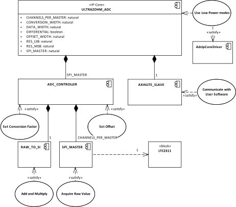

.. _ipCore_LTC2311_v3:

==============
ADC LTC2311 V3
==============

Introduction
------------

The IP core ADC_LVDS_LTC2311 in version 3 is designed to read the ADCs
which are located on the :ref:`analog adapter board
<Analog_LTC2311_16_v3>` and to further process the values obtained
from the ADCs. The IP core features an AXI4 Lite interface for
settings and software control. For real time control, the IP core can
be triggered by using a hardware port as well. The raw value from the
ADC and the processed value are available as ``std_logic_vectors`` at
the hardware interface of the IP core. For a thorough project description
please refer to the project report which is available in the 
:ref:`Downloads section <downloads>`

Features
--------

- Up to 32 independent Serial Peripheral Interface (SPI) Masters with
  each up to 32 synchronous channels. In total up to 1024 individual
  ADCs are theoretically possible.
- Pipelined addition with an offset value and subsequent
  multiplication with a conversion factor with the following features:

  + Low resource footprint due to pipelined setup
  + Each individual SPI Master features one DSP48 block
  + The results from the synchronous SPI channels are piped through
    the DSP48 block. This leads to high throughput while maintaining a
    low resource footprint by not granting a single DSP48 block per
    ADC channel.

- Offset and conversion factor are configurable by software
  individually for each ADC
- Burst transfer of a setable number of samples
- Continuous and triggered operation modes
- Hardware trigger interface for real time requirements and software
  trigger interface via AXI4 Lite for convenient usage in case of non
  time-critical applications
- Software control:

  + Software trigger
  + Software reset

- CPHA CPOL and SCLK frequency of the SPI interface are configurable
  by software
- Read only SPI. Only a **unidirectional** communication from the ADC
  to FPGA is possible.
- Single ended output of the core interface. In order to interact with
  the analog adapter board which is connected via LVDS a differential
  buffer needs to be placed at the output of the IP core. The core
  itself only implements the communication logic.

Software Driver
---------------

Configuration Procedure
***********************

Representation in software
**************************

.. _config_typedef:

.. doxygentypedef:: uz_adcLtc2311_t

.. _config_struct:

.. doxygenstruct:: uz_adcLtc2311_config_t
   :members:

Operation
*********

.. doxygenfunction:: uz_adcLtc2311_init

.. doxygenfunction:: uz_adcLtc2311_update_conversion_factor

.. doxygenfunction:: uz_adcLtc2311_update_offset

.. doxygenfunction:: uz_adcLtc2311_update_samples

.. doxygenfunction:: uz_adcLtc2311_update_sample_time

.. doxygenfunction:: uz_adcLtc2311_update_spi

.. doxygenfunction:: uz_adcLtc2311_set_triggered_mode

.. doxygenfunction:: uz_adcLtc2311_set_continuous_mode

.. doxygenfunction:: uz_adcLtc2311_software_trigger

.. doxygenfunction:: uz_adcLtc2311_software_reset

Nap and Sleep Mode
******************

.. doxygenfunction:: uz_adcLtc2311_enter_nap_mode

.. doxygenfunction:: uz_adcLtc2311_leave_nap_mode

.. doxygenfunction:: uz_adcLtc2311_enter_sleep_mode

.. doxygenfunction:: uz_adcLtc2311_leave_sleep_mode

Parameter Adjustment
********************

Every parameter in :ref:`configuration struct <config_struct>` has a get and set function by default.
If a get or set function is not available it is mentioned explicitly. The ``self`` parameter is always
a pointer to the :ref:`instance representing the IP core in software <config_typedef>`. The get function
always asserts that self is not NULL and that the instance is ready and then it returns the demanded value.

If the set function is not further explained below, the value is not examined for validity. Otherwise, the
performed asserts are mentioned below.

.. doxygenfunction:: uz_adcLtc2311_set_samples

.. doxygenfunction:: uz_adcLtc2311_set_sample_time

.. doxygenfunction:: uz_adcLtc2311_set_pre_delay

.. doxygenfunction:: uz_adcLtc2311_set_post_delay

.. doxygenfunction:: uz_adcLtc2311_set_clk_div

.. doxygenfunction:: uz_adcLtc2311_set_cpha

.. doxygenfunction:: uz_adcLtc2311_set_cpol

Functional Description
----------------------

Architecture
************

The IP core is hierarchically organized. The figure below shows the components of the IP core.
Every component is a single VHDL file. The functionality, which is assigned to the component is
also mentioned in the figure.

.. _uz_adcLtc2311_architecture:

   Architecture of the ADC IP core.

Data Flow
*********

Configuration Registers
-----------------------

Control Register
****************

Address offset: 0x0

Software control register of the IP core.

.. _table_adc_cr:
.. csv-table:: ADC_CR
  :file: ./adc_v3/tables/adc_cr.csv
  :widths: 5 10 5 10 40 40
  :header-rows: 1

By setting the bits 4 to 6 the meaning of the value in the
``ADC_VALUE`` register is determined. Bit 4 to 6 are interpreted as an
unsigned integer.

.. _table_adc_cr_2:
.. csv-table::
  :file: ./adc_v3/tables/adc_cr_2.csv
  :widths: 2 2 2 10 40 20
  :header-rows: 1

SPI Control Register
********************

Address offset: 0x4

The SPI interfaces can be controlled manually with this register in
order to use sleep and nap modes of the ADC. The signal ``SS_N`` and
``SCLK`` only can be controlled manually if the selected master
channels are not busy. Check :ref:`table_adc_master_busy` as a status
indicator.

Furthermore, the clock polarity and the sample phase are set with this
register. This setting applies globally to all SPI masters
instantiated.

.. _table_adc_spi_cr:
.. csv-table:: ADC_SPI_CR
  :file: ./adc_v3/tables/adc_spi_cr.csv
  :widths: 5 10 5 10 40 40
  :header-rows: 1

SPI Configuration Register
**************************

Address offset: 0x8

Setting for

- DCNVSCKL (a.k.a PRE_WAIT)
- DSCKLCNVH (a.k.a POST_WAIT)
- Number of system clock cycles per half SCLK cycle - 1 (a.k.a
  CLK_DIV)

See figure 21 in `the datasheet of the LTC2311
<https://www.analog.com/media/en/technical-documentation/data-sheets/231116fa.pdf>`_
for illustration.

The values given indicate the number of system clock cycles for the
time described.

.. _table_adc_spi_cfgr:
.. csv-table:: ADC_SPI_CFGR
  :file: ./adc_v3/tables/adc_spi_cfgr.csv
  :widths: 10 10 5 10 40 30
  :header-rows: 1

Master Channel selection
************************

Address offset: 0xC

Encoding: :ref:`One-Hot <adc_one_hot>`

This register is used for two different functions:

1. Update of the configuration values such as offset, conversion
   factor and number of samples per trigger. In order to specify which
   individual ADC channels shall be updated, the SPI master as well as
   the ADC which is controlled by the selected SPI master channel must
   be selected. The individual channel selection is done in
   :ref:`table_adc_channel`
2. Channel selection for software trigger: When setting the software
   trigger bit in the :ref:`table_adc_cr` all channels selected in
   :ref:`table_adc_master_channel` are triggered by software. When
   using hardware trigger the content of this register is ignored.

.. _table_adc_master_channel:
.. csv-table:: ADC_MASTER_CHANNEL
  :file: ./adc_v3/tables/adc_master_channel.csv
  :widths: 8 30 3 10 30 30
  :header-rows: 1

ADC Channel selection
*********************

Address offset: 0x10

Encoding: :ref:`One-Hot <adc_one_hot>`

When updating the offset and conversion factor select the channel on
the SPI masters selected in :ref:`table_adc_master_channel` that shall
be updated.

.. _table_adc_channel:
.. csv-table:: ADC_CHANNEL
  :file: ./adc_v3/tables/adc_channel.csv
  :widths: 8 30 3 10 30 30
  :header-rows: 1

Transmission ended register
***************************

Address offset: 0x14

Encoding: :ref:`One-Hot <adc_one_hot>`

This register indicates that an SPI master unit finished with the
transmission of the raw value from the SPI master i.e. the value on
the hardware port ``RAW_VALUE`` is valid for the indicated channels.

.. _table_adc_master_finish:
.. csv-table:: ADC_MASTER_FINISH
  :file: ./adc_v3/tables/adc_master_finish.csv
  :widths: 7 25 3 10 30 30
  :header-rows: 1

Addition and Multiplication ended register
******************************************

Address offset: 0x18

Encoding: :ref:`One-Hot <adc_one_hot>`

This register indicates that an SPI master unit finished with the
addition and the multiplication of the raw value  i.e. the value on
the hardware port ``SI_VALUE`` is valid for the indicated channels.

.. _table_adc_si_finish:
.. csv-table:: ADC_MASTER_SI_FINISH
  :file: ./adc_v3/tables/adc_master_si_finish.csv
  :widths: 8 30 3 10 30 30
  :header-rows: 1

Conversion ongoing indicator
****************************

Address offset: 0x1C

Encoding: :ref:`One-Hot <adc_one_hot>`

The indicated master channels are currently busy i.e. a transmission
or a multiplication is ongoing.

.. _table_adc_master_busy:
.. csv-table:: ADC_MASTER_BUSY
  :file: ./adc_v3/tables/adc_master_busy.csv
  :widths: 8 30 3 10 30 30
  :header-rows: 1

Configuration Value register
****************************

Address offset: 0x20

Encoding: Depending on the value

The value for the offset and the conversion factor is given in this
register. The distinction between the offset and the conversion factor
is done in :ref:`table_adc_cr`.

.. _table_adc_off_conv:
.. csv-table:: ADC_VALUE
  :file: ./adc_v3/tables/adc_conv_value.csv
  :widths: 10 10 5 10 30 30
  :header-rows: 1

ADC Available indicator
***********************

Address offset: 0x24

Encoding: :ref:`One-Hot <adc_one_hot>`

The indicated master channels are currently not available because they
are either in sleep mode or in nap mode. This register is set by
software and used by the hardware in order to prohibit a trigger when
an ADC is not available.

.. _table_adc_available:
.. csv-table:: ADC_AVAILABLE
  :file: ./adc_v3/tables/adc_available.csv
  :widths: 8 30 3 10 30 30
  :header-rows: 1

Design Parameters
-----------------

.. _table_adc_generics:
.. csv-table:: Generics
  :file: ./adc_v3/tables/generics.csv
  :widths: 10 30 5 5 30
  :header-rows: 1

I/O Signals
-----------

Clock and Reset
***************

The IP core is globally clocked with the signal ``s00_axi_aclk``. The
global reset signal apart from the software reset is
``s00_axi_aresetn``. The reset is synchronous and low activ. Keep this
signal high for normal operation.

The IP core can be operated with a system clock frequency of up to 100MHz.

AXI Signals
***********

All signals with the prefix ``s00_axi`` belong to the AXI4 Lite
interface. See the Xilinx AXI signal description for details.

Other I/O Signals
*****************

.. _table_adc_io_interface:
.. csv-table:: I/O Interface
  :file: ./adc_v3/tables/io_signals.csv
  :widths: 10 5 40 5 30
  :header-rows: 1

Terminology
-----------

.. _adc_one_hot:

One-Hot Encoding
****************

One-Hot encoding means that every bit in a register controls a channel
of the IP core. This channel can be either an SPI master instance with
a DSP48 block or a channel (a.k.a. individual ADC) of that instance
which is synchronously controlled with the other channels assigned to
the SPI master instance. This distinction is done in the description
of the individual register.

.. _downloads:

Downloads
---------

:download:`Detailed project description <./adc_v3/report_2_wendt.pdf>` 

Designed by
-----------

`Thilo Wendt <mailto:business@thilo-wendt.de>`_, `Institut ELSYS
<https://www.th-nuernberg.de/einrichtungen-gesamt/in-institute/institut-fuer-leistungselektronische-systeme-elsys/>`_
@ `Technische Hochschule Nürnberg <https://www.th-nuernberg.de>`_, 04/2021
