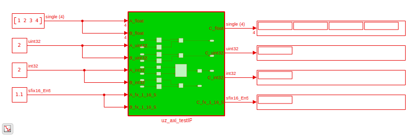
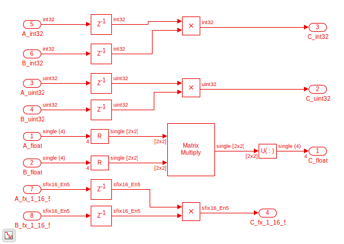

.. _AXI_testIP:

===========
AXI Test IP
===========

This IP-Core is used for testing the AXI communication between PS and PL.
The IP-Core calculates :math:`C=A \cdot B` with different data types.
For all data types except for the ``float`` calculation, the input and output values are scalar.
The ``float`` calculation input and output is a ``2x2`` matrix.

Use this IP-Core to test read/write operations by AXI between PL and PS using the :ref:`HAL`.

.. _AXI_testIP_ModuleOverview:

   Top view of the Module.

.. _AXI_testIP_inner:

   Top view of the Module.

.. csv-table:: Interfaces of the AXI test IP
   :file: ./AXI_testIP_interfaces.csv
   :widths: 50 50 50 50
   :header-rows: 1

Driver function reference
=========================

.. doxygenfunction:: uz_myIP2_init

.. doxygenfunction:: uz_myIP2_multiply