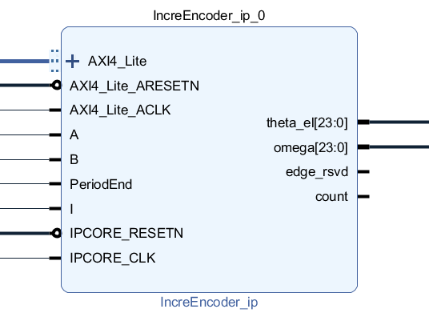

===================
Incremental Encoder
===================

Idea
----

1. This IP Core allows to read an incremental encoder

2. The idea is, that this IP core outputs automatically:
	
	a.) The mechanical spee
	
	b.) the angle of the motor: theta electric
	
	c.) the angle of the shaft: theta mechanical

Basics
------

1. The basic configuration allows:

	
	
2. The conversion allows:

	
		
		
Designed by
-----------

Sebastian Wendel (THN) in 08/2018
