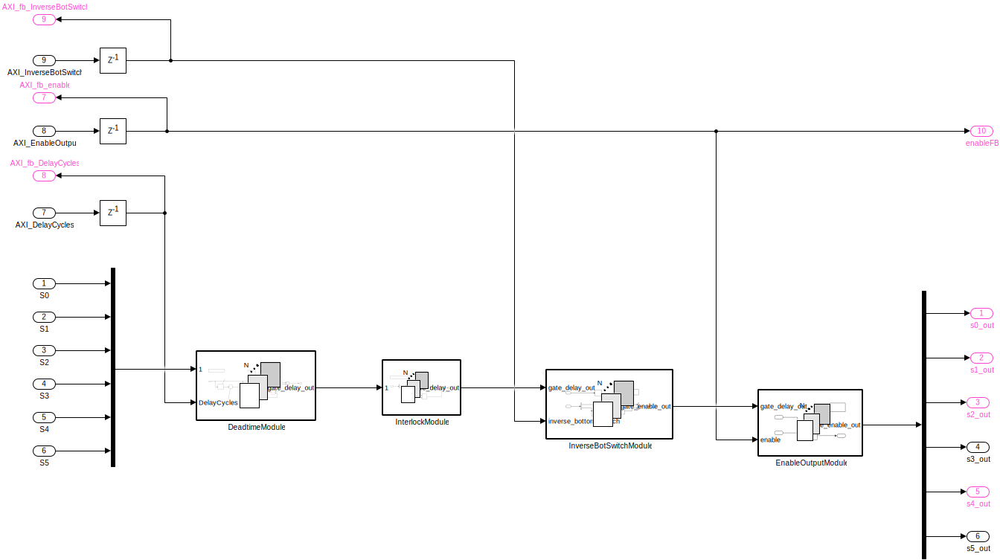
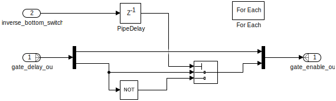
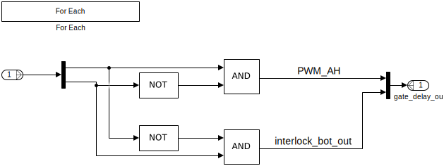
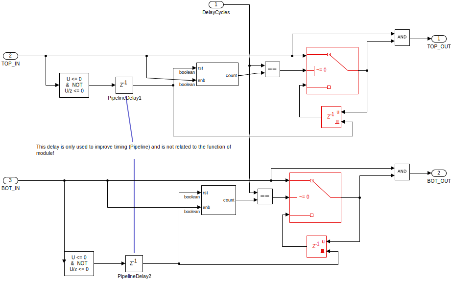
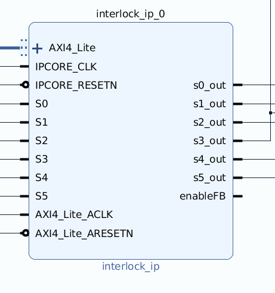

#############################
Interlock and Deadtime module
#############################

The interlock and dead time IP-Core prevents the TOP and BOT gate signal being high at the same time and introduces a variable dead time between high states.
The dead time can be choosen from :math:`0\,\mu s` to :math:`10.24\,\mu s` with :math:`10\,ns` resolution.
If the requested dead time is not an integer multiple of :math:`10\,ns` the driver rounds up (``ceil``).

.. warning::

   It is possible to set the dead time to :math:`0\,\mu s`!
   Check if your power electronics / driver stage can handle this!

The module features three legs, i.e., is intended for two level voltage inverters.
IP-Core is generated by Simulink HDL-Coder 2020b.

.. _InterlockDeadtime_driver:

***************
Software Driver
***************

The software driver for the InterlockDeadtime module is located in ``ultrazohm_sw/vitis/export/Baremetal/IP_Cores/InterlockDeadtime``.
It consists of:

 * ``interlock_ip_add.h`` - AXI addresses (generated by matlab)
 * ``InterlockDeadtime2L.h`` - header of driver
 * ``InterlockDeadtime2L.c`` - implements functions of driver
 * ``InterlockDeadtime_hw.h`` - header of hardware layer
 * ``InterlockDeadtime_hw.c`` - implements functions of hardware layer

The driver is build around the struct ``InterlockDeadtime2L`` and has four public methods:

 * SetEnableOutput
 * GetEnableOutput
 * SetDeadtimeInMicroseconds
 * GetDeadtimeInMicroseconds

The struct holds an instance of the hardware (``hw``) of type ``InterlockDeadtime_hw`` to communicate with the hardware.

How-to use
----------

The functions intended to be used to control the IP-Core are listed in the following.

.. code-block:: c

   InterlockDeadtime2L foo;
   InterlockDeadtime2L_init(foo, DeviceId, BaseAddr, ClockFrequencyMHz, InverseBotSwitch, DeadtimeInMicroSeconds);
   foo.SetEnableOutput(&foo,true);

To change the dead time of the module at runtime disable the output and set the dead time:

.. code-block:: c

   foo.SetEnableOutput(&foo,false);
   foo.SetDeadtimeInMicroseconds(&foo,1.0); // Set to 1.0 us
   foo.SetEnableOutput(&foo,true);

It is not possible to change other values of the module after initialization.

Initialize
----------

``InterlockDeadtime2L_init`` initializes the instance of the IP-Core with a base address and values for the behavior of the module.
If multiple instances of the IP-Core are used, call the function with different base addresses and increment the DeviceId.
The ``BaseAddr`` is set to the define ``XPAR_GATES_INTERLOCK_IP_0_BASEADDR`` which is written to ``xparameters.h`` during synthesis by Vivado.
The clock frequency of the IP-Core is 100 MHz in the example, dead time is :math:`1\,\mu s` and the bottom switch is not inverted.

Example function call:

.. code-block:: c

   u32 Status;
   InterlockDeadtime2L Module1;
   InterlockDeadtime2L Module2;
   u32 DeviceId=1;
   u32 BaseAddr0=XPAR_GATES_INTERLOCK_IP_0_BASEADDR;
   u32 BaseAddr1=XPAR_GATES_INTERLOCK_IP_1_BASEADDR;  
   u32 IPCoreClockFrequencyInMHz=100;
   float DeadtimeInMicroSeconds=1.0;
   bool InverseBotSwitch=false;
   InterlockDeadtime2L_init(foo, DeviceId, BaseAddr, ClockFrequencyMHz, InverseBotSwitch, DeadtimeInMicroSeconds);
   InterlockDeadtime2L_init(foo, DeviceId, BaseAddr, ClockFrequencyMHz, InverseBotSwitch, DeadtimeInMicroSeconds);

****************
IP-Core Hardware
****************

.. _InterlockDeadtime_ModuleOverview:

   Top view of the Module.

:numref:`InterlockDeadtime_ModuleOverview` shows the module.
The module takes the gate signals of a three phase inverter ``S0..S5`` as input and outputs them as ``S0_out..S5_out``.
The output is enabled if ``AXI_EnableOutput`` is ``true``.
The enable signal is routed to ``enableFB`` to be used by other IP-Cores in the PL.
The :ref:`InterlockDeadtime_interlock` prevents TOP and BOT (S0 & S1, S2 & S3, S4 & S5) of each signal to be ``true`` at the same time.
The :ref:`InterlockDeadtime_deadtime` adds a variable length delay to each rising edge of the input signal.
The number of IP-Core clock cycles added is determined by ``AXI_DelayCycles``.
It is possible to inverse the signal of the bottom switch by setting ``AXI_InverseBotSwitch`` to true, see :ref:`InterlockDeadtime_invBot`.
New values for IP-Core are written by the :ref:`InterlockDeadtime_driver`.

.. _InterlockDeadtime_Interface:

Interface
---------

.. csv-table:: Interfaces of interlock deadtime module
   :file: ./InterlockDeadtime_interfaces.csv
   :widths: 50 50 50 50
   :header-rows: 1

.. _InterlockDeadtime_invBot:

Inverse Bottom switch
---------------------

   Inverses the signal of the BOT switches (S1, S3, S5), if ``AXI_fb_InverseBotSwitch`` is ``true``.

.. _InterlockDeadtime_interlock:

Interlock
---------

   Interlock prevents the TOP/BOT to switch to ``true`` if BOT/TOP is already ``true``.

.. _InterlockDeadtime_deadtime:

Deadtime
--------

   Deadtime module

The deadtime module adds a delay to every rising edge on the signals ``S0..S5``.
If TOP_IN/BOT_IN is ``true`` the 8-bit counter starts counting until the value of ``DelayCycles`` is reached.
The switch changes to pass through input one, which in turn makes the ``AND`` switch to true.
The ``true`` signal is held by the resettable delay block.
As soon as TOP_IN/BOT_In switches to ``false`` the ``AND`` switches to ``false``.
The counter for the delay is reset after TOP_IN/BOT_IN switches from ``true`` to ``false``.

**************
Vivado Example
**************

    Screenshot of IP-Core in Vivado.

The clock frequency for ``IPCORE_CLK`` and ``AXI4_Lite_ACLK`` is 100 MHz.

.. csv-table:: Vivado block design interfaces of interlock deadtime module
   :file: ./InterlockDeadtime_VivadoInterface.csv
   :widths: 50 50 50
   :header-rows: 1