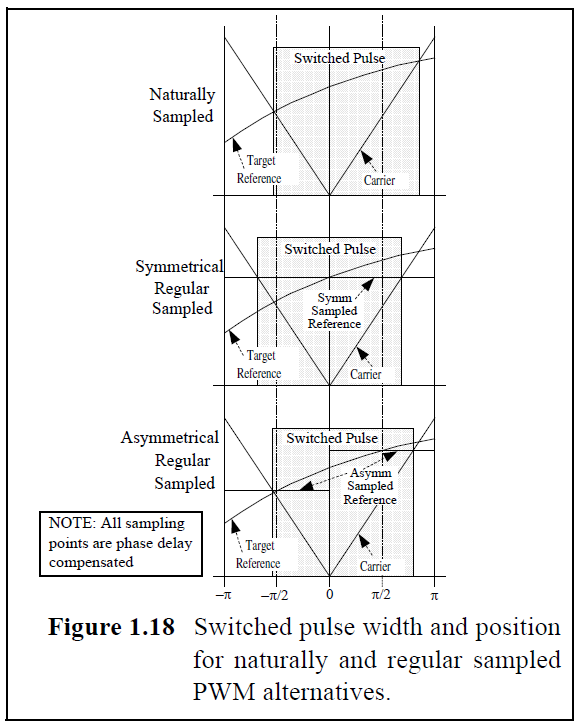

.. _ipCore_pwm:

=====================
PWM and SS Control V3
=====================

Idea
----

1. This IP Core allows to get a Duty Cycle or direct switching states (SS) and outputs the final SS

2. The idea is, to have one IP Core, which enables during operation, to decide if:

	a. A Duty Cycles are received over the AXI interface
	
	b. A Duty Cycles are received directly from inside the FPGA
	
	c. The switching states are received directly from inside the FPGA

	
Basics
------

1. Asymmetrical Regular Sampling is used regarding to Grahame Holmes. 

	
2. The PWM frequency must be between 100 Hz and 100 kHz, otherwise the counter end values must be extended/checked.

4. An up-down-counter is used.

5. A flag for 1 cycle is active at the counter maximum and minimum value for triggering subsequent blocks or interrupts.

6. TriState flags can be used to set both switches of one phase-leg to an off-state.

Designed by
-----------

Sebastian Wendel (THN) in 08/2018

