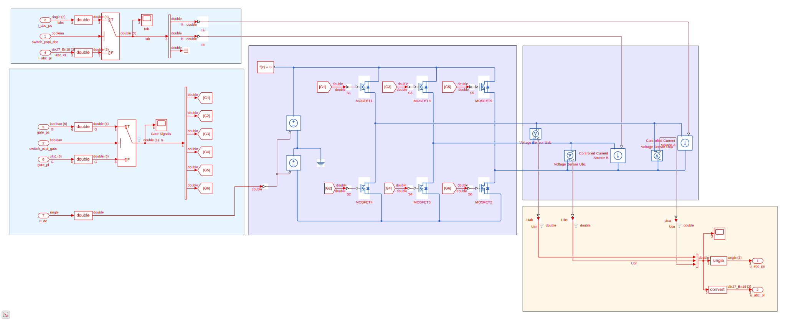

.. _uz_inverter_3ph:

==============
Inverter Model
==============

- IP-Core of a 3 phase inverter
- Simulates the inverter on the FPGA
- Intended for controller-in-the-loop (CIL) on the UltraZohm
- IP-Core clock frequency **must** be :math:`f_{clk}=100\,MHz`!

Model Description
=================

The Simscape model of the inverter is shown in the figure below.
While in the light blue areas, only the inputs are handled (mainly switching between PS and PL inputs depending on the configuration) and in the yellow area the ouputs are realized, the central part of the model is placed in the dark blue areas.
The power electronics part is modelled with six N-channel MOSFET from the Simscape parts library.
Note that their electrical parameters are listed in the table below and can only be changed in the Simscape model but not after the IP-core generation.
The MOSFETs are placed to model three half bridges (HB) and each of the switches can be controlled individually.
There is no logic implemented to prevent short circuits, if top and bottom switch of one HB are closed simultaneously.
Because the physical references of the Simscape model will be lost after the IP-core generation, the two controlled currents sources from phases ``a`` and ``b`` to phase ``c`` are placed.
The usage of the IP-core demands the user to feed back the actual flowing currents in the current application to the inverter for it to determine the voltage drop across the switches and diodes.
If the user does not feed back any currents or sets the feedback to zero, no voltage drops will be considered for the ouput voltage.
The voltages are output as line-to-line voltages :math:`u_{ab},u_{bc},u_{ca}`.

   Overview of Simscape inverter model ``uz_inverter_3ph.slx``

.. csv-table:: Parameter Switch (MOSFET and body diode)
   :file: ./MOSFET_parameter.csv
   :widths: 50 50 50
   :header-rows: 1

IP-Core Interfaces
==================

.. csv-table:: IP-core Interfaces Switch
   :file: ./inverter_interfaces.csv
   :widths: 50 40 60 50 60 210
   :header-rows: 1

Driver Reference
================

.. doxygentypedef:: uz_inverter_3ph_t

.. doxygenstruct:: uz_inverter_3ph_config_t
  :members:

.. doxygenstruct:: uz_inverter_3ph_gate_ps_t
  :members:

.. doxygenfunction:: uz_inverter_3ph_init

.. doxygenfunction:: uz_inverter_3ph_get_u_abc_ps

.. doxygenfunction:: uz_inverter_3ph_set_i_abc_ps

.. doxygenfunction:: uz_inverter_3ph_set_gate_ps

.. doxygenfunction:: uz_inverter_3ph_trigger_u_abc_ps_strobe

.. doxygenfunction:: uz_inverter_3ph_trigger_i_abc_ps_strobe

.. doxygenfunction:: uz_inverter_3ph_trigger_gate_ps_strobe

Example Usage
=============

The inverter IP-core can be used in several different ways because the inputs and outputs can be accessed from PS or PL individually.
For this example only the access via PS is shown.
Using the IP-core in PL mainly demands the usage of other IP-cores to provide the inputs and utilize the outputs which is shown in :ref:`uz_pmsm_model_9ph_dq`.
To use the IP-core with the PS only, the PL inputs do not need to be connected, although the ``u_abc_pl`` in the figure below is connected to an ILA in the greyed area.
This is not necessary and only done for verification purposes.

.. figure:: ps_example.jpg

   Placement of the IP-core in Vivado for PS only access

The following code is used in ``main.c`` (initialization) and ``isr.c`` (application):

.. code-block:: c
  :caption: initialization in ``main.c`` (R5)

  #include "IP_Cores/uz_inverter_3ph/uz_inverter_3ph.h"
  uz_inverter_3ph_t *inverter=NULL;
  struct uz_inverter_3ph_config_t inverter_config = {   // example config values
    .base_address=BASADDR,
    .ip_core_frequency_Hz = 100000000.0f,
    .switch_pspl_abc = true,
    .switch_pspl_gate = true,
    .udc = 560.f};

  // .. rest of the code in main.c before loop
  int main(void)
  // ..
    case init_ip_cores: // default line from main.c
    inverter = uz_inverter_3ph_init(inverter_config);

.. code-block:: c
  :caption: usage in ``isr.c``

  #include "../IP_Cores/uz_inverter_3ph/uz_inverter_3ph.h"
  extern uz_inverter_3ph_t *inverter;                              // pointer to Inverter object
  uz_3ph_abc_t out_voltages = {0};                                 // stores output voltages
  uz_3ph_abc_t in_currents = {                                     // stores flowing currents (made up values for this example)
    .a = 10,
    .b = 10,
    .c = 10};
  struct uz_inverter_3ph_gate_ps_t gate_signals = {
    .gate1 = true,
    .gate2 = false,
    .gate3 = false,
    .gate4 = true,
    .gate5 = false,
    .gate6 = true};

  // .. rest of the code in isr.c before loop
  void ISR_Control(void *data)
  // ..
    update_speed_and_position_of_encoder_on_D5(&Global_Data);      // default line from isr.c

    uz_inverter_3ph_set_gate_ps(inverter,gate_signals);            // set example gate values
    uz_inverter_3ph_set_i_abc_ps(inverter,in_currents);            // set example currents
    uz_inverter_3ph_trigger_gate_ps_strobe(inverter);              // write values to PL
    uz_inverter_3ph_trigger_i_abc_ps_strobe(inverter);             // write values to PL
    uz_inverter_3ph_trigger_u_abc_ps_strobe(inverter);             // read values from PL
    out_voltages = uz_inverter_3ph_get_u_abc_ps(inverter);         // read output values to voltages struct

Reference
=========

“Troubleshoot conversion of simscape permanent magnet synchronous motor to hdlcompatible simulink model.” [Online]. Available: https://de.mathworks.com/help/releases/R2021a/hdlcoder/ug/troubleshoot-generate-implementation-model-from-simscape-pmsm.html